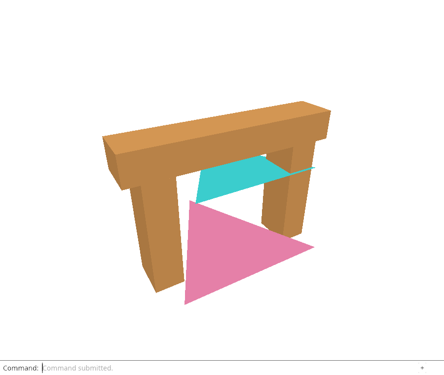
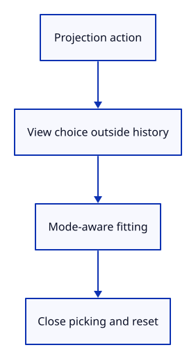

# 24b · Fit and change projection through the editor

**Typing: 25–49 minutes.** [Estimate](typing-load.md).

Fit an enclosing sphere using the selected projection. Perspective uses the smaller half-angle; orthographic uses the smaller half-extent.

## Type

Continue from [Build perspective and orthographic camera matrices](24a-projection.md). [Save or recover your work](recovery.md).

### 1. `src/camera.rs`

Fit the sphere through a perspective half-angle or the smaller orthographic half-extent.

<details>
<summary>Locate the existing block</summary>

```rust
        self.distance = self.radius * 1.1 / half_x.min(half_y).sin();
```

</details>

Replace that block with:

```rust
--8<-- "journey/code/25-projection-05.rs"
```

### 2. `src/editor.rs`

Carry the requested projection in Action for the named view commands.

<details>
<summary>Locate the existing block</summary>

```rust
    Fit,
```

</details>

Replace that block with:

```rust
--8<-- "journey/code/25-projection-07.rs"
```

### 3. `src/editor.rs`

Change projection without moving the camera or creating a document history entry.

<details>
<summary>Locate the existing block</summary>

```rust
                    Action::Isometric => self.camera.isometric(),
```

</details>

Replace that block with:

```rust
--8<-- "journey/code/25-projection-08.rs"
```

### 4. `src/projection_tests.rs`

Import bounds and editor actions for fitting, selection and history checks.

<details>
<summary>Locate the existing block</summary>

```rust
use crate::camera::{Camera, Projection};
use session_rust::{Point, Vector};
```

</details>

Replace that block with:

```rust
--8<-- "journey/code/24b-projection-test-imports.rs"
```

### 5. `src/projection_tests.rs`

Check orthographic fitting, close selection, view history and reset.

<details>
<summary>Locate the existing block</summary>

```rust
    assert!(camera.ray([-0.5, 0.0]).unwrap().direction
        .cross(&camera.ray([0.5, 0.0]).unwrap().direction).magnitude() > 0.1);
}
```

</details>

Replace that block with:

```rust
--8<-- "journey/code/24b-projection-editor-tests.rs"
```

## Run and check

In your project:

```sh
cd workspace/journey
REGEN_PROTO=0 cargo build --lib --locked --target wasm32-unknown-unknown -j4
REGEN_PROTO=0 CARGO_BUILD_JOBS=4 trunk serve --port 8780
```

Open `http://127.0.0.1:8780/`. Keep an existing Trunk server running; saving rebuilds it.

Run the state checks. Orthographic fitting contains every corner in tall and wide views; close picking and document Undo keep the chosen view coherent.

**Verified checkpoint in Chrome.**



[Verification scope](release.md).

Run the state checks on your computer from your project folder:

```sh
REGEN_PROTO=0 cargo test --lib --locked --target host-tuple -j4
```

<details>
<summary>Code explanation and diagram</summary>

Carry Projection in an editor action. Changing it preserves camera parameters and document history; Reset View still restores the perspective default.

Selected projection → fit opening; Action::Projection → view-only change.



Why keep projection outside document history?

It changes how the document is seen. Undo should restore geometry while retaining the current view choice.

Study estimate, including typing and experiments: 0.75–1.25 hours.

</details>

<details>
<summary>Optional experiment</summary>

Read the close-orthographic picking test and predict what Reset View does to its projection choice.

</details>

<details>
<summary>Check and save your work</summary>

Restore experimental edits, then run from `session_viewer`:

```sh
npm --prefix ../session_tests run course -- check 24b-projection-actions
npm --prefix ../session_tests run course -- save 24b-projection-actions
```

Source comparison leaves your project untouched. [Save and recovery instructions](recovery.md).

</details>

<details>
<summary>Viewer coverage and verification</summary>

Drawing and picking consume the same selected camera matrix. Later lessons add tighter fitting, named views and reversed depth without putting view choices into document history.

Native checks and GPU readback establish editor mode changes, orthographic fitting and close picking. Chrome retains the previous Fit route until the named projection commands are connected.

[Full validation scope](release.md).

</details>
