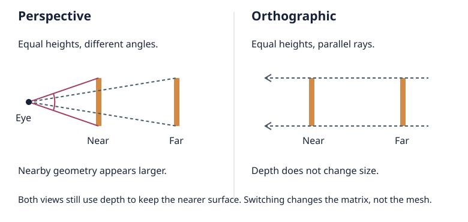
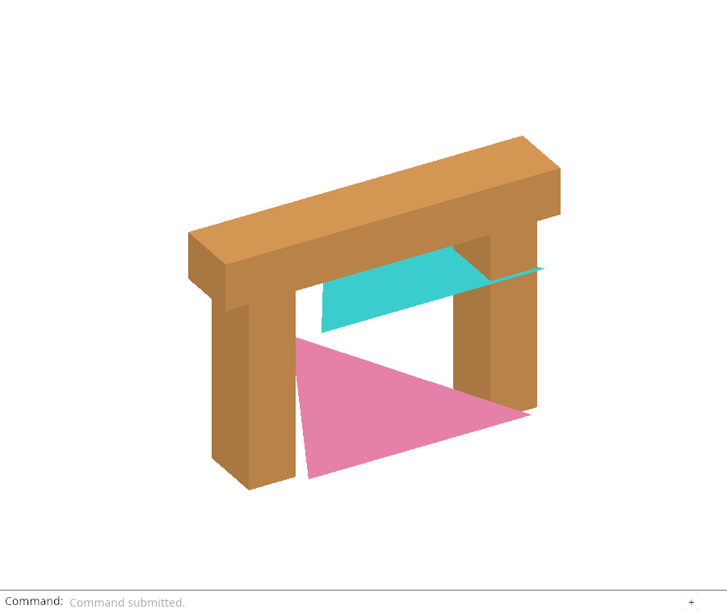

# 25 · Choose how depth changes size

**Combined study estimate: 3–5 hours.** Includes reading, typing, reasoning and experiments.

**Typing estimate: 58–116 minutes.** 132 added or changed lines; unchanged context is excluded. [How this is estimated](typing-load.md).

**Splitting required:** this verified checkpoint exceeds the one-hour typing target. Smaller runnable lessons are still being prepared.

**Today:** Switch between perspective and orthographic views while keeping fitting, zoom and picking coherent.

**In the whole viewer:** Connect the browser, drawing and input, then extend the same project. [See the destination](../journey.md#the-destination).

**Follow:** projection command → Editor → Camera matrix → drawing and inverse-matrix picking.

**Before you finish, explain:** Why can the same ray-picking code work in both views even though their rays have different shapes?

Look down a corridor: the far end appears smaller. That is perspective. Now imagine a technical drawing of the same corridor: equal lengths can keep the same size even at different depths. That is orthographic projection.



We are changing one rule: **does depth change apparent size?** We are not flattening the mesh or rotating the model. Orbit still controls the direction from which you look. Isometric describes a direction; orthographic describes the projection. They are separate choices.

Keep one useful anchor when switching. A flat shape on the plane through the camera target should keep its screen size. At that plane, the perspective view has half-height `distance × tan(30°)`. Give the orthographic rectangle that same half-height. Objects in front of or behind that plane will change apparent size; that is the difference we want to see.

The depth buffer still decides which surface is nearest. In orthographic mode, we let its depth interval reach behind the eye as well as ahead. Zoom can move the notional eye inside the model, but parallel projection does not need an eye-shaped cut through the geometry.

**Where this belongs:** Camera owns the projection and its bounds. Editor changes the choice. Browser shows which choice is active. Renderer and picking consume the camera matrix they already understand.

## Type the change

Continue [Find the whole scene](24-fit.md). From `session_viewer`, save your files with `npm --prefix ../session_tests run course -- save before-25-projection`. A save keeps your own work; it does not fill in the next lesson.

### 1. `src/camera.rs`

Name the two choices instead of passing an unexplained true or false. Copy lets us pass this small enum by value; PartialEq and Eq let us compare it. HALF_FOV is the same 30-degree half-angle used by the existing camera.

Find this exact block:

```rust
pub struct Ray {
```

Replace that block with:

```rust
--8<-- "journey/code/25-projection-01.rs"
```

### 2. `src/camera.rs`

Projection belongs to the view, alongside its orientation and size. It is not a property of an object.

Find this exact block:

```rust
    pub aspect: f64,
```

Replace that block with:

```rust
--8<-- "journey/code/25-projection-02.rs"
```

### 3. `src/camera.rs`

Start with the perspective view you already know. Reset view will restore this default too.

Find this exact block:

```rust
            aspect: 640.0 / 480.0,
```

Replace that block with:

```rust
--8<-- "journey/code/25-projection-03.rs"
```

### 4. `src/camera.rs`

Use the shared angle so fitting and drawing cannot quietly use different fields of view.

Find this exact block:

```rust
        let half_y = 30.0_f64.to_radians();
```

Replace that block with:

```rust
--8<-- "journey/code/25-projection-04.rs"
```

### 5. `src/camera.rs`

Perspective keeps the enclosing-sphere calculation from lesson 24. Orthographic fits that sphere inside a rectangle: half-height is distance × tan(30°), and half-width is half-height × aspect. The smaller side must hold the radius and margin.

Find this exact block:

```rust
        self.distance = self.radius * 1.1 / half_x.min(half_y).sin();
```

Replace that block with:

```rust
--8<-- "journey/code/25-projection-05.rs"
```

### 6. `src/camera.rs`

The orthographic rectangle matches the perspective view at the target plane. Its depth interval extends behind and ahead of the eye; this lets parallel rays reach the scene even when a close zoom puts the eye inside it. Both matrices still map visible depth to 0–1.

Find this exact block:

```rust
        let projection = Xform::perspective(60.0_f64.to_radians(), self.aspect, near, far);
```

Replace that block with:

```rust
--8<-- "journey/code/25-projection-06.rs"
```

### 7. `src/editor.rs`

An action carries the requested projection. One route serves both commands and any future keyboard shortcut.

Find this exact block:

```rust
    Fit,
```

Replace that block with:

```rust
--8<-- "journey/code/25-projection-07.rs"
```

### 8. `src/editor.rs`

Changing projection preserves target, distance and orientation. It returns Change::View and leaves document history alone. Isometric remains an orientation choice; it does not silently choose a projection.

Find this exact block:

```rust
                    Action::Isometric => self.camera.isometric(),
```

Replace that block with:

```rust
--8<-- "journey/code/25-projection-08.rs"
```

### 9. `src/projection_tests.rs`

Check the geometric promises: equal scale on the target plane, depth-independent orthographic size, parallel pick rays, complete fitting, and selection at close zoom. The final test also checks that switching modes never becomes an undoable document edit.

Create the file and type:

```rust
--8<-- "journey/code/25-projection-14.rs"
```

### 10. `src/lib.rs`

Register the new checks without changing the production browser entry point.

Find this exact block:

```rust
#[cfg(test)]
mod fit_tests;
#[cfg(test)]
mod navigation_tests;
#[cfg(test)]
mod gesture_tests;
```

Replace that block with:

```rust
--8<-- "journey/code/25-projection-fullscreen-1.rs"
```

### 11. `src/browser.rs`

Connect choose how depth changes size to the typed command path. Keep the scene state in its existing owner and redraw the dock after applying an action.

Find this exact block:

```rust
            "Orbit Right",
            "Orbit Up",
            "View Isometric",
            "Fit",
            "View Reset",
        ],
```

Replace that block with:

```rust
--8<-- "journey/code/25-projection-window-1.rs"
```

### 12. `src/browser.rs`

Connect choose how depth changes size to the typed command path. Keep the scene state in its existing owner and redraw the dock after applying an action.

Find this exact block:

```rust
                    "orbit right" => Action::Orbit(std::f64::consts::FRAC_PI_4, 0.0),
                    "orbit up" => Action::Orbit(0.0, std::f64::consts::FRAC_PI_6),
                    "view isometric" => Action::Isometric,
                    "fit" => Action::Fit,
                    "view reset" => Action::ResetView,
                    _ => return,
```

Replace that block with:

```rust
--8<-- "journey/code/25-projection-window-2.rs"
```

### 13. `src/browser.rs`

Connect choose how depth changes size to the typed command path. Keep the scene state in its existing owner and redraw the dock after applying an action.

Find this exact block:

```rust
                }
            }
        }
        if event.type_() == "viewer-file" {
            report("File imported. Undo removes the entire import.");
        }
```

Replace that block with:

```rust
--8<-- "journey/code/25-projection-window-3.rs"
```

### 14. `src/browser.rs`

Connect choose how depth changes size to the typed command path. Keep the scene state in its existing owner and redraw the dock after applying an action.

Find this exact block:

```rust
    Ok(())
}

fn navigation_action(
    event: &web_sys::Event,
    canvas: &web_sys::HtmlCanvasElement,
```

Replace that block with:

```rust
--8<-- "journey/code/25-projection-window-4.rs"
```

## Run and look

From `session_viewer`, enter your project folder:

```sh
cd workspace/journey
cargo build --lib --locked --target wasm32-unknown-unknown -j4
CARGO_BUILD_JOBS=4 trunk serve --port 8780
```

Open `http://127.0.0.1:8780/`. If Trunk is already running in this project, leave it running; it rebuilds when you save.

Run `Open` and choose `sample.pb`. Enter `View Isometric`, `View Orthographic`, then `Fit`. Now run `View Perspective` without fitting again. The target stays fixed, but near and far objects change their relative sizes.

Click an orange beam in each mode; selection should follow the visible face. Run `View Reset` to return to perspective. Compare both modes in a narrow window, using `Fit` after each change.

**Actual Chrome screenshot.**

The orange frame is fitted in orthographic view; the pink Orthographic command records the active choice. Chrome checks mouse and keyboard switching, exact perspective/orthographic round trips, visible-face selection in both modes, and fitting at wide and tall viewport sizes.



*Captured from this checkpoint’s browser bundle after its browser checks passed. [Check scope and environment](release.md).*

Run the state checks from your project folder:

```sh
cargo test --lib --locked -j4
```

## Try one small experiment

Switch modes while looking squarely at the two original triangles. Which one changes size more? Their depths differ, and neither lies on the target plane. Now orbit: the mode should stay selected while the viewing direction changes. Explain why Isometric and Orthographic are not synonyms.

## Explain it in your own words

Trace the values through the files without reading the answer first. If you lose the connection, stop at the last value you can follow.

<details>
<summary>Compare your explanation</summary>

Camera builds the selected projection and combines it with the same view transform. Drawing uses that matrix. Picking inverts it and maps a screen point at depths 0 and 1 back into the world. Those two points define the correct ray for either matrix. Perspective rays spread out; orthographic rays are parallel. Their different origins and directions come from the matrix, not a second picking routine.

</details>

## Keep your working result

Return to `session_viewer` in a second terminal. Restore experimental edits before comparing:

```sh
npm --prefix ../session_tests run course -- check 25-projection
npm --prefix ../session_tests run course -- save 25-projection
```

The comparison spots typing differences; it does not prove behaviour. Keep three notes: what I changed; the values I followed; the question I still have. [Recover a checkpoint](recovery.md) if an experiment gets tangled.

## Where this grows

The production camera uses this same target-plane scale relationship. Its tighter fitting, units, named views and camera-relative coordinates come next. Production also uses reversed depth for precision; this checkpoint keeps the existing 0-near/1-far depth convention. Switching modes deliberately preserves the view parameters rather than automatically refitting; run Fit if the new perspective clips or crops a nearby part.

[Validation status and course release](release.md).
