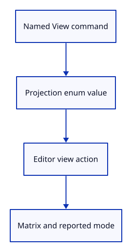

# 25 · Run the named projection commands

**Typing: 9–18 minutes.** [Estimate](typing-load.md).

Add View Perspective and View Orthographic to the command vocabulary and route them to Action::Projection. Report the active projection on the canvas after applying an action.

The commands preserve target-plane scale and view parameters. Fit remains explicit; run it after switching if perspective crops nearby geometry.

## Type

Continue from [Fit and change projection through the editor](24b-projection-actions.md). [Save or recover your work](recovery.md).

### 1. `src/browser.rs`

Add the two named projection commands.

<details>
<summary>Locate the existing block</summary>

```rust
            "Orbit Right",
            "Orbit Up",
            "View Isometric",
            "Fit",
            "View Reset",
        ],
```

</details>

Replace that block with:

```rust
--8<-- "journey/code/25-projection-window-1.rs"
```

### 2. `src/browser.rs`

Map each projection command to its enum value.

<details>
<summary>Locate the existing block</summary>

```rust
                    "orbit right" => Action::Orbit(std::f64::consts::FRAC_PI_4, 0.0),
                    "orbit up" => Action::Orbit(0.0, std::f64::consts::FRAC_PI_6),
                    "view isometric" => Action::Isometric,
                    "fit" => Action::Fit,
                    "view reset" => Action::ResetView,
                    _ => return,
```

</details>

Replace that block with:

```rust
--8<-- "journey/code/25-projection-window-2.rs"
```

### 3. `src/browser.rs`

Refresh the reported projection after applying an action.

<details>
<summary>Locate the existing block</summary>

```rust
                }
            }
        }
        if event.type_() == "viewer-file" {
            report("File imported. Undo removes the entire import.");
        }
```

</details>

Replace that block with:

```rust
--8<-- "journey/code/25-projection-window-3.rs"
```

### 4. `src/browser.rs`

Expose the current projection on the canvas for inspection.

<details>
<summary>Locate the existing block</summary>

```rust
    Ok(())
}

fn navigation_action(
    event: &web_sys::Event,
    canvas: &web_sys::HtmlCanvasElement,
```

</details>

Replace that block with:

```rust
--8<-- "journey/code/25-projection-window-4.rs"
```

## Run and check

In your project:

```sh
cd workspace/journey
REGEN_PROTO=0 cargo build --lib --locked --target wasm32-unknown-unknown -j4
REGEN_PROTO=0 CARGO_BUILD_JOBS=4 trunk serve --port 8780
```

Open `http://127.0.0.1:8780/`. Keep an existing Trunk server running; saving rebuilds it.

Type View Orthographic, Fit, then View Perspective. The target stays fixed while depth changes relative sizes.

**Verified checkpoint in Chrome.**


[Verification scope](release.md).

Run the state checks from your project folder:

```sh
REGEN_PROTO=0 cargo test --lib --locked -j4
```

<details>
<summary>Code explanation and diagram</summary>


Named View command → Projection value → Editor → camera matrix and reported mode.



Why can the same ray-picking code work in both views even though their rays have different shapes?

Camera builds the selected projection and combines it with the same view transform. Drawing uses that matrix. Picking inverts it and maps a screen point at depths 0 and 1 back into the world. Those two points define the correct ray for either matrix. Perspective rays spread out; orthographic rays are parallel. Their different origins and directions come from the matrix, not a second picking routine.

Study estimate, including typing and experiments: 0.25–0.5 hours.

</details>

<details>
<summary>Optional experiment</summary>

Switch modes while looking squarely at the two original triangles. Which one changes size more? Their depths differ, and neither lies on the target plane. Now orbit: the mode should stay selected while the viewing direction changes. Explain why Isometric and Orthographic are not synonyms.

</details>

<details>
<summary>Check and save your work</summary>

Restore experimental edits, then run from `session_viewer`:

```sh
npm --prefix ../session_tests run course -- check 25-projection
npm --prefix ../session_tests run course -- save 25-projection
```

Source comparison leaves your project untouched. [Save and recovery instructions](recovery.md).

</details>

<details>
<summary>Viewer coverage and verification</summary>

The production camera uses this same target-plane scale relationship. Its tighter fitting, units, named views and camera-relative coordinates come next. Production also uses reversed depth for precision; this checkpoint keeps the existing 0-near/1-far depth convention. Switching modes deliberately preserves the view parameters rather than automatically refitting; run Fit if the new perspective clips or crops a nearby part.

Chrome types the two projection commands, verifies exact round trips, selects visible faces in both modes and fits at wide and tall viewport sizes.

[Full validation scope](release.md).

</details>
