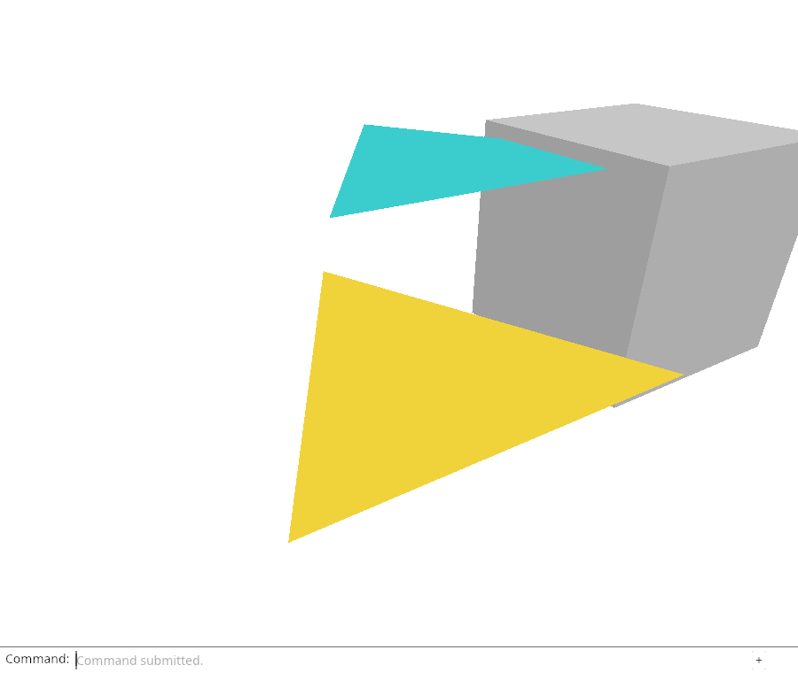
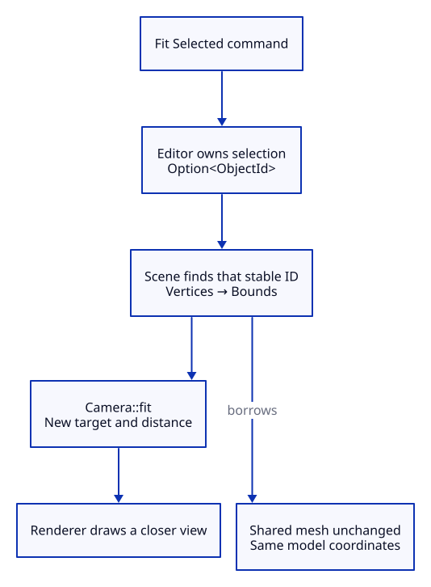

# 26 · Frame one object without changing its size

**Typing: 22–44 minutes.** [Estimate](typing-load.md).

Make `Fit Selected` use one object's bounds with the same fitting policy as `Fit`.

Scene finds the object by `ObjectId`. `?` returns `None` for a missing ID or empty mesh. Start bounds from its first vertex so the origin does not enlarge every box.

## Type

Continue from [Choose how depth changes size](25-projection.md). [Save or recover your work](recovery.md).

### 1. `src/scene.rs`

Find one stable ID and collect only its displayed vertices. An absent ID or empty mesh returns None.

<details>
<summary>Locate the existing block</summary>

```rust
    pub fn objects(&self) -> &[Object] {
```

</details>

Replace that block with:

```rust
--8<-- "journey/code/26-selected-01.rs"
```

### 2. `src/editor.rs`

Name a separate action for fitting the selection.

<details>
<summary>Locate the existing block</summary>

```rust
    Fit,
    Projection(crate::camera::Projection),
```

</details>

Replace that block with:

```rust
--8<-- "journey/code/26-selected-02.rs"
```

### 3. `src/editor.rs`

Borrow the selected ID, ask Scene for its bounds, and reuse Camera::fit. Neither the mesh nor document history changes.

<details>
<summary>Locate the existing block</summary>

```rust
                    Action::ResetView => {
```

</details>

Replace that block with:

```rust
--8<-- "journey/code/26-selected-03.rs"
```

### 4. `src/browser.rs`

Expose Fit Selected in the existing command vocabulary.

<details>
<summary>Locate the existing block</summary>

```rust
            "Fit",
            "View Reset",
```

</details>

Replace that block with:

```rust
--8<-- "journey/code/26-selected-04.rs"
```

### 5. `src/browser.rs`

Translate the named command into the new action.

<details>
<summary>Locate the existing block</summary>

```rust
                    "fit" => Action::Fit,
                    "view reset" => Action::ResetView,
```

</details>

Replace that block with:

```rust
--8<-- "journey/code/26-selected-05.rs"
```

### 6. `src/lib.rs`

Register the focused state checks.

<details>
<summary>Locate the existing block</summary>

```rust
#[cfg(test)]
mod projection_tests;
```

</details>

Replace that block with:

```rust
--8<-- "journey/code/26-selected-06.rs"
```

### 7. `src/selected_fit_tests.rs`

Check both projection modes, selection, shared mesh identity, history and the empty-selection case.

Create the file and type:

```rust
--8<-- "journey/code/26-selected-07.rs"
```

## Run and check

In your project:

```sh
cd workspace/journey
REGEN_PROTO=0 cargo build --lib --locked --target wasm32-unknown-unknown -j4
REGEN_PROTO=0 CARGO_BUILD_JOBS=4 trunk serve --port 8780
```

Open `http://127.0.0.1:8780/`. Keep an existing Trunk server running; saving rebuilds it.

Type `Select Next`, then `Fit Selected`. The selected object fills the view with a margin. Geometry, selection and Undo history stay unchanged.

**Verified checkpoint in Chrome.**



[Verification scope](release.md).

Run the state checks from your project folder:

```sh
REGEN_PROTO=0 cargo test --lib --locked -j4
```

<details>
<summary>Code explanation and diagram</summary>

Editor uses `Option::and_then` to request bounds only when selection exists, then passes them to Camera. No second fitting formula is needed.

Fitting changes pixels occupied by the object, preserving its model coordinates and shared mesh. It changes neither document units nor object size.

Fit Selected → Editor → stable ObjectId → selected bounds → Camera::fit → frame.



Does fitting an object change its coordinates or only the camera?

Only the camera target and distance change. The selected object keeps the same shared mesh and stable ID. Bounds are measured in existing model coordinates; fitting changes their screen coverage, not their physical dimensions.

Study estimate, including typing and experiments: 1–2 hours.

</details>

<details>
<summary>Optional experiment</summary>

Select Next repeatedly and run Fit Selected after each selection. Predict the camera target from that object’s minimum and maximum coordinates. Then compare perspective and orthographic fits. Explain why neither operation should create an undo entry.

</details>

<details>
<summary>Check and save your work</summary>

Restore experimental edits, then run from `session_viewer`:

```sh
npm --prefix ../session_tests run course -- check 26-selected
npm --prefix ../session_tests run course -- save 26-selected
```

Source comparison leaves your project untouched. [Save and recovery instructions](recovery.md).

</details>

<details>
<summary>Viewer coverage and verification</summary>

The maintained viewer fits selected display rows and their world-space bounds. This checkpoint establishes stable selection and camera-only fitting. Local placements, inherited transforms and multiple selected objects will extend the bounds query in later lessons.

Fit Selected frames the first triangle without deleting the added box or changing object coordinates.

[Full validation scope](release.md).

</details>
