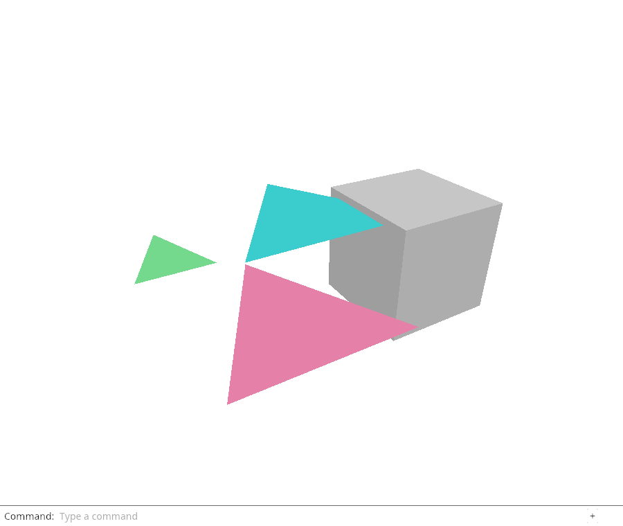
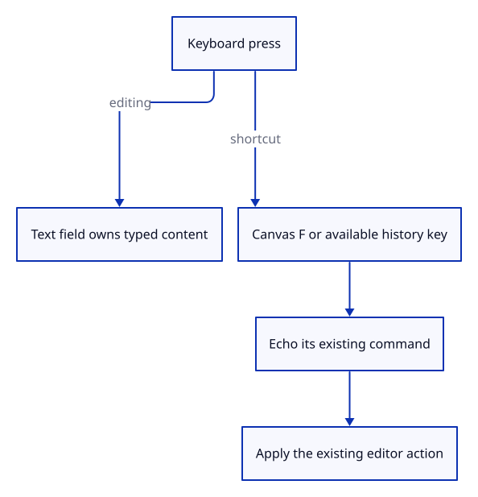

# 26a · Fit and step history from the keyboard

**Typing: 19–38 minutes.** [Estimate](typing-load.md).

Classify a key before the panel can focus on its printable letter. F belongs to the unfocused canvas. History keys belong to the document when no nonempty focused text field owns them.

## Type

Continue from [Frame one object without changing its size](26-selected.md). [Save or recover your work](recovery.md).

### 1. `src/shortcuts.rs`

Classify canvas Fit and available history keys without owning browser or document state.

Create the file and type:

```rust
--8<-- "journey/code/26a-keys-01.rs"
```

### 2. `src/panel.rs`

Use current text focus and content to decide shortcut ownership.

<details>
<summary>Locate the existing block</summary>

```rust
    pub fn key(&mut self, event: &web_sys::KeyboardEvent) -> bool {
```

</details>

Replace that block with:

```rust
--8<-- "journey/code/26a-keys-02.rs"
```

### 3. `src/browser.rs`

Echo an accepted shortcut through the same command route before the panel consumes typing.

<details>
<summary>Locate the existing block</summary>

```rust
        let line = match panel.update(Some(&event), &input_canvas) {
            Ok(line) => line,
            Err(error) => {
                report(&format!("Cannot read command: {error:?}"));
                return;
            }
        };
```

</details>

Replace that block with:

```rust
--8<-- "journey/code/26a-keys-03.rs"
```

### 4. `src/browser.rs`

Make canvas F fit the selection when present; otherwise fit the whole scene.

<details>
<summary>Locate the existing block</summary>

```rust
                    "fit" => Action::Fit,
```

</details>

Replace that block with:

```rust
--8<-- "journey/code/26a-keys-04.rs"
```

### 5. `src/lib.rs`

Register the shared shortcut policy.

<details>
<summary>Locate the existing block</summary>

```rust
pub mod navigation;
```

</details>

Replace that block with:

```rust
--8<-- "journey/code/26a-keys-05.rs"
```

### 6. `src/shortcuts_tests.rs`

Copy the modifier and text-ownership checks.

Copy this check file:

```rust
--8<-- "journey/code/26a-keys-tests.rs"
```

### 7. `src/lib.rs`

Register the native checks.

<details>
<summary>Locate the existing block</summary>

```rust
pub mod shortcuts;
```

</details>

Replace that block with:

```rust
--8<-- "journey/code/26a-keys-06.rs"
```

## Run and check

In your project:

```sh
cd workspace/journey
REGEN_PROTO=0 cargo build --lib --locked --target wasm32-unknown-unknown -j4
REGEN_PROTO=0 CARGO_BUILD_JOBS=4 trunk serve --port 8780
```

Open `http://127.0.0.1:8780/`. Keep an existing Trunk server running; saving rebuilds it.

Select an object, click the canvas, then press F. Ctrl+Z undoes a document edit; Ctrl+Y or Ctrl+Shift+Z redoes it. Use Cmd on macOS.

**Verified checkpoint in Chrome.**



[Verification scope](release.md).

Run the state checks on your computer from your project folder:

```sh
REGEN_PROTO=0 cargo test --lib --locked --target host-tuple -j4
```

<details>
<summary>Code explanation and diagram</summary>

Both Ctrl and Cmd use the same policy. Ignore repeated, composing and Alt-modified events. Echo the existing command and reuse the normal action route, preserving one history transaction.

keyboard press → text ownership → existing command → editor action → redraw.



Why must Ctrl+Z stay with a nonempty focused command field?

It edits the text being typed. Document history must change only when that text does not own the shortcut.

Study estimate, including typing and experiments: 0.5–1 hours.

</details>

<details>
<summary>Optional experiment</summary>

Focus the command field and type F. It remains text. Type a word, then press Ctrl+Z: document history must stay unchanged.

</details>

<details>
<summary>Check and save your work</summary>

Restore experimental edits, then run from `session_viewer`:

```sh
npm --prefix ../session_tests run course -- check 26a-keys
npm --prefix ../session_tests run course -- save 26a-keys
```

Source comparison leaves your project untouched. [Save and recovery instructions](recovery.md).

</details>

<details>
<summary>Viewer coverage and verification</summary>

This carries the October 4 F and history shortcuts into the course. H/S hide and show arrive with visibility policies in chapter 53. Existing named commands and mouse navigation remain available.

Native key policy checks and Chrome exercise actual keys, text editing, camera-only Fit and exact document history round trips.

Actual keyboard input checks selected and whole-scene fitting, Undo/Redo, platform modifiers and command-text ownership.

[Full validation scope](release.md).

To reproduce the scripted acceptance of the reference checkpoint, run from `session_viewer` with the [course bundle server](release.md#reproduce) running on port 8781:

```sh
npm --prefix ../session_tests run course -- capture 26a-keys
```

This uses the verified reference bundle; it does not check or change your typed project.

</details>
