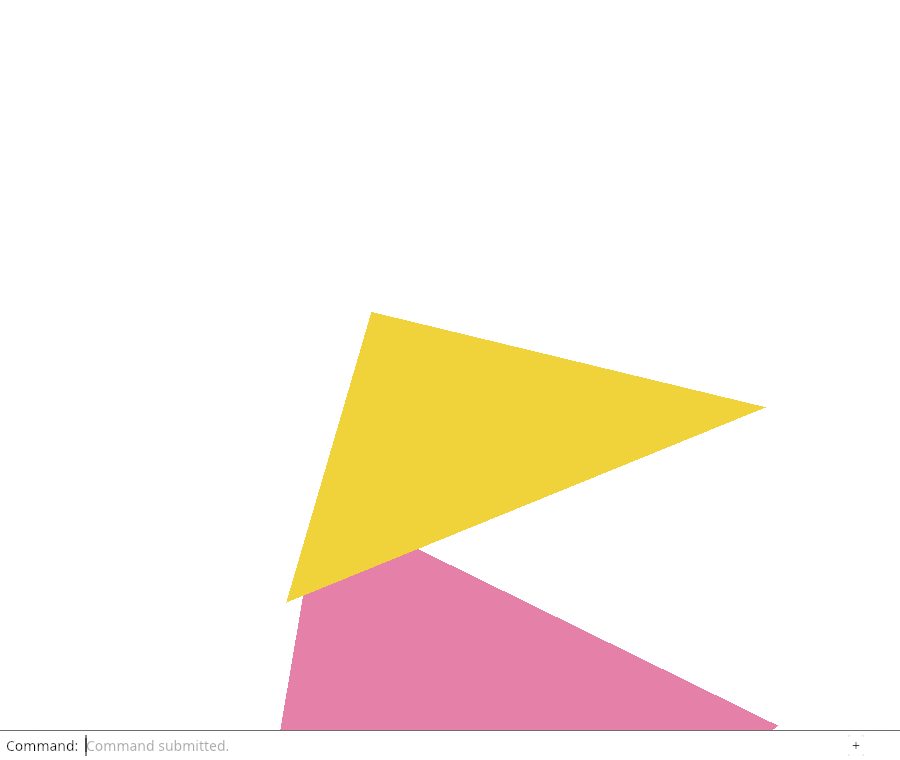
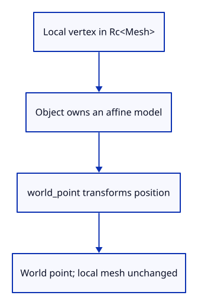

# 27 · Give each object a placement

**Typing: 21–41 minutes.** [Estimate](typing-load.md).

A mesh describes a shape. A placement describes where one use of that shape belongs. Keeping both in Object lets history retain the same shared mesh while remembering a different placement.

## Type

Continue from [Frame one object without changing its size](26-selected.md). [Save or recover your work](recovery.md).

### 1. `src/scene.rs`

Store one placement beside the shared local mesh.

<details>
<summary>Locate the existing block</summary>

```rust
    pub mesh: Rc<Mesh>,
```

</details>

Replace that block with:

```rust
--8<-- "journey/code/27-placement-01.rs"
```

### 2. `src/scene.rs`

Transform position only; return world coordinates without changing the mesh.

<details>
<summary>Locate the existing block</summary>

```rust
#[derive(Clone)]
pub struct Scene {
```

</details>

Replace that block with:

```rust
--8<-- "journey/code/27-placement-02.rs"
```

### 3. `src/scene.rs`

Identity preserves the behavior of all existing objects.

<details>
<summary>Locate the existing block</summary>

```rust
        self.objects.push(Object { id, mesh: Rc::new(mesh), source: None });
```

</details>

Replace that block with:

```rust
--8<-- "journey/code/27-placement-03.rs"
```

### 4. `src/scene.rs`

Check the placement before mutating the object found by its stable ID.

<details>
<summary>Locate the existing block</summary>

```rust
    pub fn remove(&mut self, id: ObjectId) -> bool {
```

</details>

Replace that block with:

```rust
--8<-- "journey/code/27-placement-04.rs"
```

### 5. `src/lib.rs`

Register the placement checks.

<details>
<summary>Locate the existing block</summary>

```rust
#[cfg(test)]
mod selected_fit_tests;
```

</details>

Replace that block with:

```rust
--8<-- "journey/code/27-placement-05.rs"
```

### 6. `src/placement_tests.rs`

Prove mesh identity and local coordinates survive placement, and failed updates leave it unchanged.

Create the file and type:

```rust
--8<-- "journey/code/27-placement-06.rs"
```

## Run and check

In your project:

```sh
cd workspace/journey
REGEN_PROTO=0 cargo build --lib --locked --target wasm32-unknown-unknown -j4
REGEN_PROTO=0 CARGO_BUILD_JOBS=4 trunk serve --port 8780
```

Open `http://127.0.0.1:8780/`. Keep an existing Trunk server running; saving rebuilds it.

Run the Rust checks below. A translation changes the tested world point while retaining its local vertex. Placement is not connected to drawing yet, so the browser picture stays unchanged.

**Verified checkpoint in Chrome.**



[Verification scope](release.md).

Run the state checks on your computer from your project folder:

```sh
REGEN_PROTO=0 cargo test --lib --locked --target host-tuple -j4
```

<details>
<summary>Code explanation and diagram</summary>

Add an identity matrix to every newly inserted object. Identity leaves coordinates unchanged, so this checkpoint preserves the working picture. Object::world_point borrows a six-float vertex, uses its first three values as a position, and returns a double-precision world point. Its color is not a coordinate and never enters the transform.

Scene::place finds the stable ID before replacing its matrix. It rejects a non-finite matrix and a projective last row. Object placements are affine: they can translate, rotate, scale or shear a shape, but perspective belongs to Camera. Returning Result makes a missing object or invalid placement visible to the caller.

The two checks deliberately use the same Rc<Mesh> before and after a placement. Clone on Rc creates another owner of the allocation. It does not duplicate or rewrite the vertex array. Bounds, picking and GPU presentation will adopt this placement in the next two small lessons; no Move command is exposed yet.

Local vertex → Object::world_point → placement matrix → world point.



Which value changes when an object moves without changing shape?

Its placement matrix changes. The shared mesh keeps local coordinates. Multiplying a local point by the placement produces its world position; multiplying that world point by the camera later produces its screen position.

Study estimate, including typing and experiments: 1–2 hours.

</details>

<details>
<summary>Optional experiment</summary>

In the state check, change translation from (2, −1, 0.5) to (−3, 4, 0). Predict the resulting world point before running the check, then restore it. Explain why the local vertex and Rc allocation stay unchanged.

</details>

<details>
<summary>Check and save your work</summary>

Restore experimental edits, then run from `session_viewer`:

```sh
npm --prefix ../session_tests run course -- check 27-placement
npm --prefix ../session_tests run course -- save 27-placement
```

Source comparison leaves your project untouched. [Save and recovery instructions](recovery.md).

</details>

<details>
<summary>Viewer coverage and verification</summary>

The maintained viewer stores placement separately from source geometry and composes placements for instances. This checkpoint establishes the document value. World-space queries and GPU model matrices come next.

Give each object a placement. The actual command dock drives this checkpoint; the selected object is highlighted.

[Full validation scope](release.md).

</details>
