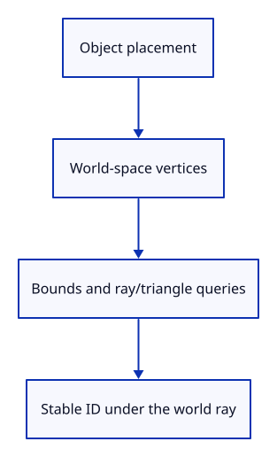
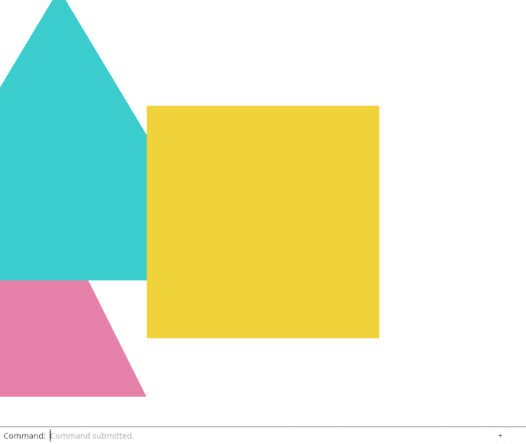

# 27a · Ask geometry questions in world coordinates

**Combined study estimate: 1–2 hours.** Includes reading, typing, reasoning and experiments.

**Typing estimate: 19–38 minutes.** 37 added or changed lines; unchanged context is excluded. [How this is estimated](typing-load.md).

**Today:** Use placement for scene bounds, selected bounds and ray picking.

**Follow:** Object placement → world vertices → bounds or ray/triangle query.

A local vertex is useful for sharing a shape, but the camera does not live in every object’s local coordinate system. Bounds and ray tests must agree on where that object is.

Reuse world_point in the whole-scene bounds loop, the selected-object bounds loop and the picking loop. Each loop borrows the original mesh. The returned points are temporary query values, not replacement geometry.



Picking now receives three doubles per position. Colors are irrelevant to intersection. Keep the triangle calculation in doubles instead of subtracting floats and converting only the already-rounded result.

The new state check places a triangle, asks for its bounds, projects its centroid and casts the camera ray back through that pixel. These are connected observations: the same stable ID must be found at its new world location. The live commands still use identity placements until the next lesson connects model matrices to the GPU.

## Type the change

Continue from [Give each object a placement](27-placement.md). Save your own work first: `npm --prefix ../session_tests run course -- save before-27a-world` (from `session_viewer`).

### 1. `src/scene.rs`

Whole-scene bounds include placed points.

Find this exact block:

```rust
                let point = [vertex[0] as f64, vertex[1] as f64, vertex[2] as f64];
```

Replace that block with:

```rust
--8<-- "journey/code/27a-world-01.rs"
```

### 2. `src/scene.rs`

Use the same placed coordinates for fitting the selected object.

Find this exact block:

```rust
        let mut bounds = crate::bounds::Bounds::point([
            first[0] as f64, first[1] as f64, first[2] as f64,
        ]);
        for vertex in vertices {
            bounds.include([vertex[0] as f64, vertex[1] as f64, vertex[2] as f64]);
```

Replace that block with:

```rust
--8<-- "journey/code/27a-world-02.rs"
```

### 3. `src/picking.rs`

Ask whether the world ray hits the placed triangle.

Find this exact block:

```rust
            let a = vertices[triangle[0] as usize];
            let b = vertices[triangle[1] as usize];
            let c = vertices[triangle[2] as usize];
```

Replace that block with:

```rust
--8<-- "journey/code/27a-world-03.rs"
```

### 4. `src/picking.rs`

Compute differences in the double-precision coordinates supplied by placement.

Find this exact block:

```rust
fn triangle_distance(ray: &Ray, a: [f32; 6], b: [f32; 6], c: [f32; 6]) -> Option<f64> {
    let edge1 = Vector::new((b[0] - a[0]) as f64, (b[1] - a[1]) as f64, (b[2] - a[2]) as f64);
    let edge2 = Vector::new((c[0] - a[0]) as f64, (c[1] - a[1]) as f64, (c[2] - a[2]) as f64);
```

Replace that block with:

```rust
--8<-- "journey/code/27a-world-04.rs"
```

### 5. `src/picking.rs`

Build the triangle origin from the same world point.

Find this exact block:

```rust
    let origin = &ray.origin - &Point::new(a[0] as f64, a[1] as f64, a[2] as f64);
```

Replace that block with:

```rust
--8<-- "journey/code/27a-world-05.rs"
```

### 6. `src/placement_tests.rs`

Connect placement, both bounds and camera-ray picking in one state check.

Find this exact block:

```rust
use session_rust::Xform;
```

Replace that block with:

```rust
--8<-- "journey/code/27a-world-06.rs"
```

## Run and look

From `session_viewer`, enter your project folder:

```sh
cd workspace/journey
REGEN_PROTO=0 cargo build --lib --locked --target wasm32-unknown-unknown -j4
REGEN_PROTO=0 CARGO_BUILD_JOBS=4 trunk serve --port 8780
```

Open `http://127.0.0.1:8780/`. If Trunk is already running in this project, leave it running; it rebuilds when you save.

Run the Rust checks below. Bounds and ray picking must use placed world coordinates, while the stored local mesh remains unchanged. GPU placement follows next.

**Verified checkpoint in Chrome.**



[What this screenshot checks](release.md).

Run the state checks from your project folder:

```sh
REGEN_PROTO=0 cargo test --lib --locked -j4
```

<details>
<summary>Optional experiment</summary>

Change the world-query test’s translation to (4, 2, −0.25). Predict the new bounds and camera target, then restore it. Explain why querying colors would not help identify the triangle’s position.

</details>

## Explain the change

Why must picking and fitting use the same placement as drawing?

<details>
<summary>Compare your explanation</summary>

A camera ray and a fitted camera target are expressed in world coordinates. Comparing them with unplaced local vertices asks about a different location. Apply Object::world_point at each query boundary so both questions refer to the placed object.

</details>

## Keep your working result

Return to `session_viewer` in a second terminal. Restore experimental edits before comparing:

```sh
npm --prefix ../session_tests run course -- check 27a-world
npm --prefix ../session_tests run course -- save 27a-world
```

Check compares your typed source; run the focused check above for behavior. [Recover your work](recovery.md).

<details>
<summary>Where this fits in the finished viewer</summary>

The production viewer combines source bounds and world placements, including inherited instance transforms. These loops establish one coordinate convention before adding hierarchy and shared GPU storage.

</details>

<details>
<summary>Verification notes and browser acceptance</summary>

Ask geometry questions in world coordinates. The actual command dock drives this checkpoint; the selected object is highlighted.

[Full validation scope](release.md).

</details>
