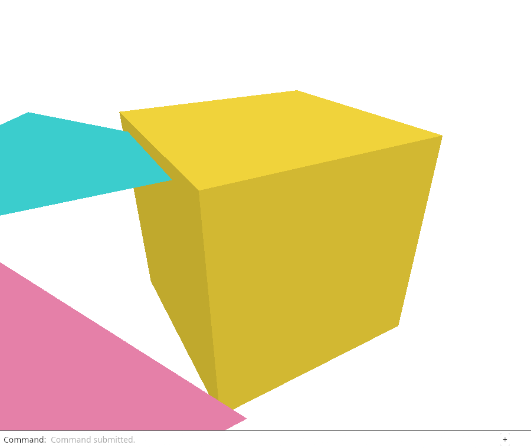
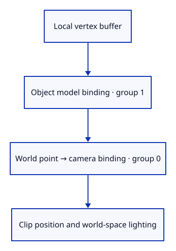

# 27b · Apply object placement on the GPU

**Typing: 17–33 minutes.** [Estimate](typing-load.md).

Bounds and picking now understand placement. Drawing must apply that same matrix, or the visible object and the selectable object would disagree.

Add a second uniform binding to the shader. Group 0 remains the shared camera transform. Group 1 contains one object’s model matrix. The vertex shader first produces a world position, then applies the camera. The fragment shader receives that world position so its derivative-based lighting follows the placed surface too.

## Type

Continue from [Ask geometry questions in world coordinates](27a-world.md). [Save or recover your work](recovery.md).

### 1. `src/triangle.wgsl`

Keep camera and object placement in separate uniform groups.

<details>
<summary>Locate the existing block</summary>

```wgsl
@group(0) @binding(0) var<uniform> transform: mat4x4<f32>;
```

</details>

Replace that block with:

```wgsl
--8<-- "journey/code/27b-model-01.wgsl"
```

### 2. `src/triangle.wgsl`

Place the vertex before projecting it; use world position for lighting.

<details>
<summary>Locate the existing block</summary>

```wgsl
    output.position = transform * vec4<f32>(position, 1.0);
    output.colour = colour;
    output.world = position;
```

</details>

Replace that block with:

```wgsl
--8<-- "journey/code/27b-model-02.wgsl"
```

### 3. `src/gpu_mesh.rs`

Upload an object’s mesh and placement together.

<details>
<summary>Locate the existing block</summary>

```rust
use crate::mesh::Mesh;
```

</details>

Replace that block with:

```rust
--8<-- "journey/code/27b-model-03.rs"
```

### 4. `src/gpu_mesh.rs`

Retain the object bind group alongside its vertex/index buffers.

<details>
<summary>Locate the existing block</summary>

```rust
    index_count: u32,
```

</details>

Replace that block with:

```rust
--8<-- "journey/code/27b-model-04.rs"
```

### 5. `src/gpu_mesh.rs`

Borrow local mesh coordinates and the model from the same Object.

<details>
<summary>Locate the existing block</summary>

```rust
    pub fn upload(device: &wgpu::Device, mesh: &Mesh, selected: bool) -> Self {
```

</details>

Replace that block with:

```rust
--8<-- "journey/code/27b-model-05.rs"
```

### 6. `src/gpu_mesh.rs`

Encode the model’s column-major values and bind the uniform buffer.

<details>
<summary>Locate the existing block</summary>

```rust
        Self { vertices, indices, index_count: mesh.indices().len() as u32 }
```

</details>

Replace that block with:

```rust
--8<-- "journey/code/27b-model-06.rs"
```

### 7. `src/gpu_mesh.rs`

Choose this object’s placement before its indexed draw.

<details>
<summary>Locate the existing block</summary>

```rust
    pub fn draw(&self, pass: &mut wgpu::RenderPass<'_>) {
```

</details>

Replace that block with:

```rust
--8<-- "journey/code/27b-model-07.rs"
```

### 8. `src/renderer.rs`

Remove the upload that ran before the pipeline layout was available.

Find this exact block:

```rust
        let meshes = scene.objects().iter().map(|object| GpuMesh::upload(&device, &object.mesh, false)).collect();
```

Delete this block.

### 9. `src/renderer.rs`

Upload objects using the model layout inferred from the shader.

<details>
<summary>Locate the existing block</summary>

```rust
        let uniform = device.create_buffer(&wgpu::BufferDescriptor {
```

</details>

Replace that block with:

```rust
--8<-- "journey/code/27b-model-09.rs"
```

### 10. `src/renderer.rs`

Include each placement when a scene update rebuilds the current uploads.

<details>
<summary>Locate the existing block</summary>

```rust
    pub fn set_scene(&mut self, scene: &Scene, selected: Option<ObjectId>) {
        self.meshes = scene.objects().iter().map(|object| {
            GpuMesh::upload(&self.device, &object.mesh, selected == Some(object.id))
```

</details>

Replace that block with:

```rust
--8<-- "journey/code/27b-model-10.rs"
```

### 11. `src/scene.rs`

Keep the generated box centred in its local coordinates.

Find this exact block:

```rust
        source.transform(&session_rust::Xform::translation(0.9, 0.0, 0.4));
```

Delete this block.

### 12. `src/scene.rs`

Assign its world placement after inserting the local mesh.

<details>
<summary>Locate the existing block</summary>

```rust
        self.insert(Mesh::from_kernel(&source)?)
```

</details>

Replace that block with:

```rust
--8<-- "journey/code/27b-model-12.rs"
```

## Run and check

In your project:

```sh
cd workspace/journey
REGEN_PROTO=0 cargo build --lib --locked --target wasm32-unknown-unknown -j4
REGEN_PROTO=0 CARGO_BUILD_JOBS=4 trunk serve --port 8780
```

Open `http://127.0.0.1:8780/`. Keep an existing Trunk server running; saving rebuilds it.

Type `Example Box`, then `View Isometric`. The box now draws at its placed position. Click a visible face: picking must agree with the GPU placement, while local vertices stay unchanged.

**Verified checkpoint in Chrome.**



[Verification scope](release.md).

Run the state checks from your project folder:

```sh
REGEN_PROTO=0 cargo test --lib --locked -j4
```

<details>
<summary>Code explanation and diagram</summary>

GpuMesh uploads the original local vertices, encodes the sixteen model values as floats, and creates the object bind group from the pipeline’s group-1 layout. The bind group retains its referenced buffer. Bind it immediately before drawing that object’s indices.

Finally change Example Box: create its shape around the local origin, then give the Object the translation that used to be baked into its vertices. Its world appearance stays consistent. Its local box coordinates are now reusable. The current renderer still rebuilds uploads on scene changes; later shared-storage lessons will update changed ranges.

Local vertex → model uniform → world point → camera uniform → clip position.



Why do model and camera matrices need separate owners?

The object owns where its shape belongs; the camera owns how the scene is viewed. Binding the object model before each draw lets local mesh data stay unchanged while the same camera draws many placements.

Study estimate, including typing and experiments: 1–2 hours.

</details>

<details>
<summary>Optional experiment</summary>

Change Example Box’s placement translation from (0.9, 0, 0.4) to (1.4, 0, 0.4). Predict where Fit Selected will aim and verify the visible box and its pick agree. Restore the original value. Do not move the box by rewriting its mesh.

</details>

<details>
<summary>Check and save your work</summary>

Restore experimental edits, then run from `session_viewer`:

```sh
npm --prefix ../session_tests run course -- check 27b-model
npm --prefix ../session_tests run course -- save 27b-model
```

Source comparison leaves your project untouched. [Save and recovery instructions](recovery.md).

</details>

<details>
<summary>Viewer coverage and verification</summary>

The maintained viewer shares local geometry across instances and supplies placement data to GPU draws. This checkpoint introduces the same ownership boundary with one bind group per object; batching and resource accounting follow later.

Apply object placement on the GPU. The actual command dock drives this checkpoint; the selected object is highlighted.

[Full validation scope](release.md).

To reproduce the scripted acceptance of the reference checkpoint, run from `session_viewer` with the [course bundle server](release.md#reproduce) running on port 8781:

```sh
npm --prefix ../session_tests run course -- capture 27b-model
```

This uses the verified reference bundle; it does not check or change your typed project.

</details>
