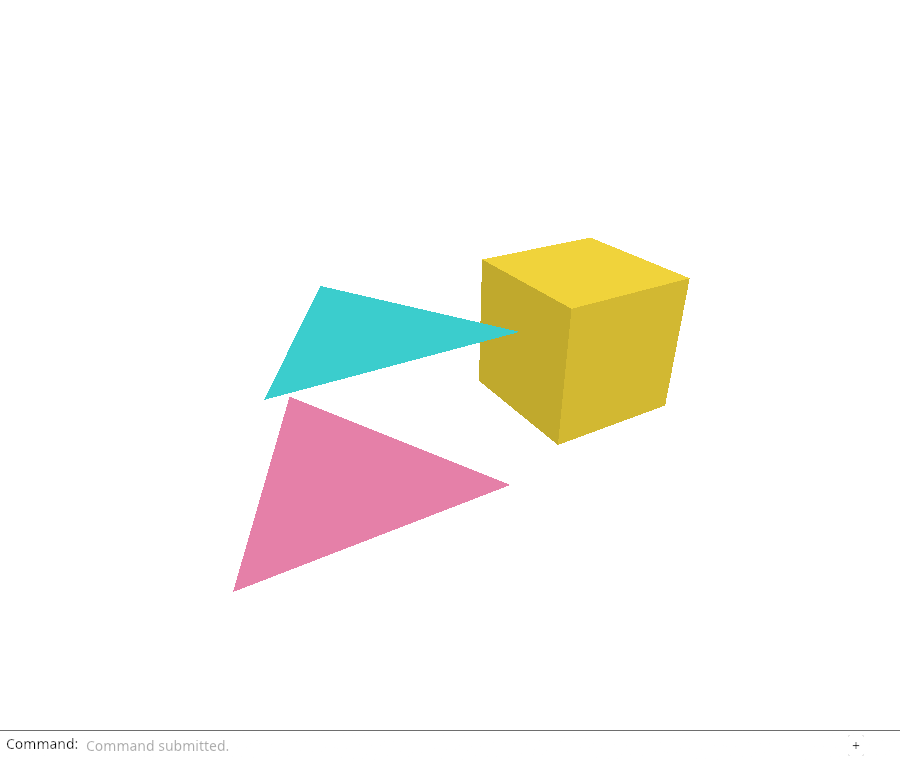
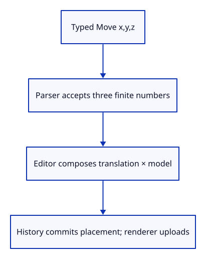

# 27c · Move a placed object with a typed offset

**Typing: 21–42 minutes.** [Estimate](typing-load.md).

The complete path is ready for a real command: local vertices, world queries and a GPU model matrix. Add Move x,y,z without adding a second editing owner.

The offset parser accepts exactly three comma-separated finite numbers. Spaces around those numbers are harmless. A missing coordinate, extra coordinate, NaN or infinity is an error. Result separates a valid offset from a useful explanation.

## Type

Continue from [Apply object placement on the GPU](27b-model.md). [Save or recover your work](recovery.md).

### 1. `src/lib.rs`

Register the small numeric parser.

<details>
<summary>Locate the existing block</summary>

```rust
pub mod editor;
```

</details>

Replace that block with:

```rust
--8<-- "journey/code/27c-move-01.rs"
```

### 2. `src/offset.rs`

Validate a complete numeric offset before it reaches the document.

Create the file and type:

```rust
--8<-- "journey/code/27c-move-02.rs"
```

### 3. `src/editor.rs`

Carry the offset as data in the existing Action enum.

<details>
<summary>Locate the existing block</summary>

```rust
    AddBox,
```

</details>

Replace that block with:

```rust
--8<-- "journey/code/27c-move-03.rs"
```

### 4. `src/editor.rs`

Move along world axes and commit one placement change through document history.

<details>
<summary>Locate the existing block</summary>

```rust
            Action::ToggleExtra => self.history.edit(&mut self.scene, Scene::toggle_extra),
```

</details>

Replace that block with:

```rust
--8<-- "journey/code/27c-move-04.rs"
```

### 5. `src/browser.rs`

Offer the named command in the dock vocabulary.

<details>
<summary>Locate the existing block</summary>

```rust
            "Fit Selected",
```

</details>

Replace that block with:

```rust
--8<-- "journey/code/27c-move-05.rs"
```

### 6. `src/panel.rs`

Recognize Move followed by arguments; the parser validates those arguments.

<details>
<summary>Locate the existing block</summary>

```rust
            .any(|name| name.eq_ignore_ascii_case(&line))
```

</details>

Replace that block with:

```rust
--8<-- "journey/code/27c-move-06.rs"
```

### 7. `src/panel.rs`

Replace the latest command’s answer without recording the line twice.

<details>
<summary>Locate the existing block</summary>

```rust
    pub fn update(
```

</details>

Replace that block with:

```rust
--8<-- "journey/code/27c-move-07.rs"
```

### 8. `src/browser.rs`

A valid offset becomes an Action; a parse error becomes a dock answer and still redraws.

<details>
<summary>Locate the existing block</summary>

```rust
            } else {
                let action = match line.as_str() {
```

</details>

Replace that block with:

```rust
--8<-- "journey/code/27c-move-08.rs"
```

### 9. `src/browser.rs`

Display editing failures in the command dock and continue to its normal redraw.

<details>
<summary>Locate the existing block</summary>

```rust
                Err(error) => {
                    report(error);
                    return;
                }
```

</details>

Replace that block with:

```rust
--8<-- "journey/code/27c-move-09.rs"
```

## Run and check

In your project:

```sh
cd workspace/journey
REGEN_PROTO=0 cargo build --lib --locked --target wasm32-unknown-unknown -j4
REGEN_PROTO=0 CARGO_BUILD_JOBS=4 trunk serve --port 8780
```

Open `http://127.0.0.1:8780/`. Keep an existing Trunk server running; saving rebuilds it.

Type `Select Next`, `Move 0.5,0,0`, then `Undo`. The selected object moves along world X and returns in one Undo step.

**Verified checkpoint in Chrome.**



[Verification scope](release.md).

Run the state checks from your project folder:

```sh
REGEN_PROTO=0 cargo test --lib --locked -j4
```

<details>
<summary>Code explanation and diagram</summary>

Editor asks for the selected stable ID, composes a world translation with its existing model, and submits Scene::place through History::try_edit. The local mesh is still shared. A zero offset changes nothing and does not create an undo entry.

The dock recognizes Move with arguments. It records the submitted line once; result replaces that line’s preliminary answer when parsing or editing fails. The browser still redraws the dock on an error, so an explanation is visible immediately. Later tool lessons will add Move with picked base/target points and command repetition. Today Move needs its complete offset on the line.

Move x,y,z → finite offset → Editor → history transaction → new placement → GPU upload.



Why is a world translation multiplied on the left of the existing placement?

The existing placement first takes a local point into world coordinates. The new translation then shifts that world point. Translation times existing placement moves along world axes; reversing their order can move along scaled or rotated local axes instead.

Study estimate, including typing and experiments: 1–2 hours.

</details>

<details>
<summary>Optional experiment</summary>

Run Move 0,0,0 followed by Undo. Explain why the zero offset creates no history entry. Try Move 1,2 and Move NaN,0,0: both must report an error without moving geometry. Restore the checkpoint before saving.

</details>

<details>
<summary>Check and save your work</summary>

Restore experimental edits, then run from `session_viewer`:

```sh
npm --prefix ../session_tests run course -- check 27c-move
npm --prefix ../session_tests run course -- save 27c-move
```

Source comparison leaves your project untouched. [Save and recovery instructions](recovery.md).

</details>

<details>
<summary>Viewer coverage and verification</summary>

The maintained viewer’s Move accepts a typed offset or starts a tool that collects points. This lesson completes the direct typed-offset route using the shared placement/history boundary. Interactive Move and repeating tools will extend it in the tool chapters.

Move a placed object with a typed offset. The actual command dock drives this checkpoint; the selected object is highlighted.

[Full validation scope](release.md).

To reproduce the scripted acceptance of the reference checkpoint, run from `session_viewer` with the [course bundle server](release.md#reproduce) running on port 8781:

```sh
npm --prefix ../session_tests run course -- capture 27c-move
```

This uses the verified reference bundle; it does not check or change your typed project.

</details>
