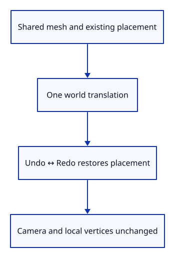
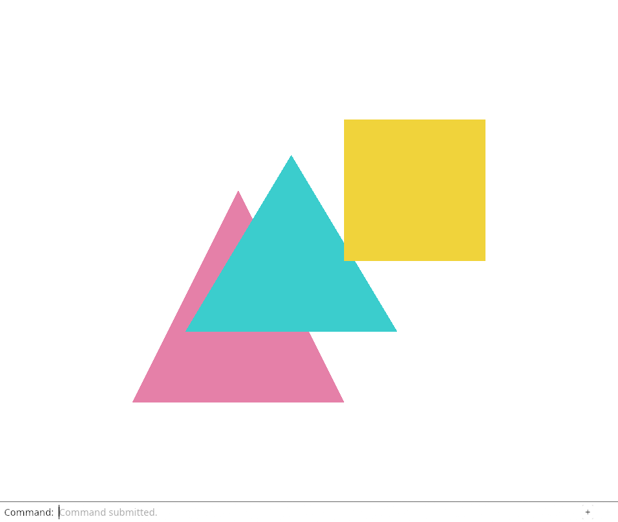

# 27d · Prove placement and history agree

**Combined study estimate: 1–2 hours.** Includes reading, typing, reasoning and experiments.

**Typing estimate: 22–44 minutes.** 52 added or changed lines; unchanged context is excluded. [How this is estimated](typing-load.md).

**Today:** Check that Move changes world placement, preserves local geometry, and remains one reversible transaction.

**Follow:** Parsed offset → world translation → shared mesh → Undo/Redo → identical placement.

The visible result is useful evidence, but a moved picture alone does not prove which data changed. These checks follow the values that future editing tools must preserve.

First parse valid and invalid lines. Then start with a scaled placement. A world-axis Move must shift its world point by the exact requested offset, regardless of that existing scale. Retain an Rc handle and compare local vertices as well as world coordinates.



Scene::place takes ownership of its Xform. Save the sixteen-value array before that call when a later assertion needs it. The array is Copy; the kernel Xform is not.

Undo must restore the complete old placement, and Redo must restore the moved placement. Insert invalid and zero moves between Undo and Redo: neither may discard the redo record. This is why a history transaction belongs in Editor rather than in a browser key handler.

## Type the change

Continue from [Move a placed object with a typed offset](27c-move.md). Save your own work first: `npm --prefix ../session_tests run course -- save before-27d-history` (from `session_viewer`).

### 1. `src/lib.rs`

Register the direct Move and history checks.

Find this exact block:

```rust
#[cfg(test)]
mod placement_tests;
```

Replace that block with:

```rust
--8<-- "journey/code/27d-history-01.rs"
```

### 2. `src/move_tests.rs`

Verify grammar, world-axis composition, shared geometry, failure/no-op history and selection.

Create the file and type:

```rust
--8<-- "journey/code/27d-history-02.rs"
```

## Run and look

From `session_viewer`, enter your project folder:

```sh
cd workspace/journey
REGEN_PROTO=0 cargo build --lib --locked --target wasm32-unknown-unknown -j4
REGEN_PROTO=0 CARGO_BUILD_JOBS=4 trunk serve --port 8780
```

Open `http://127.0.0.1:8780/`. If Trunk is already running in this project, leave it running; it rebuilds when you save.

Run the placement/history checks below. Move and Undo must change only placement, preserve shared local geometry, and treat a zero offset as no document edit.

**Verified checkpoint in Chrome.**



[What this screenshot checks](release.md).

Run the state checks from your project folder:

```sh
REGEN_PROTO=0 cargo test --lib --locked -j4
```

<details>
<summary>Optional experiment</summary>

Change the existing x scale in the world-axis test from 2 to 3. Predict the local-axis error you would see if the multiplication order were reversed. Confirm the existing implementation still shifts the world point by the same amount, then restore the test.

</details>

## Explain the change

What evidence distinguishes moving a placement from rewriting a mesh?

<details>
<summary>Compare your explanation</summary>

The world point shifts by the requested offset, the Rc allocation and local vertices stay identical, and Undo/Redo restore the placement while leaving the camera alone. Invalid input and zero movement must not consume the document’s redo or undo history.

</details>

## Keep your working result

Return to `session_viewer` in a second terminal. Restore experimental edits before comparing:

```sh
npm --prefix ../session_tests run course -- check 27d-history
npm --prefix ../session_tests run course -- save 27d-history
```

Check compares your typed source; run the focused check above for behavior. [Recover your work](recovery.md).

<details>
<summary>Where this fits in the finished viewer</summary>

These invariants carry into picked-point Move, Copy, Rotate, Scale, previews and cancellation. The production course must keep the same source/placement distinction while adding large scenes, instancing and incremental uploads.

</details>

<details>
<summary>Verification notes and browser acceptance</summary>

The native frame also projects a known point on the moved box, casts its picking ray, and samples the resulting GPU pixels. Chrome repeats the typed move/Undo/Redo picture round trip and checks visible errors. These are separate checks of state, shader presentation and event delivery. An exact edge click compares two different calculations—the CPU ray and GPU raster. Here we test an interior fragment; the later GPU-ID lesson covers exact raster ownership.

Prove placement and history agree. The actual command dock drives this checkpoint; the selected object is highlighted.

[Full validation scope](release.md).

To reproduce the scripted acceptance of the reference checkpoint, run from `session_viewer` with the [course bundle server](release.md#reproduce) running on port 8781:

```sh
npm --prefix ../session_tests run course -- capture 27d-history
```

This uses the verified reference bundle; it does not check or change your typed project.

</details>
