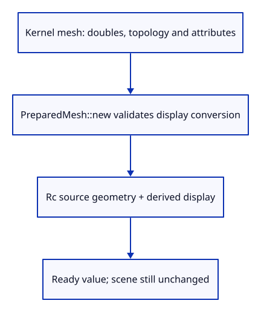
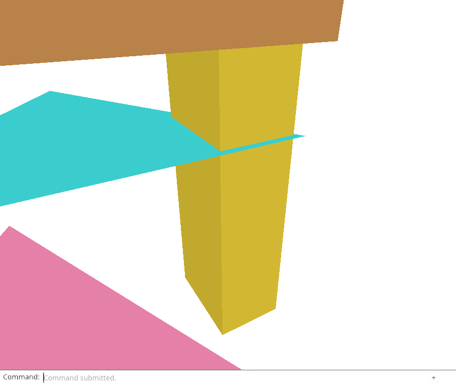

# 28 · Prepare a display from an owned source mesh

**Combined study estimate: 1–2 hours.** Includes reading, typing, reasoning and experiments.

**Typing estimate: 22–43 minutes.** 60 added or changed lines; unchanged context is excluded. [How this is estimated](typing-load.md).

**Today:** Give source geometry a shared owner and prepare its display before committing an object.

**In the whole viewer:** Connect the browser, drawing and input, then extend the same project. [See the destination](../journey.md#the-destination).

**Follow:** Kernel mesh → PreparedMesh → shared source geometry plus validated display arrays.

**Before you finish, explain:** Why must a save read the source mesh instead of the displayed vertex array?

The imported file has a retained source, but Example Box currently keeps only the arrays made for drawing. That would be a poor starting point for Save: a drawing buffer cannot recover all the source information.

Introduce PreparedMesh. It is a transit value between source construction and scene insertion. The kernel mesh is the source; display is a derived, validated adapter result. This checkpoint builds and tests that boundary. The next two lessons connect it to import and generated objects. The live scene still uses the previous insertion path today.



Rc shares one immutable kernel mesh between records and later history snapshots. Source remains optional provenance: generated geometry has no imported file, while an imported object can still refer to its original session and GUID. A missing file is not the same as missing geometry.

The constructor initializes the kernel mesh’s lazy GUID before handing it to shared owners. Then it calls the adapter we already wrote. The ? returns an adapter error before a PreparedMesh exists. No object ID or undo record is consumed by this preparation.

The precision check chooses a coordinate that is distinguishable as a double but rounds when cast to a float. This is intentional evidence that the two representations serve different purposes. It also checks that the source name and visibility/locking attributes survived preparation. Those attributes are retained here; their display and selection policies come in later small lessons.

The second check uses a finite double too large for a float. Preparation must return an error. Finite source coordinates alone do not prove the display can represent them.

## Type the change

Continue [Prove placement and history agree](27d-history.md). From `session_viewer`, save your files with `npm --prefix ../session_tests run course -- save before-28-record`. A save keeps your own work; it does not fill in the next lesson.

### 1. `src/prepared.rs`

Create the transit owner. Keep original kernel data beside the display prepared from it.

Create the file and type:

```rust
--8<-- "journey/code/28-record-01.rs"
```

### 2. `src/lib.rs`

Expose the preparation boundary without changing the running browser adapter.

Find this exact block:

```rust
pub mod mesh;
```

Replace that block with:

```rust
--8<-- "journey/code/28-record-02.rs"
```

### 3. `src/prepared_tests.rs`

Compare original doubles with the display, and retain name, flags and GUID through preparation.

Create the file and type:

```rust
--8<-- "journey/code/28-record-03.rs"
```

### 4. `src/lib.rs`

Compile the source checks in the native test build.

Find this exact block:

```rust
#[cfg(test)]
mod move_tests;
```

Replace that block with:

```rust
--8<-- "journey/code/28-record-04.rs"
```

## Run and look

From `session_viewer`, enter your project folder:

```sh
cd workspace/journey
cargo build --lib --locked --target wasm32-unknown-unknown -j4
CARGO_BUILD_JOBS=4 trunk serve --port 8780
```

Open `http://127.0.0.1:8780/`. If Trunk is already running in this project, leave it running; it rebuilds when you save.

Build and run the source-record checks. The source retains its exact double coordinate, name and flags; its display uses float coordinates. In the live viewer, Open your sample file, View Isometric, Select Next four times and Fit Selected. That existing picture is unchanged by adding the preparation type.

**Actual Chrome screenshot.**

Prepare a display from an owned source mesh. These commands run in the actual dock; kernel ownership is checked separately in Rust.



*Captured from this checkpoint’s browser bundle after its browser checks passed. [Check scope and environment](release.md).*

Run the state checks from your project folder:

```sh
cargo test --lib --locked -j4
```

## Try one small experiment

Change the precision check’s coordinate to 123456789.125 and predict the source and float values. Restore it. Explain why a clone of Rc keeps one source allocation while a float display still needs its own arrays.

## Explain it in your own words

Trace the values through the files without reading the answer first. If you lose the connection, stop at the last value you can follow.

<details>
<summary>Compare your explanation</summary>

The display array uses floats, triangle indices and draw colours. The kernel mesh keeps double coordinates, original topology, names, visibility and locking. PreparedMesh owns the kernel mesh and derives the display from it, so failure happens before the scene takes ownership.

</details>

## Keep your working result

Return to `session_viewer` in a second terminal. Restore experimental edits before comparing:

```sh
npm --prefix ../session_tests run course -- check 28-record
npm --prefix ../session_tests run course -- save 28-record
```

The comparison spots typing differences; it does not prove behaviour. Keep three notes: what I changed; the values I followed; the question I still have. [Recover a checkpoint](recovery.md) if an experiment gets tangled.

## Where this grows

The production viewer retains kernel source objects separately from upload tables. PreparedMesh makes the source-to-display boundary explicit; import and generated-object insertion adopt it next.

[Validation status and course release](release.md).
