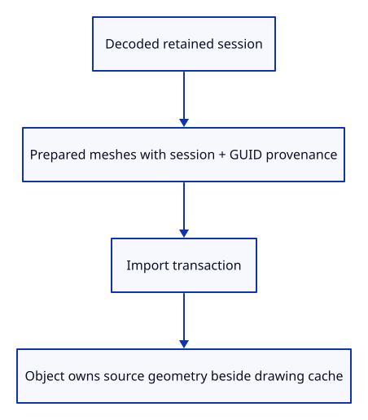
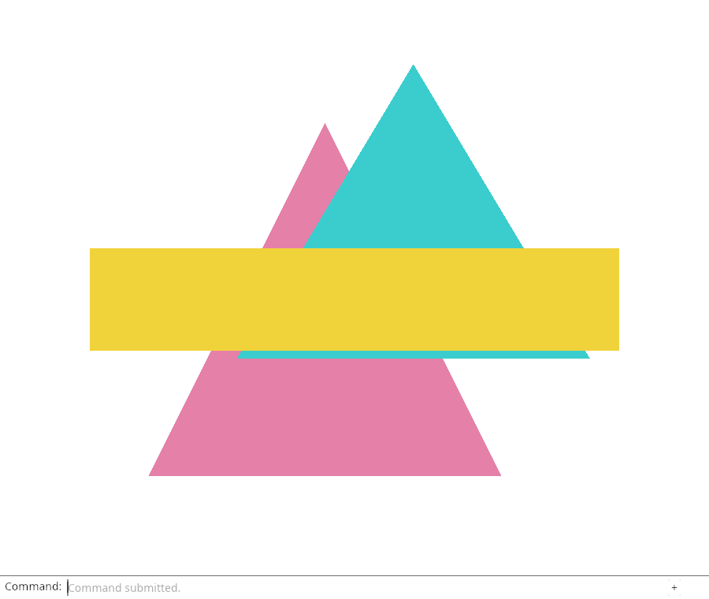

# 28a · Retain the imported mesh behind each row

**Combined study estimate: 1–2 hours.** Includes reading, typing, reasoning and experiments.

**Typing estimate: 16–32 minutes.** 34 added or changed lines; unchanged context is excluded. [How this is estimated](typing-load.md).

**Today:** Insert imported source geometry and its prepared display together.

**In the whole viewer:** Connect the browser, drawing and input, then extend the same project. [See the destination](../journey.md#the-destination).

**Follow:** Decoded session → prepared source/display pair → Object source geometry → history snapshot.

**Before you finish, explain:** If rows move after deletion, how can the object still find its source?

Now use the preparation boundary when loading. Loaded carries PreparedMesh values instead of a GUID/display tuple. Each prepared value retains the complete kernel mesh and its provenance before any scene insertion occurs.

The scene is in a short migration: imported objects get Some shared source geometry; our older hand-written demos and generated box still get None. The next lesson removes that temporary gap. The Option makes the current state explicit rather than pretending every existing object already has a source.



The kernel session already stores each mesh in an Rc. Rc::clone shares that same source allocation with the prepared value and later scene snapshots. No deep geometry copy is needed. The imported session remains intact: it holds file context such as the tree and document name. These are two related owners with different jobs.

Preparation may fail while decoding the supported subset. No scene has been touched then. Scene::import inserts each display and moves the corresponding source owners into that same object. History still wraps the entire import as one transaction.

Moving prepared.display transfers that field into the insertion function. Rust still lets this transit value transfer its other fields individually: geometry and source have not moved yet. The later complete insertion groups these transfers in one place.

## Type the change

Continue [Prepare a display from an owned source mesh](28-record.md). From `session_viewer`, save your files with `npm --prefix ../session_tests run course -- save before-28a-imported`. A save keeps your own work; it does not fill in the next lesson.

### 1. `src/document.rs`

Load source/display pairs rather than display arrays alone.

Find this exact block:

```rust
use crate::mesh::Mesh;
```

Replace that block with:

```rust
--8<-- "journey/code/28a-imported-01.rs"
```

### 2. `src/document.rs`

Retain the prepared geometry alongside its display.

Find this exact block:

```rust
    pub meshes: Vec<(String, Mesh)>,
```

Replace that block with:

```rust
--8<-- "journey/code/28a-imported-02.rs"
```

### 3. `src/document.rs`

Share the session’s existing kernel mesh owner, then attach retained file provenance.

Find this exact block:

```rust
        meshes.push((mesh.guid().to_owned(), Mesh::from_kernel(mesh)?));
```

Replace that block with:

```rust
--8<-- "journey/code/28a-imported-03.rs"
```

### 4. `src/scene.rs`

During migration, distinguish rows with source geometry from older demo rows.

Find this exact block:

```rust
    pub mesh: Rc<Mesh>,
```

Replace that block with:

```rust
--8<-- "journey/code/28a-imported-04.rs"
```

### 5. `src/scene.rs`

Keep the existing insertion path while imported rows begin retaining source geometry.

Find this exact block:

```rust
        self.objects.push(Object { id, mesh: Rc::new(mesh), model: session_rust::Xform::identity(), source: None });
```

Replace that block with:

```rust
--8<-- "journey/code/28a-imported-05.rs"
```

### 6. `src/scene.rs`

Keep each prepared display and source on the same stable object record.

Find this exact block:

```rust
        for (guid, mesh) in loaded.meshes {
            self.insert(mesh)?;
            self.objects.last_mut().unwrap().source = Some(crate::document::Source {
                document: Rc::clone(&loaded.document), guid,
            });
        }
```

Replace that block with:

```rust
--8<-- "journey/code/28a-imported-06.rs"
```

### 7. `src/imported_source_tests.rs`

Prove import shares the session’s existing source allocation even when earlier display rows disappear.

Create the file and type:

```rust
--8<-- "journey/code/28a-imported-07.rs"
```

### 8. `src/lib.rs`

Run the source allocation check at this intermediate checkpoint.

Find this exact block:

```rust
#[cfg(test)]
mod prepared_tests;
```

Replace that block with:

```rust
--8<-- "journey/code/28a-imported-08.rs"
```

## Run and look

From `session_viewer`, enter your project folder:

```sh
cd workspace/journey
cargo build --lib --locked --target wasm32-unknown-unknown -j4
CARGO_BUILD_JOBS=4 trunk serve --port 8780
```

Open `http://127.0.0.1:8780/`. If Trunk is already running in this project, leave it running; it rebuilds when you save.

Open your sample file, Select Next five times, View Orthographic and Fit Selected. The top beam is framed and selectable. Inspect the Rust checks: imported objects have source geometry even after their display row moves; Undo/Redo restores the same Rc owners.

**Actual Chrome screenshot.**

Retain the imported mesh behind each row. These commands run in the actual dock; kernel ownership is checked separately in Rust.



*Captured from this checkpoint’s browser bundle after its browser checks passed. [Check scope and environment](release.md).*

Run the state checks from your project folder:

```sh
cargo test --lib --locked -j4
```

## Try one small experiment

In the import test, remove both original demo IDs before inspecting the imported object. Its row number changes while its ObjectId, source GUID and geometry allocation remain stable. Restore the test before checking your files.

## Explain it in your own words

Trace the values through the files without reading the answer first. If you lose the connection, stop at the last value you can follow.

<details>
<summary>Compare your explanation</summary>

Source identity uses a retained session and GUID, not the row index. The object also directly owns the original kernel mesh through Rc. Its display can move to another row without changing either source owner.

</details>

## Keep your working result

Return to `session_viewer` in a second terminal. Restore experimental edits before comparing:

```sh
npm --prefix ../session_tests run course -- check 28a-imported
npm --prefix ../session_tests run course -- save 28a-imported
```

The comparison spots typing differences; it does not prove behaviour. Keep three notes: what I changed; the values I followed; the question I still have. [Recover a checkpoint](recovery.md) if an experiment gets tangled.

## Where this grows

The production scene keeps source identity through row replacement and compaction. This lesson connects source ownership to our smaller row table; generated objects adopt the same path next.

[Validation status and course release](release.md).
