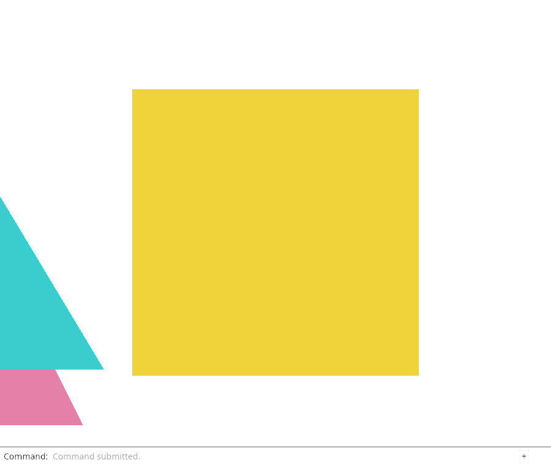
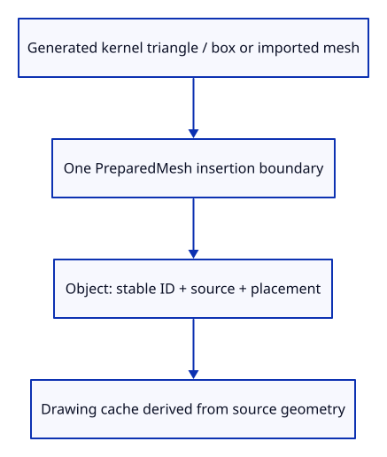

# 28b · Give generated objects the same source owner

**Typing: 16–31 minutes.** [Estimate](typing-load.md).

Close the migration. Demo triangles and the optional extra triangle are small kernel meshes; Example Box retains the kernel mesh it already creates. All enter through PreparedMesh. Every Object can now keep its source geometry, placement and optional file provenance independently of the drawing cache.

## Type

Continue from [Retain the imported mesh behind each row](28a-imported.md). [Save or recover your work](recovery.md).

### 1. `src/prepared.rs`

Create demo source geometry before deriving the drawing representation.

<details>
<summary>Locate the existing block</summary>

```rust
impl PreparedMesh {
```

</details>

Replace that block with:

```rust
--8<-- "journey/code/28b-generated-01.rs"
```

### 2. `src/scene.rs`

All insertion callers now supply prepared source geometry.

<details>
<summary>Locate the existing block</summary>

```rust
use crate::mesh::Mesh;
```

</details>

Replace that block with:

```rust
--8<-- "journey/code/28b-generated-02.rs"
```

### 3. `src/scene.rs`

Every current object has source geometry; only imported-file provenance stays optional.

<details>
<summary>Locate the existing block</summary>

```rust
    pub geometry: Option<Rc<session_rust::Mesh>>,
```

</details>

Replace that block with:

```rust
--8<-- "journey/code/28b-generated-03.rs"
```

### 4. `src/scene.rs`

Describe the same two triangles as source points and an object colour.

<details>
<summary>Locate the existing block</summary>

```rust
        let pink = Mesh::new(vec![
            [-0.7, -0.6, 0.25, 0.9, 0.25, 0.45],
            [ 0.5, -0.6, 0.25, 0.9, 0.25, 0.45],
            [-0.1,  0.6, 0.25, 0.9, 0.25, 0.45],
        ], vec![0, 1, 2]).expect("Valid pink triangle");
        let turquoise = Mesh::new(vec![
            [-0.4, -0.2, 0.75, 0.05, 0.7, 0.7],
            [ 0.8, -0.2, 0.75, 0.05, 0.7, 0.7],
            [ 0.2,  0.8, 0.75, 0.05, 0.7, 0.7],
        ], vec![0, 1, 2]).expect("Valid turquoise triangle");
```

</details>

Replace that block with:

```rust
--8<-- "journey/code/28b-generated-04.rs"
```

### 5. `src/scene.rs`

Consume one prepared value into one source-owning document record.

<details>
<summary>Locate the existing block</summary>

```rust
    pub fn insert(&mut self, mesh: Mesh) -> Result<ObjectId, &'static str> {
        let next = self.next_id.checked_add(1).ok_or("Object IDs exhausted")?;
        let id = ObjectId(self.next_id);
        self.next_id = next;
        self.objects.push(Object { id, mesh: Rc::new(mesh), geometry: None, model: session_rust::Xform::identity(), source: None });
        Ok(id)
    }
```

</details>

Replace that block with:

```rust
--8<-- "journey/code/28b-generated-05.rs"
```

### 6. `src/scene.rs`

Import uses the same complete record insertion as generated geometry.

<details>
<summary>Locate the existing block</summary>

```rust
        for prepared in loaded.meshes {
            self.insert(prepared.display)?;
            let object = self.objects.last_mut().unwrap();
            object.geometry = Some(prepared.geometry);
            object.source = prepared.source;
        }
```

</details>

Replace that block with:

```rust
--8<-- "journey/code/28b-generated-06.rs"
```

### 7. `src/scene.rs`

Retain the kernel box instead of keeping only its display.

<details>
<summary>Locate the existing block</summary>

```rust
        let id = self.insert(Mesh::from_kernel(&source)?)?;
```

</details>

Replace that block with:

```rust
--8<-- "journey/code/28b-generated-07.rs"
```

### 8. `src/scene.rs`

Keep source geometry for the optional triangle too.

<details>
<summary>Locate the existing block</summary>

```rust
            let extra = Mesh::new(vec![
                [-0.9, 0.3, 0.5, 0.2, 0.8, 0.3],
                [-0.4, 0.3, 0.5, 0.2, 0.8, 0.3],
                [-0.65, 0.9, 0.5, 0.2, 0.8, 0.3],
            ], vec![0, 1, 2]).expect("Valid extra triangle");
```

</details>

Replace that block with:

```rust
--8<-- "journey/code/28b-generated-08.rs"
```

### 9. `src/imported_source_tests.rs`

The source is now required, so remove the temporary Option unwrap in the check.

<details>
<summary>Locate the existing block</summary>

```rust
    let geometry = Rc::clone(imported.geometry.as_ref().unwrap());
```

</details>

Replace that block with:

```rust
--8<-- "journey/code/28b-generated-09.rs"
```

### 10. `src/imported_source_tests.rs`

Compare the required shared owner after its display row changes.

<details>
<summary>Locate the existing block</summary>

```rust
    assert!(Rc::ptr_eq(moved_row.geometry.as_ref().unwrap(), &geometry));
```

</details>

Replace that block with:

```rust
--8<-- "journey/code/28b-generated-10.rs"
```

## Run and check

In your project:

```sh
cd workspace/journey
REGEN_PROTO=0 cargo build --lib --locked --target wasm32-unknown-unknown -j4
REGEN_PROTO=0 CARGO_BUILD_JOBS=4 trunk serve --port 8780
```

Open `http://127.0.0.1:8780/`. Keep an existing Trunk server running; saving rebuilds it.

Type `Example Box`, then `Undo`. The generated box now uses the same source/display ownership as imported geometry and remains one reversible object.

**Verified checkpoint in Chrome.**



[Verification scope](release.md).

Run the state checks on your computer from your project folder:

```sh
REGEN_PROTO=0 cargo test --lib --locked --target host-tuple -j4
```

<details>
<summary>Code explanation and diagram</summary>

PreparedMesh::triangle creates three kernel Points and one triangular face. Color is an object attribute. The kernel stores its colour channels in bytes, so these demo colours are quantized before the display adapter reads them; a slight shade change is expected. This does not change the source/drawing ownership rule.

Change Scene::insert to consume a prepared value. The geometry goes to Object::geometry, display goes into the Rc drawing cache, and provenance goes to Object::source. Remove Option from geometry because every call now supplies it. Identity still initializes placement.

Example Box stops discarding its kernel mesh after conversion. Imported objects use the same insertion function, so import no longer patches source fields on the last inserted row. Bounds, picking, GPU matrices and Move keep the ownership conventions already established.

Kernel triangle or box → PreparedMesh → source-owning Object → derived display.



What does None provenance mean after every object owns kernel geometry?

It means the object was made here instead of imported from a file. It no longer means geometry is missing: Object::geometry is now a required shared source mesh. The display is derived from that source on the same insertion path.

Study estimate, including typing and experiments: 1–2 hours.

</details>

<details>
<summary>Optional experiment</summary>

Change PreparedMesh::triangle’s object colour, then compare its kernel colour with the uploaded display colour. Explain why the conversion may quantize channels and why changing the camera does not rewrite either geometry representation. Restore the original code.

</details>

<details>
<summary>Check and save your work</summary>

Restore experimental edits, then run from `session_viewer`:

```sh
npm --prefix ../session_tests run course -- check 28b-generated
npm --prefix ../session_tests run course -- save 28b-generated
```

Source comparison leaves your project untouched. [Save and recovery instructions](recovery.md).

</details>

<details>
<summary>Viewer coverage and verification</summary>

The maintained viewer creates and edits source geometry first, then synchronizes display tables. This checkpoint establishes that direction for every current mesh object. Later geometry families extend it without making GPU data the editable document.

Give generated objects the same source owner. These commands run in the actual dock; kernel ownership is checked separately in Rust.

[Full validation scope](release.md).

To reproduce the scripted acceptance of the reference checkpoint, run from `session_viewer` with the [course bundle server](release.md#reproduce) running on port 8781:

```sh
npm --prefix ../session_tests run course -- capture 28b-generated
```

This uses the verified reference bundle; it does not check or change your typed project.

</details>
