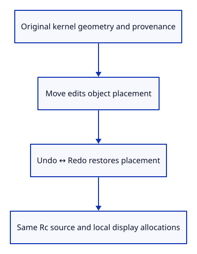
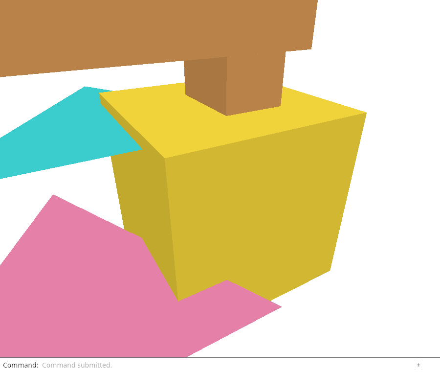

# 28c · Prove source ownership survives editing

**Combined study estimate: 1–2 hours.** Includes reading, typing, reasoning and experiments.

**Typing estimate: 20–40 minutes.** 46 added or changed lines; unchanged context is excluded. [How this is estimated](typing-load.md).

**Today:** Connect local source geometry, display caches, provenance and document history.

**In the whole viewer:** Connect the browser, drawing and input, then extend the same project. [See the destination](../journey.md#the-destination).

**Follow:** Source mesh plus placement → Move → Undo/Redo → same source allocation and identity.

**Before you finish, explain:** Which data must stay unchanged when Move edits only placement?

Now test the complete boundary rather than only the constructor. A moved object is still the same source shape. Its placement changes, but editing must not bake that placement into either the kernel vertices or drawing arrays.



The first check uses a generated box. It clones the Rc owners, records a source vertex and GUID, moves the box, then travels through history. Pointer equality proves we did not silently replace a source allocation with an equivalent copy.

The second check imports a file, removes the two original demo rows and asks again about the imported object by stable ID. The display row changes, but the owned source mesh still matches the source GUID and retained session.

Together with the preparation and import checks, these checks cover generated and imported source owners. Generated objects have geometry even without file provenance. Imported objects have both. These are the owners Save can use next; it must never rebuild source geometry from the float drawing cache.

## Type the change

Continue [Give generated objects the same source owner](28b-generated.md). From `session_viewer`, save your files with `npm --prefix ../session_tests run course -- save before-28c-ownership`. A save keeps your own work; it does not fill in the next lesson.

### 1. `src/source_tests.rs`

Check source and display allocations, original vertices, placement history and retained file provenance.

Create the file and type:

```rust
--8<-- "journey/code/28c-ownership-01.rs"
```

### 2. `src/lib.rs`

Compile the connected ownership checks with the current scene.

Find this exact block:

```rust
#[cfg(test)]
mod prepared_tests;
```

Replace that block with:

```rust
--8<-- "journey/code/28c-ownership-02.rs"
```

## Run and look

From `session_viewer`, enter your project folder:

```sh
cd workspace/journey
REGEN_PROTO=0 cargo build --lib --locked --target wasm32-unknown-unknown -j4
REGEN_PROTO=0 CARGO_BUILD_JOBS=4 trunk serve --port 8780
```

Open `http://127.0.0.1:8780/`. If Trunk is already running in this project, leave it running; it rebuilds when you save.

Open the sample file, Example Box, Select Next six times, Move -0.3,0,0, Undo, Redo, View Isometric and Fit Selected. The generated box moves and history restores its placement. Run the ownership checks to inspect source vertices, GUIDs and shared owners independently of the picture.

**Actual Chrome screenshot.**

Prove source ownership survives editing. These commands run in the actual dock; kernel ownership is checked separately in Rust.



*Captured from this checkpoint’s browser bundle after its browser checks passed. [Check scope and environment](release.md).*

Run the state checks from your project folder:

```sh
REGEN_PROTO=0 cargo test --lib --locked -j4
```

## Try one small experiment

In the generated-box check, add a second Move with a different offset and another Undo. Predict which placement is restored and why both Rc pointers stay identical. Restore the original checks afterward.

## Explain it in your own words

Trace the values through the files without reading the answer first. If you lose the connection, stop at the last value you can follow.

<details>
<summary>Compare your explanation</summary>

The original kernel vertices and attributes, the Rc source allocation, source GUID, imported session and local display arrays must remain unchanged. Undo and Redo change the placement stored in the document, while the camera stays where the user put it.

</details>

## Keep your working result

Return to `session_viewer` in a second terminal. Restore experimental edits before comparing:

```sh
npm --prefix ../session_tests run course -- check 28c-ownership
npm --prefix ../session_tests run course -- save 28c-ownership
```

The comparison spots typing differences; it does not prove behaviour. Keep three notes: what I changed; the values I followed; the question I still have. [Recover a checkpoint](recovery.md) if an experiment gets tangled.

## Where this grows

The production source transaction and display synchronization paths preserve document identity through moves, undo and row compaction. These checks establish the source owner for our current mesh subset; later save/load and additional geometry types extend it.

[Validation status and course release](release.md).
