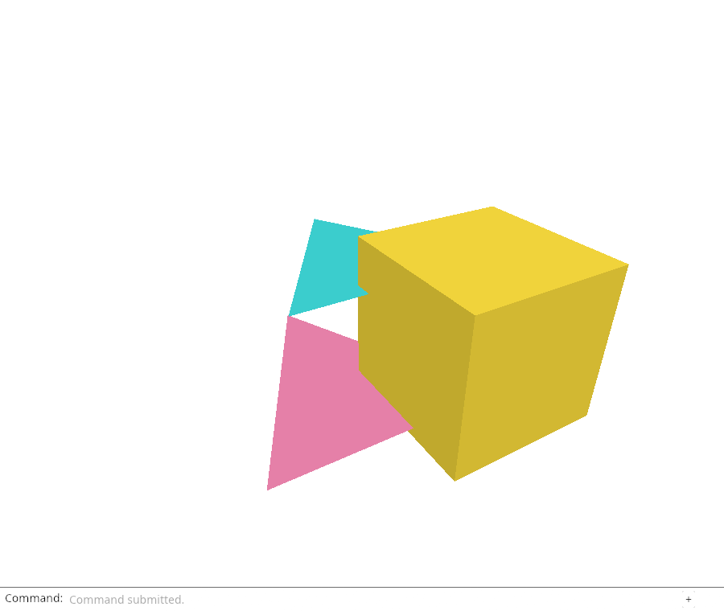
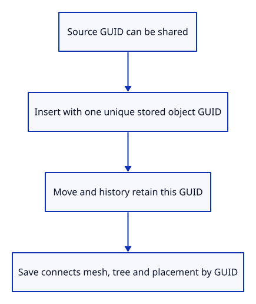

# 29 · Give each saved object a stable identity

**Typing: 19–38 minutes.** [Estimate](typing-load.md).

Give each inserted object a stored GUID for saving. Local `ObjectId` still identifies the editor object; imported source GUID still identifies its original geometry.

Prefer the geometry GUID when unused. Duplicate imports receive a new UUID without changing their original source mesh or provenance. Check even generated candidates against live objects.

## Type

Continue from [Prove source ownership survives editing](28c-ownership.md). [Save or recover your work](recovery.md).

### 1. `Cargo.toml`

Declare the UUID generator explicitly; browser randomness uses its js feature.

<details>
<summary>Locate the existing block</summary>

```toml
prost = "=0.14.4"
```

</details>

Replace that block with:

```toml
--8<-- "journey/code/29-identity-01.toml"
```

### 2. `src/scene.rs`

Store the inserted object identity separately from kernel source identity and the local counter.

<details>
<summary>Locate the existing block</summary>

```rust
    pub id: ObjectId,
```

</details>

Replace that block with:

```rust
--8<-- "journey/code/29-identity-02.rs"
```

### 3. `src/scene.rs`

Keep the source GUID when available; assign and check a fresh stored GUID for a duplicate import.

<details>
<summary>Locate the existing block</summary>

```rust
        self.objects.push(Object { id, mesh: Rc::new(prepared.display), geometry: prepared.geometry,
```

</details>

Replace that block with:

```rust
--8<-- "journey/code/29-identity-03.rs"
```

### 4. `src/file_identity_tests.rs`

Exercise duplicate imports, row removal and history without mutating original source GUIDs.

Create the file and type:

```rust
--8<-- "journey/code/29-identity-04.rs"
```

### 5. `src/lib.rs`

Compile the file-identity regression check.

<details>
<summary>Locate the existing block</summary>

```rust
#[cfg(test)]
mod source_tests;
```

</details>

Replace that block with:

```rust
--8<-- "journey/code/29-identity-05.rs"
```

## Run and check

After typing the manifest, run this from `session_viewer` to select the fixed dependency versions. It updates Cargo.lock, preserves the previous lock, and installs any supplied binary font assets. It does not write implementation code:

```sh
npm --prefix ../session_tests run course -- dependencies 29-identity
```

In your project:

```sh
cd workspace/journey
REGEN_PROTO=0 cargo build --lib --locked --target wasm32-unknown-unknown -j4
REGEN_PROTO=0 CARGO_BUILD_JOBS=4 trunk serve --port 8780
```

Open `http://127.0.0.1:8780/`. Keep an existing Trunk server running; saving rebuilds it.

Import `sample.pb` twice. Run the identity checks: copies may share a source GUID, but each scene object must have its own saved identity.

**Verified checkpoint in Chrome.**



[Verification scope](release.md).

Run the state checks on your computer from your project folder:

```sh
REGEN_PROTO=0 cargo test --lib --locked --target host-tuple -j4
```

<details>
<summary>Code explanation and diagram</summary>

Assign identity once at insertion. History clones the stored `String`; Move and Save must not regenerate it.

The duplicate-import test checks distinct object GUIDs and unchanged source GUIDs, then removes an earlier row and travels through Undo/Redo. Download is connected later.

Source GUID → inserted object GUID → cloned history → stable file identity.



Why can two imports share a source GUID but need different saved GUIDs?

The source GUID identifies geometry in an original file. Two imports create two scene objects with separate placements and histories. Each needs a unique stored identity. We preserve the source GUID when available, assign a fresh UUID on collision, and store that decision in the object so saving or row changes cannot rename it.

Study estimate, including typing and experiments: 1–2 hours.

</details>

<details>
<summary>Optional experiment</summary>

Inspect both imported copies’ source GUIDs and object GUIDs in the check. Predict which pair matches. Add another Undo/Redo cycle, then restore the check.

</details>

<details>
<summary>Check and save your work</summary>

Restore experimental edits, then run from `session_viewer`:

```sh
npm --prefix ../session_tests run course -- check 29-identity
npm --prefix ../session_tests run course -- save 29-identity
```

Source comparison leaves your project untouched. [Save and recovery instructions](recovery.md).

</details>

<details>
<summary>Viewer coverage and verification</summary>

The production viewer keeps unique object identity in editable sessions and distinguishes it from shared definitions or source references. Our flat mesh editor establishes that boundary before serializing placements.


[Full validation scope](release.md).

To reproduce the scripted acceptance of the reference checkpoint, run from `session_viewer` with the [course bundle server](release.md#reproduce) running on port 8781:

```sh
npm --prefix ../session_tests run course -- capture 29-identity
```

This uses the verified reference bundle; it does not check or change your typed project.

</details>
