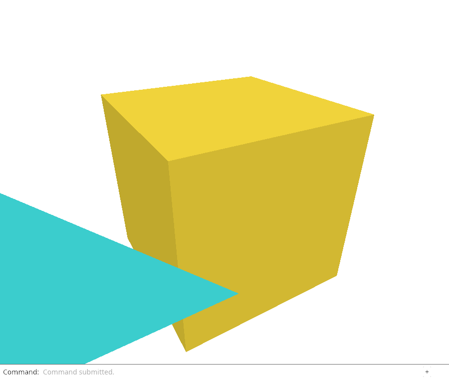
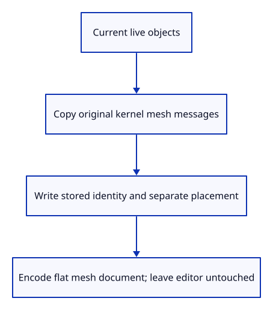

# 29a · Write a snapshot from the editable sources

**Typing: 30–60 minutes.** [Estimate](typing-load.md).

Build Save bytes from live scene objects, including generated and edited objects and excluding deleted rows.

Copy each source mesh's protobuf message, preserving doubles, topology, colours, names and flags. Replace only the copy's GUID with the stored object identity. Keep geometry local and write placement separately, keyed by that same GUID; baking both would move it twice.

## Type

Continue from [Give each saved object a stable identity](29-identity.md). [Save or recover your work](recovery.md).

### 1. `src/document.rs`

Copy live sources into one bounded flat document, write placements separately and return bytes without editor mutation.

<details>
<summary>Locate the existing block</summary>

```rust
fn validate(message: &proto::Session) -> Result<(), &'static str> {
```

</details>

Replace that block with:

```rust
--8<-- "journey/code/29a-snapshot-01.rs"
```

### 2. `src/snapshot_tests.rs`

Check live row membership, source topology/attributes, separate placement and untouched history.

Create the file and type:

```rust
--8<-- "journey/code/29a-snapshot-02.rs"
```

### 3. `src/lib.rs`

Compile the read-only snapshot checks.

<details>
<summary>Locate the existing block</summary>

```rust
#[cfg(test)]
mod file_identity_tests;
```

</details>

Replace that block with:

```rust
--8<-- "journey/code/29a-snapshot-03.rs"
```

## Run and check

In your project:

```sh
cd workspace/journey
REGEN_PROTO=0 cargo build --lib --locked --target wasm32-unknown-unknown -j4
REGEN_PROTO=0 CARGO_BUILD_JOBS=4 trunk serve --port 8780
```

Open `http://127.0.0.1:8780/`. Keep an existing Trunk server running; saving rebuilds it.

Run the snapshot checks below. Serialization must read original source coordinates and separate placements without changing the live editor. Browser Save is connected in lesson 29d.

**Verified checkpoint in Chrome.**



[Verification scope](release.md).

Run the state checks on your computer from your project folder:

```sh
REGEN_PROTO=0 cargo test --lib --locked --target host-tuple -j4
```

<details>
<summary>Code explanation and diagram</summary>

This snapshot writes a flat tree. Camera, selection, display arrays and history are application state and stay outside the file.

Match the current loader's bounds: 1–64 meshes and at most 4 MiB encoded. Reject unsupported source data. Today Rust checks inspect the snapshot; placement loading and browser downloading follow.

Live objects → source protobuf copies + object GUIDs → flat tree and placements → bytes.



Why must saving copy source messages instead of modifying the retained session?

The retained file can contain objects that have since been deleted, and imported source allocations are shared through history. Saving traverses current objects and copies their source messages. It applies the inserted object GUID to each copy and writes placement separately, leaving the original geometry, history and file provenance unchanged.

Study estimate, including typing and experiments: 1–2 hours.

</details>

<details>
<summary>Optional experiment</summary>

Change the box placement in the check, then predict whether mesh vertices or the XformEntry changes. Confirm the retained source GUID stays unchanged and restore the check.

</details>

<details>
<summary>Check and save your work</summary>

Restore experimental edits, then run from `session_viewer`:

```sh
npm --prefix ../session_tests run course -- check 29a-snapshot
npm --prefix ../session_tests run course -- save 29a-snapshot
```

Source comparison leaves your project untouched. [Save and recovery instructions](recovery.md).

</details>

<details>
<summary>Viewer coverage and verification</summary>

The production serializer combines editable source objects and placements rather than reading GPU buffers. This checkpoint covers a deliberately bounded flat-mesh document; complete trees, geometry families and metadata arrive later.


[Full validation scope](release.md).

To reproduce the scripted acceptance of the reference checkpoint, run from `session_viewer` with the [course bundle server](release.md#reproduce) running on port 8781:

```sh
npm --prefix ../session_tests run course -- capture 29a-snapshot
```

This uses the verified reference bundle; it does not check or change your typed project.

</details>
