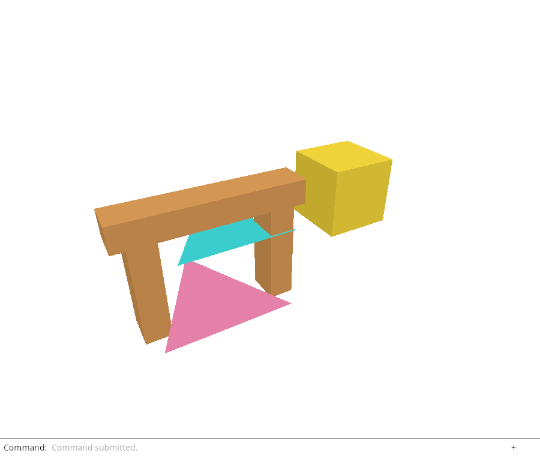
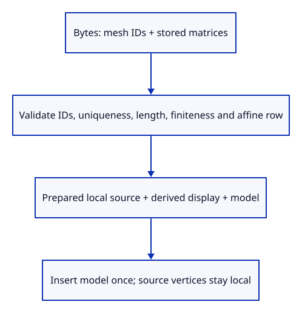

# 29b · Reopen source geometry with its placement

**Typing: 24–48 minutes.** [Estimate](typing-load.md).

Accept the saved file's separate placement records. Each must identify an existing mesh, occur once, and contain sixteen finite values with an affine final row.

## Type

Continue from [Write a snapshot from the editable sources](29a-snapshot.md). [Save or recover your work](recovery.md).

### 1. `src/placement.rs`

Use one affine validation rule for decoded matrices and direct edits.

Create the file and type:

```rust
--8<-- "journey/code/29b-placements-01.rs"
```

### 2. `src/lib.rs`

Expose the shared matrix validator.

<details>
<summary>Locate the existing block</summary>

```rust
pub mod prepared;
```

</details>

Replace that block with:

```rust
--8<-- "journey/code/29b-placements-02.rs"
```

### 3. `src/scene.rs`

Make direct placement edits use the same rule as imported files.

<details>
<summary>Locate the existing block</summary>

```rust
        if !model.m.iter().all(|v| v.is_finite())
            || [model.m[3], model.m[7], model.m[11], model.m[15]] != [0.0, 0.0, 0.0, 1.0]
```

</details>

Replace that block with:

```rust
--8<-- "journey/code/29b-placements-03.rs"
```

### 4. `src/prepared.rs`

Carry the validated object placement beside local source geometry.

<details>
<summary>Locate the existing block</summary>

```rust
    pub source: Option<Source>,
```

</details>

Replace that block with:

```rust
--8<-- "journey/code/29b-placements-04.rs"
```

### 5. `src/prepared.rs`

Generated geometry begins with identity placement.

<details>
<summary>Locate the existing block</summary>

```rust
        Ok(Self { geometry, display, source: None })
```

</details>

Replace that block with:

```rust
--8<-- "journey/code/29b-placements-05.rs"
```

### 6. `src/document.rs`

Retain the validated stored placement without baking it into source vertices.

<details>
<summary>Locate the existing block</summary>

```rust
        let mut prepared = PreparedMesh::from_shared(Rc::clone(mesh))?;
```

</details>

Replace that block with:

```rust
--8<-- "journey/code/29b-placements-06.rs"
```

### 7. `src/scene.rs`

Insert each prepared model exactly once.

<details>
<summary>Locate the existing block</summary>

```rust
            model: session_rust::Xform::identity(), source: prepared.source });
```

</details>

Replace that block with:

```rust
--8<-- "journey/code/29b-placements-07.rs"
```

### 8. `src/document.rs`

Remove the temporary source-only validation comment.

Find this exact block:

```rust
    // Source validation; placements come next.
```

Delete this block.

### 9. `src/document.rs`

Validate the complete saved message now that the loader accepts placements.

<details>
<summary>Locate the existing block</summary>

```rust
    let mut geometry = message.clone(); geometry.xforms.clear();
    validate(&geometry)?;
```

</details>

Replace that block with:

```rust
--8<-- "journey/code/29b-placements-09.rs"
```

### 10. `src/document.rs`

Accept placements while keeping the other unsupported source families explicit.

<details>
<summary>Locate the existing block</summary>

```rust
    if !message.xforms.is_empty() || message.definitions.is_some() || !message.interactions.is_empty() {
        return Err("Placements, definitions and interactions arrive in later checkpoints");
```

</details>

Replace that block with:

```rust
--8<-- "journey/code/29b-placements-10.rs"
```

### 11. `src/document.rs`

Reject unknown, duplicate, incomplete, non-finite or projective placement records before kernel construction.

<details>
<summary>Locate the existing block</summary>

```rust
    if let Some(root) = message.tree.as_ref().and_then(|tree| tree.root.as_ref()) {
```

</details>

Replace that block with:

```rust
--8<-- "journey/code/29b-placements-11.rs"
```

### 12. `src/placement_load_tests.rs`

Reject all malformed placement families using actual encoded messages.

Create the file and type:

```rust
--8<-- "journey/code/29b-placements-12.rs"
```

### 13. `src/lib.rs`

Compile the malformed-input checks.

<details>
<summary>Locate the existing block</summary>

```rust
#[cfg(test)]
mod snapshot_tests;
```

</details>

Replace that block with:

```rust
--8<-- "journey/code/29b-placements-13.rs"
```

## Run and check

In your project:

```sh
cd workspace/journey
REGEN_PROTO=0 cargo build --lib --locked --target wasm32-unknown-unknown -j4
REGEN_PROTO=0 CARGO_BUILD_JOBS=4 trunk serve --port 8780
```

Open `http://127.0.0.1:8780/`. Keep an existing Trunk server running; saving rebuilds it.

Run the reopen checks below. Valid stored placements restore the objects; an invalid matrix must reject the document before changing live rows.

**Verified checkpoint in Chrome.**



[Verification scope](release.md).

Run the state checks on your computer from your project folder:

```sh
REGEN_PROTO=0 cargo test --lib --locked --target host-tuple -j4
```

<details>
<summary>Code explanation and diagram</summary>

Share this rule through `placement::valid` for loading and scene placement. Validate before constructing `Xform`: its defaults must not silently fill a short file matrix.

`PreparedMesh` now carries a model matrix. Generated geometry starts at identity; loading copies the validated source placement; insertion retains it.

Snapshot and load now use the same complete validator. Tests reject short, non-finite or projective matrices and orphan or duplicate placement entries before scene mutation. Exact round-trip checks come next; the browser download follows those.

Bytes → validated mesh IDs and affine matrices → prepared local sources plus placement → inserted objects.



Where must a saved transform be applied when reopening?

A saved transform belongs to the object placement. Load prepares the original local kernel mesh and attaches its validated matrix. Scene insertion uses that matrix once. It must not transform source vertices and also retain the placement, or the object moves twice.

Study estimate, including typing and experiments: 1–2 hours.

</details>

<details>
<summary>Optional experiment</summary>

Change the malformed-placement check’s projective matrix into a finite translation. Predict why validation accepts it, then restore the rejection case. Explain why a fifteen-value matrix remains invalid even if every supplied value is finite.

</details>

<details>
<summary>Check and save your work</summary>

Restore experimental edits, then run from `session_viewer`:

```sh
npm --prefix ../session_tests run course -- check 29b-placements
npm --prefix ../session_tests run course -- save 29b-placements
```

Source comparison leaves your project untouched. [Save and recovery instructions](recovery.md).

</details>

<details>
<summary>Viewer coverage and verification</summary>

The production session stores local placements keyed by object GUID and composes nested tree transforms later. This checkpoint handles one flat level and rejects unsupported definitions and interactions.


[Full validation scope](release.md).

To reproduce the scripted acceptance of the reference checkpoint, run from `session_viewer` with the [course bundle server](release.md#reproduce) running on port 8781:

```sh
npm --prefix ../session_tests run course -- capture 29b-placements
```

This uses the verified reference bundle; it does not check or change your typed project.

</details>
