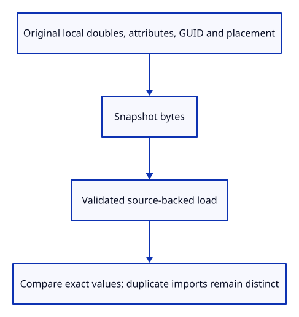
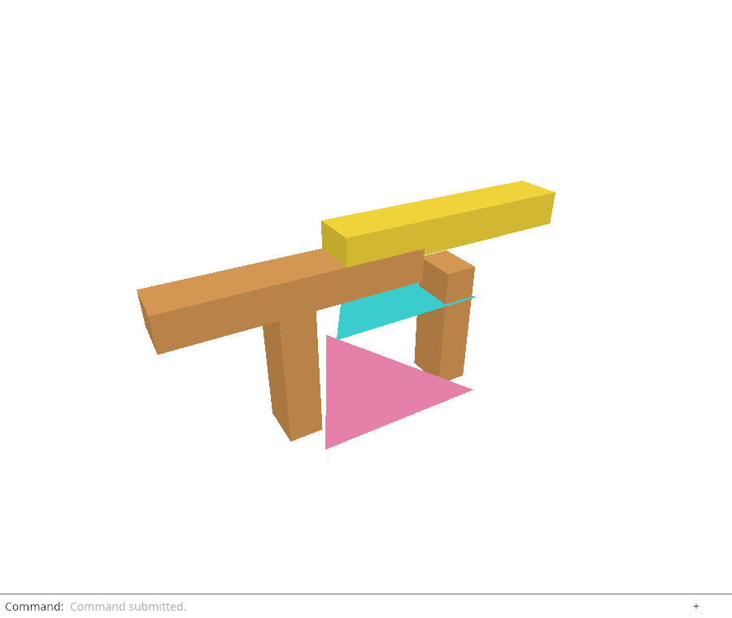

# 29c · Prove the saved document reopens faithfully

**Combined study estimate: 1–2 hours.** Includes reading, typing, reasoning and experiments.

**Typing estimate: 23–46 minutes.** 47 added or changed lines; unchanged context is excluded. [How this is estimated](typing-load.md).

**Today:** Check exact local source data, attributes, identities and placement through saving and loading.

**Follow:** Live source and placement → snapshot bytes → load → identical source values and object matrices.

Before adding the download, verify the document bytes independently of browser APIs. The same public snapshot and load functions serve the tests and the coming Save command.



The first check clears the demos and inserts a triangle at a coordinate distinguishable in double precision but rounded by its display. Give it a name, hide and lock attributes, and a translation. Saving and reopening must retain all of those source values exactly. The drawing is derived again, while placement remains separate.

The second check imports the same file twice and saves the live objects. The reopened mesh GUIDs must match each inserted object’s stored GUID, including the fork assigned to a duplicate import. Each prepared placement must match its original object matrix. The retained imported source remains untouched.

These checks use structural equality after decoding. A protobuf map need not emit bytes in the same order every time, so comparing file bytes would test an unrelated ordering rule. They also avoid treating pixels as evidence of double precision or identity.

Flags are retained here. A hidden source is not yet filtered from our tutorial drawing; a locked source is not yet excluded from editing. Later lessons connect those policies across the tree, selection and saving.

## Type the change

Continue from [Reopen source geometry with its placement](29b-placements.md). Save your own work first: `npm --prefix ../session_tests run course -- save before-29c-roundtrip` (from `session_viewer`).

### 1. `src/save_roundtrip_tests.rs`

Compare exact source values, stored identities and object matrices after encoding and decoding.

Create the file and type:

```rust
--8<-- "journey/code/29c-roundtrip-01.rs"
```

### 2. `src/lib.rs`

Compile exact document round-trip checks.

Find this exact block:

```rust
#[cfg(test)]
mod placement_load_tests;
```

Replace that block with:

```rust
--8<-- "journey/code/29c-roundtrip-02.rs"
```

## Run and look

From `session_viewer`, enter your project folder:

```sh
cd workspace/journey
REGEN_PROTO=0 cargo build --lib --locked --target wasm32-unknown-unknown -j4
REGEN_PROTO=0 CARGO_BUILD_JOBS=4 trunk serve --port 8780
```

Open `http://127.0.0.1:8780/`. If Trunk is already running in this project, leave it running; it rebuilds when you save.

Run the round-trip checks below. Reopened geometry must retain exact doubles, attributes, saved identities and placements. Compare the source values, not the float display.

**Verified checkpoint in Chrome.**



[What this screenshot checks](release.md).

Run the state checks from your project folder:

```sh
REGEN_PROTO=0 cargo test --lib --locked -j4
```

<details>
<summary>Optional experiment</summary>

Change the exact coordinate to 123456789.125. Predict why the reopened kernel coordinate matches exactly even though the display uses floats. Then inspect corresponding imported copies’ saved GUIDs. Restore the checks.

</details>

## Explain the change

What can a screenshot prove about saved precision and identity?

<details>
<summary>Compare your explanation</summary>

A screenshot proves the drawing, not exact saved doubles or identifiers. Native round-trip checks compare original vertices, names, attributes, GUIDs and matrices. Duplicate-import checks also ensure separate objects survive one saved file even when they came from the same source GUID.

</details>

## Keep your working result

Return to `session_viewer` in a second terminal. Restore experimental edits before comparing:

```sh
npm --prefix ../session_tests run course -- check 29c-roundtrip
npm --prefix ../session_tests run course -- save 29c-roundtrip
```

Check compares your typed source; run the focused check above for behavior. [Recover your work](recovery.md).

<details>
<summary>Where this fits in the finished viewer</summary>

The production viewer preserves editable source data through save/reopen and assigns distinct identities to inserted copies. These bounded flat-mesh tests establish that contract before browser downloading or full geometry families.

</details>

<details>
<summary>Verification notes and browser acceptance</summary>


[Full validation scope](release.md).

To reproduce the scripted acceptance of the reference checkpoint, run from `session_viewer` with the [course bundle server](release.md#reproduce) running on port 8781:

```sh
npm --prefix ../session_tests run course -- capture 29c-roundtrip
```

This uses the verified reference bundle; it does not check or change your typed project.

</details>
