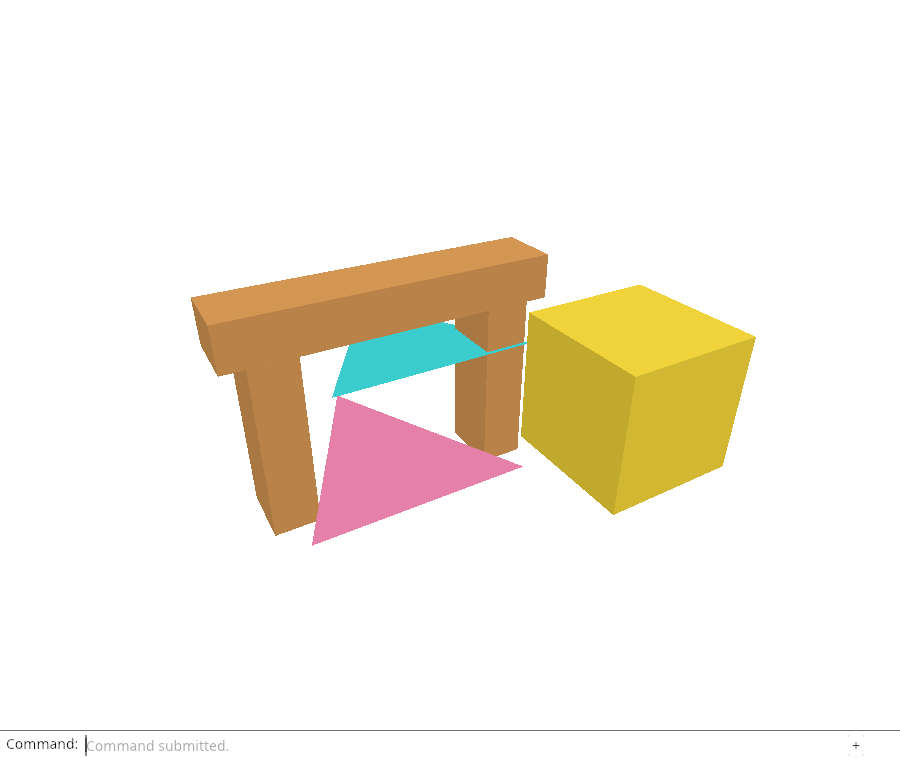
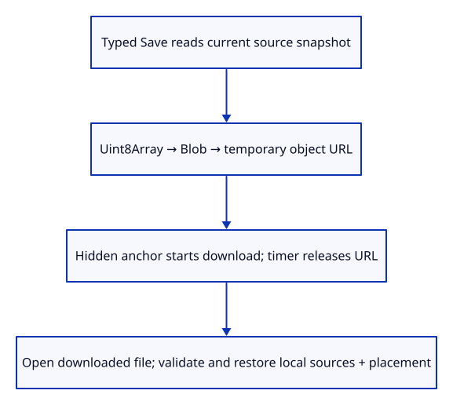

# 29d · Download the editable document from the command line

**Typing: 24–47 minutes.** [Estimate](typing-load.md).

Connect typed `Save` to `snapshot` and a browser download. Snapshot errors go to command history and start no download.

## Type

Continue from [Prove the saved document reopens faithfully](29c-roundtrip.md). [Save or recover your work](recovery.md).

### 1. `Cargo.toml`

Enable the browser object URL and download anchor APIs. These features do not change dependency versions.

<details>
<summary>Locate the existing block</summary>

```toml
web-sys = { version = "=0.3.105", features = ["Window", "Document", "Element", "HtmlCanvasElement", "EventTarget", "AddEventListenerOptions", "Event", "MouseEvent", "PointerEvent", "DomRect", "KeyboardEvent", "WheelEvent", "AddEventListenerOptions", "HtmlElement", "HtmlInputElement", "File", "FileList", "Blob", "CustomEvent", "CustomEventInit", "FocusOptions"] }
```

</details>

Replace that block with:

```toml
--8<-- "journey/code/29d-save-01.toml"
```

### 2. `src/file_output.rs`

Create a temporary file owner, request a download and schedule one-shot URL cleanup.

Create the file and type:

```rust
--8<-- "journey/code/29d-save-02.rs"
```

### 3. `src/lib.rs`

Expose the browser file-output adapter.

<details>
<summary>Locate the existing block</summary>

```rust
mod file_input;
```

</details>

Replace that block with:

```rust
--8<-- "journey/code/29d-save-03.rs"
```

### 4. `src/browser.rs`

Offer Save through command completion in the actual dock.

<details>
<summary>Locate the existing block</summary>

```rust
            "Open",
```

</details>

Replace that block with:

```rust
--8<-- "journey/code/29d-save-04.rs"
```

### 5. `src/browser.rs`

Read the scene for Save without creating a document action or consuming history.

<details>
<summary>Locate the existing block</summary>

```rust
            } else if line == "move" || line.starts_with("move ") {
```

</details>

Replace that block with:

```rust
--8<-- "journey/code/29d-save-05.rs"
```

### 6. `index.html`

Let the native file picker offer both original specimens and downloaded session files.

<details>
<summary>Locate the existing block</summary>

```html
  <input id="open" type="file" accept=".pb" hidden>
```

</details>

Replace that block with:

```html
--8<-- "journey/code/29d-save-06.html"
```

## Run and check

In your project:

```sh
cd workspace/journey
REGEN_PROTO=0 cargo build --lib --locked --target wasm32-unknown-unknown -j4
REGEN_PROTO=0 CARGO_BUILD_JOBS=4 trunk serve --port 8780
```

Open `http://127.0.0.1:8780/`. Keep an existing Trunk server running; saving rebuilds it.

Open `sample.pb`, select an object and move it. Type `Save`, then reopen the downloaded `viewer.session`. The placed scene should return; Save itself must not consume Undo.

**Verified checkpoint in Chrome.**



[Verification scope](release.md).

Run the state checks on your computer from your project folder:

```sh
REGEN_PROTO=0 cargo test --lib --locked --target host-tuple -j4
```

<details>
<summary>Code explanation and diagram</summary>

Copy bytes into `Uint8Array`, wrap them in `Blob`, and create an object URL. A temporary hidden anchor downloads `viewer.session` and is removed; it is not a viewer feature control.

Keep the URL alive for ten seconds, then revoke it with a one-shot callback owning its `String`. If timer scheduling fails, clean up immediately and report the error.

Save reads the document without creating a history edit. The Chrome check downloads and reopens that file, preserving the prior Move's Undo/Redo and the reconstructed scene picture.

Typed Save → source snapshot → Blob URL → download → Open → restored source and placement.



Why does Save belong outside document history?

Save reads the current scene and creates bytes; it does not edit geometry, placement or selection. It must not consume an Undo step. The browser owns file downloading, while the native snapshot and loader own the document contract.

Study estimate, including typing and experiments: 1–2 hours.

</details>

<details>
<summary>Optional experiment</summary>

Save after moving the box, then move it again and save to a second file. Reopen each into a cleared scene and predict which placement it restores. Saving should leave the next Undo step unchanged.

</details>

<details>
<summary>Check and save your work</summary>

Restore experimental edits, then run from `session_viewer`:

```sh
npm --prefix ../session_tests run course -- check 29d-save
npm --prefix ../session_tests run course -- save 29d-save
```

Source comparison leaves your project untouched. [Save and recovery instructions](recovery.md).

</details>

<details>
<summary>Viewer coverage and verification</summary>

The production Save command downloads the complete editable scene. This lesson connects a real browser download to our flat mesh serializer; complete trees and geometry families still require later chapters.


[Full validation scope](release.md).

To reproduce the scripted acceptance of the reference checkpoint, run from `session_viewer` with the [course bundle server](release.md#reproduce) running on port 8781:

```sh
npm --prefix ../session_tests run course -- capture 29d-save
```

This uses the verified reference bundle; it does not check or change your typed project.

</details>
