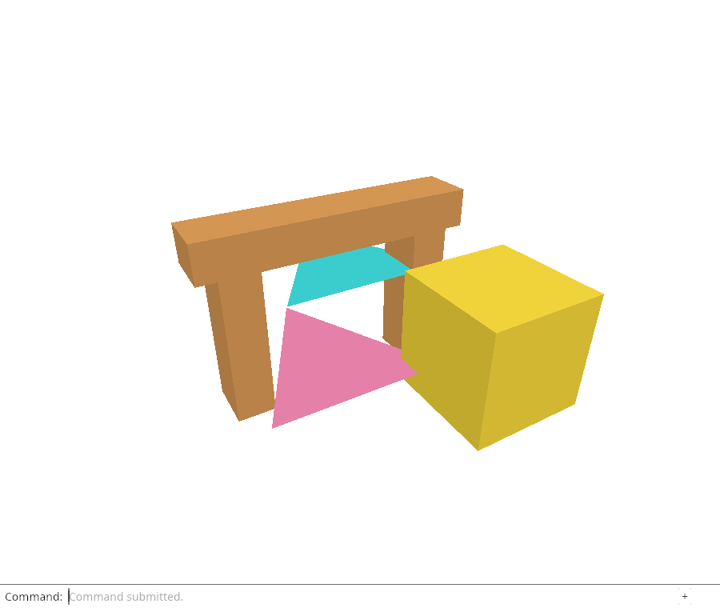
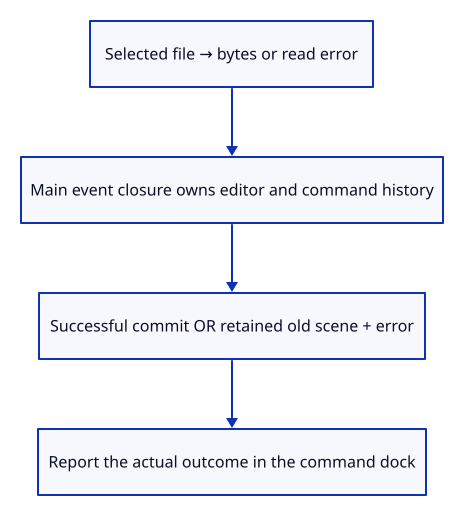

# 30 · Report the result that actually committed

**Typing: 15–30 minutes.** [Estimate](typing-load.md).

Report import success only after `Editor::apply` commits successfully. A failed decode retains the scene and records an error instead of saying “File imported.”

## Type

Continue from [Download the editable document from the command line](29d-save.md). [Save or recover your work](recovery.md).

### 1. `src/browser.rs`

Keep a startup failure visible when the GPU dock could not be created; file errors stay in command history.

<details>
<summary>Locate the existing block</summary>

```rust
            if message.starts_with("Cannot") { let _ = status.remove_attribute("hidden"); }
```

</details>

Replace that block with:

```rust
--8<-- "journey/code/30-feedback-01.rs"
```

### 2. `src/file_input.rs`

Route the size refusal through the panel’s main event closure.

<details>
<summary>Locate the existing block</summary>

```rust
        super::browser::report("This checkpoint accepts files up to 4 MiB");
```

</details>

Replace that block with:

```rust
--8<-- "journey/code/30-feedback-02.rs"
```

### 3. `src/file_input.rs`

Deliver a read error only after the existing latest-read check.

<details>
<summary>Locate the existing block</summary>

```rust
            super::browser::report(&format!("Cannot read file: {error:?}"));
```

</details>

Replace that block with:

```rust
--8<-- "journey/code/30-feedback-03.rs"
```

### 4. `src/file_input.rs`

Pass asynchronous errors through a small custom event rather than borrowing the panel.

<details>
<summary>Locate the existing block</summary>

```rust
fn deliver(buffer: JsValue) -> Result<(), JsValue> {
```

</details>

Replace that block with:

```rust
--8<-- "journey/code/30-feedback-04.rs"
```

### 5. `src/browser.rs`

Receive read failures in the same closure that owns command history.

<details>
<summary>Locate the existing block</summary>

```rust
        } else if event.type_() == "viewer-file" {
```

</details>

Replace that block with:

```rust
--8<-- "journey/code/30-feedback-05.rs"
```

### 6. `src/browser.rs`

A successful transaction is the only branch that may announce an imported file.

<details>
<summary>Locate the existing block</summary>

```rust
                Ok(Change::Scene) => renderer.set_scene(&editor.scene, editor.selected),
```

</details>

Replace that block with:

```rust
--8<-- "journey/code/30-feedback-06.rs"
```

### 7. `src/browser.rs`

Remove the unconditional success that overwrote decoding errors.

Find this exact block:

```rust
        if event.type_() == "viewer-file" {
            report("File imported. Undo removes the entire import.");
        }
```

Delete this block.

### 8. `src/browser.rs`

Keep the error event connected for the viewer lifetime.

<details>
<summary>Locate the existing block</summary>

```rust
    window.add_event_listener_with_callback("viewer-file", update.as_ref().unchecked_ref())?;
```

</details>

Replace that block with:

```rust
--8<-- "journey/code/30-feedback-08.rs"
```

### 9. `src/file_input.rs`

Move the size refusal out of the currently borrowed input callback.

Find this exact block:

```rust
    if file.size() > crate::document::MAX_BYTES as f64 {
        failure("This checkpoint accepts files up to 4 MiB");
        return;
    }
```

Delete this block.

### 10. `src/file_input.rs`

Check size in the queued task before reading; error delivery can now enter the main callback safely.

<details>
<summary>Locate the existing block</summary>

```rust
    wasm_bindgen_futures::spawn_local(async move {
```

</details>

Replace that block with:

```rust
--8<-- "journey/code/30-feedback-10.rs"
```

## Run and check

In your project:

```sh
cd workspace/journey
REGEN_PROTO=0 cargo build --lib --locked --target wasm32-unknown-unknown -j4
REGEN_PROTO=0 CARGO_BUILD_JOBS=4 trunk serve --port 8780
```

Open `http://127.0.0.1:8780/`. Keep an existing Trunk server running; saving rebuilds it.

Try opening a text file renamed `.pb`. The command history must show the read/import failure and leave the current document unchanged.

**Verified checkpoint in Chrome.**



[Verification scope](release.md).

Run the state checks on your computer from your project folder:

```sh
REGEN_PROTO=0 cargo test --lib --locked --target host-tuple -j4
```

<details>
<summary>Code explanation and diagram</summary>

An asynchronous file adapter cannot borrow the callback's Panel. Dispatch `viewer-file-error` with text, then let the owning callback update history.

Queue oversized-file errors before reading. Immediate nested dispatch would re-enter the borrowed `FnMut` callback. After an awaited read, retain the latest-request check so stale work cannot publish an error.

Command history carries file feedback; the hidden status stays out of the drawing. Startup failure can still expose status when the GPU dock never became available.

File read result → browser event → validated editor action → success or error in the command dock.



Why must import success be reported inside the successful action branch?

Receiving bytes does not mean they decoded or entered the scene. Editor::apply can reject a file while preserving scene, selection and history. Only a successful Scene change proves the import committed; an unconditional message after the match would erase the error.

Study estimate, including typing and experiments: 1–2 hours.

</details>

<details>
<summary>Optional experiment</summary>

Temporarily move the success report back outside the action match. Predict the final status after malformed bytes, reproduce the contradiction, then restore the successful-branch report.

</details>

<details>
<summary>Check and save your work</summary>

Restore experimental edits, then run from `session_viewer`:

```sh
npm --prefix ../session_tests run course -- check 30-feedback
npm --prefix ../session_tests run course -- save 30-feedback
```

Source comparison leaves your project untouched. [Save and recovery instructions](recovery.md).

</details>

<details>
<summary>Viewer coverage and verification</summary>

The production loader stages work and reports failure while keeping the last valid scene visible. This lesson separates read delivery from a committed document change; replacement and cancellation follow.

Chrome checks the actual history text, unchanged scene pixels, preserved Redo, an oversize file and a rejected read promise.

[Full validation scope](release.md).

To reproduce the scripted acceptance of the reference checkpoint, run from `session_viewer` with the [course bundle server](release.md#reproduce) running on port 8781:

```sh
npm --prefix ../session_tests run course -- capture 30-feedback
```

This uses the verified reference bundle; it does not check or change your typed project.

</details>
