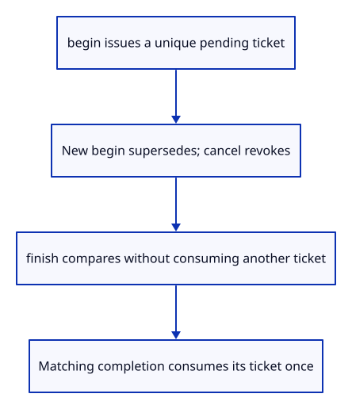
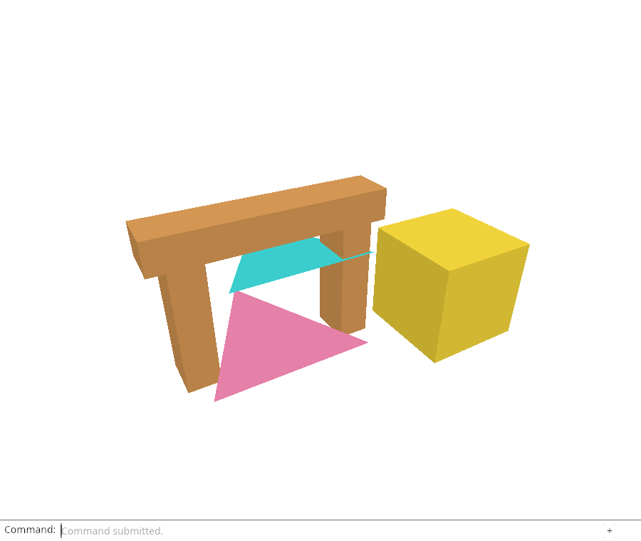

# 30a · Give a pending read an explicit ticket

**Combined study estimate: 1–2 hours.** Includes reading, typing, reasoning and experiments.

**Typing estimate: 18–35 minutes.** 64 added or changed lines; unchanged context is excluded. [How this is estimated](typing-load.md).

**Today:** Describe latest-read ownership, cancellation and one-shot completion in native Rust.

**In the whole viewer:** Connect the browser, drawing and input, then extend the same project. [See the destination](../journey.md#the-destination).

**Follow:** Begin read → pending ticket → supersede, cancel or finish once.

**Before you finish, explain:** Why must a stale completion leave the newer pending ticket intact?

The browser currently compares a loose counter before delivering a read. We need to express more than newest number: a cancelled or already completed read must no longer be allowed to publish a result.

Create ReadGate as ordinary Rust. begin issues a checked increasing ticket and makes it the sole pending read. finish returns true only for that pending ticket and consumes it. cancel removes pending ownership without reusing the issued number.



Option distinguishes no pending read from a particular ticket. The counter names requests, while pending determines which request may still commit. Those are separate responsibilities.

begin clears pending before checking the next number. If the counter is exhausted, it returns an error and does not leave an older read able to commit after a refused new request. It never wraps back to an ID a previous operation might still hold.

The checks simulate completions in the wrong order, cancellation, duplicate completion and counter exhaustion. They need no window or GPU. This checkpoint tests the ticket model; the next lesson adopts it in the running file adapter.

## Type the change

Continue [Report the result that actually committed](30-feedback.md). From `session_viewer`, save your files with `npm --prefix ../session_tests run course -- save before-30a-tickets`. A save keeps your own work; it does not fill in the next lesson.

### 1. `src/read_gate.rs`

Own one pending ticket and test stale, duplicate, cancelled and exhausted requests independently of browser APIs.

Create the file and type:

```rust
--8<-- "journey/code/30a-tickets-01.rs"
```

### 2. `src/lib.rs`

Expose the native request model without changing the browser adapter yet.

Find this exact block:

```rust
pub mod document;
```

Replace that block with:

```rust
--8<-- "journey/code/30a-tickets-02.rs"
```

## Run and look

From `session_viewer`, enter your project folder:

```sh
cd workspace/journey
cargo build --lib --locked --target wasm32-unknown-unknown -j4
CARGO_BUILD_JOBS=4 trunk serve --port 8780
```

Open `http://127.0.0.1:8780/`. If Trunk is already running in this project, leave it running; it rebuilds when you save.

Run the native ReadGate checks and explain every pending value. The live viewer still uses the earlier counter at this endpoint. Open your sample, Example Box, Select Next six times, Move 0.4,-0.5,0.1, View Isometric and Fit; the existing drawing remains usable while the ticket type is introduced.

**Actual Chrome screenshot.**



*Captured from this checkpoint’s browser bundle after its browser checks passed. [Check scope and environment](release.md).*

Run the state checks from your project folder:

```sh
cargo test --lib --locked -j4
```

## Try one small experiment

Start three tickets and finish them in reverse order. Predict why only the newest succeeds and why the rejected older completions cannot clear it. Restore the original checks.

## Explain it in your own words

Trace the values through the files without reading the answer first. If you lose the connection, stop at the last value you can follow.

<details>
<summary>Compare your explanation</summary>

The old operation owns only its own ticket. If rejecting it also cleared pending state, it would cancel the newer operation. finish compares IDs first, consumes only the matching current ticket, and rejects duplicate completions after it has been consumed.

</details>

## Keep your working result

Return to `session_viewer` in a second terminal. Restore experimental edits before comparing:

```sh
npm --prefix ../session_tests run course -- check 30a-tickets
npm --prefix ../session_tests run course -- save 30a-tickets
```

The comparison spots typing differences; it does not prove behaviour. Keep three notes: what I changed; the values I followed; the question I still have. [Recover a checkpoint](recovery.md) if an experiment gets tangled.

## Where this grows

Production load generations reject old asynchronous results. This small gate also models cancellation and one-shot delivery, preparing the same ownership rule for browser reads and later asynchronous picking.

[Validation status and course release](release.md).
