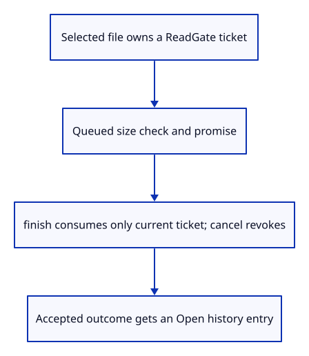
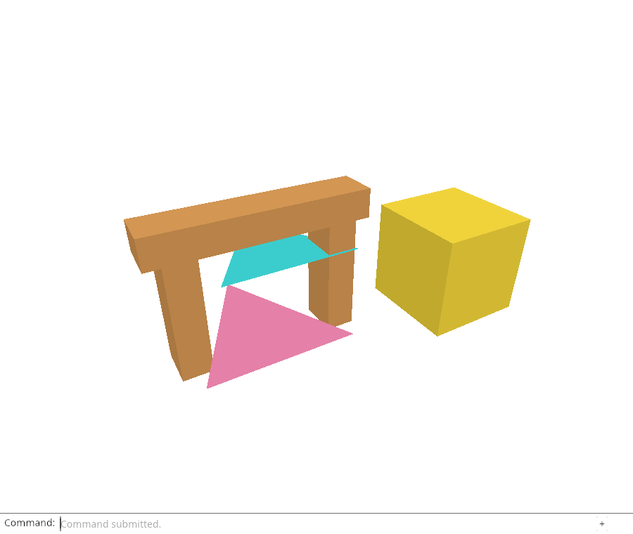

# 30b · Cancel reads without accepting their late result

**Combined study estimate: 1–2 hours.** Includes reading, typing, reasoning and experiments.

**Typing estimate: 16–31 minutes.** 31 added or changed lines; unchanged context is excluded. [How this is estimated](typing-load.md).

**Today:** Adopt one-shot tickets in the browser and give asynchronous results their own history entry.

**In the whole viewer:** Connect the browser, drawing and input, then extend the same project. [See the destination](../journey.md#the-destination).

**Follow:** Selected file → ticket-owned task → consume current ticket → deliver outcome; Cancel Open revokes ownership.

**Before you finish, explain:** Does cancelling a read mean its promise stops running?

Replace Rc<Cell<u64>> with Rc<RefCell<ReadGate>>. Sharing the Rc lets the command callback and asynchronous tasks reach one gate. RefCell permits a short mutable borrow for begin, finish or cancel; release that borrow before dispatching an event.

Each selected file begins a ticket. A queued task first checks it is still pending, then checks the file size. After the read resolves, finish consumes the current ticket once. A stale or cancelled task returns without delivering bytes or an error.



Cancel Open is a typed command. It revokes pending ownership and reports cancellation; it does not edit the document. This does not physically abort File.arrayBuffer. Its eventual value is ignored. The next lesson also invalidates work when a newer picker opens, before a file has been chosen.

Asynchronous outcomes append an Open entry to history. They must not call result on whichever command happens to be last: the user may have typed View Isometric while a read was pending. Synchronous command errors still use result for their own entry.

Add a hidden data-object-count diagnostic to the canvas. It reports editable row count without changing the interface. A second copy of the same geometry can overlap every original pixel, so count gives Chrome independent evidence that a stale read did not silently append rows.

Chrome holds real File.arrayBuffer promises, types other commands, cancels reads and releases old completions. It checks both scene pixels and object count, and confirms an old failure cannot overwrite a newer request or command.

## Type the change

Continue [Give a pending read an explicit ticket](30a-tickets.md). From `session_viewer`, save your files with `npm --prefix ../session_tests run course -- save before-30b-cancel`. A save keeps your own work; it does not fill in the next lesson.

### 1. `src/file_input.rs`

Share the native gate through short interior mutable borrows.

Find this exact block:

```rust
use std::{cell::Cell, rc::Rc};
```

Replace that block with:

```rust
--8<-- "journey/code/30b-cancel-01.rs"
```

### 2. `src/file_input.rs`

Receive the same pending-read owner as the command callback.

Find this exact block:

```rust
pub fn choose(event: &web_sys::Event, request: Rc<Cell<u64>>) {
```

Replace that block with:

```rust
--8<-- "journey/code/30b-cancel-02.rs"
```

### 3. `src/file_input.rs`

Issue a bounded ticket; even an exhaustion error must be delivered after the input callback returns.

Find this exact block:

```rust
    let id = request.get() + 1;
    request.set(id);
```

Replace that block with:

```rust
--8<-- "journey/code/30b-cancel-03.rs"
```

### 4. `src/file_input.rs`

Avoid work for a ticket already superseded or cancelled before its queued task starts.

Find this exact block:

```rust
        if request.get() != id { return; }
        if file.size()
```

Replace that block with:

```rust
--8<-- "journey/code/30b-cancel-04.rs"
```

### 5. `src/file_input.rs`

Consume the current ticket before reporting a size refusal, releasing the RefCell borrow before dispatch.

Find this exact block:

```rust
            failure("This checkpoint accepts files up to 4 MiB");
```

Replace that block with:

```rust
--8<-- "journey/code/30b-cancel-05.rs"
```

### 6. `src/file_input.rs`

Only a current one-shot completion may deliver bytes or a read error.

Find this exact block:

```rust
        if request.get() != id { return; }
        let result = result.and_then(deliver);
```

Replace that block with:

```rust
--8<-- "journey/code/30b-cancel-06.rs"
```

### 7. `src/browser.rs`

Expose the initial row count through hidden diagnostics.

Find this exact block:

```rust
    let mut editor = Editor::default();
```

Replace that block with:

```rust
--8<-- "journey/code/30b-cancel-07.rs"
```

### 8. `src/browser.rs`

Offer read cancellation as a command rather than a keyboard feature shortcut.

Find this exact block:

```rust
            "Open",
```

Replace that block with:

```rust
--8<-- "journey/code/30b-cancel-08.rs"
```

### 9. `src/browser.rs`

Let the input callback and queued tasks share one native gate.

Find this exact block:

```rust
    let request = std::rc::Rc::new(std::cell::Cell::new(0));
```

Replace that block with:

```rust
--8<-- "journey/code/30b-cancel-09.rs"
```

### 10. `src/browser.rs`

An asynchronous read error gets its own history entry instead of rewriting a later command.

Find this exact block:

```rust
                panel.result(&message);
```

Replace that block with:

```rust
--8<-- "journey/code/30b-cancel-10.rs"
```

### 11. `src/browser.rs`

Revoke pending delivery without touching the scene or edit history.

Find this exact block:

```rust
            if line == "open" {
```

Replace that block with:

```rust
--8<-- "journey/code/30b-cancel-11.rs"
```

### 12. `src/browser.rs`

Record asynchronous success separately from subsequent typed commands.

Find this exact block:

```rust
                        report("File imported. Undo removes the entire import.");
```

Replace that block with:

```rust
--8<-- "journey/code/30b-cancel-12.rs"
```

### 13. `src/browser.rs`

Distinguish a file result from a synchronous error on the current command.

Find this exact block:

```rust
                    report(error);
                    panel.result(error);
```

Replace that block with:

```rust
--8<-- "journey/code/30b-cancel-13.rs"
```

### 14. `src/browser.rs`

Update hidden diagnostics after every handled event.

Find this exact block:

```rust
show_projection(&editor.camera)
```

Replace that block with:

```rust
--8<-- "journey/code/30b-cancel-14.rs"
```

### 15. `src/browser.rs`

Keep scene count and projection in one diagnostic boundary.

Find this exact block:

```rust
fn show_projection(camera: &crate::camera::Camera) -> Result<(), JsValue> {
```

Replace that block with:

```rust
--8<-- "journey/code/30b-cancel-15.rs"
```

### 16. `src/browser.rs`

Report rows independently of overlapping drawing pixels.

Find this exact block:

```rust
    canvas.set_attribute("data-projection", &format!("{:?}", camera.projection))
```

Replace that block with:

```rust
--8<-- "journey/code/30b-cancel-16.rs"
```

## Run and look

From `session_viewer`, enter your project folder:

```sh
cd workspace/journey
REGEN_PROTO=0 cargo build --lib --locked --target wasm32-unknown-unknown -j4
REGEN_PROTO=0 CARGO_BUILD_JOBS=4 trunk serve --port 8780
```

Open `http://127.0.0.1:8780/`. If Trunk is already running in this project, leave it running; it rebuilds when you save.

Open the specimen, Example Box, Select Next six times, Move 0.5,-0.6,0.3, View Isometric and Fit. Cancel Open is available in the dock. Native ticket checks and Chrome’s controlled promises prove cancellation even though a small ordinary file may finish too quickly to cancel manually.

**Actual Chrome screenshot.**



*Captured from this checkpoint’s browser bundle after its browser checks passed. [Check scope and environment](release.md).*

Run the state checks from your project folder:

```sh
REGEN_PROTO=0 cargo test --lib --locked -j4
```

## Try one small experiment

Hold a read in a debugger, type View Isometric and Cancel Open, then let the read finish. Predict why neither the object count nor command history should change when that cancelled task returns.

## Explain it in your own words

Trace the values through the files without reading the answer first. If you lose the connection, stop at the last value you can follow.

<details>
<summary>Compare your explanation</summary>

No. File.arrayBuffer has no abort operation here. Cancellation revokes permission to deliver its result. The task may finish later, but finish rejects its ticket and neither scene nor command feedback changes. A separate result entry also prevents a read outcome from rewriting a later typed command.

</details>

## Keep your working result

Return to `session_viewer` in a second terminal. Restore experimental edits before comparing:

```sh
npm --prefix ../session_tests run course -- check 30b-cancel
npm --prefix ../session_tests run course -- save 30b-cancel
```

The comparison spots typing differences; it does not prove behaviour. Keep three notes: what I changed; the values I followed; the question I still have. [Recover a checkpoint](recovery.md) if an experiment gets tangled.

## Where this grows

Production loader generations prevent stale work from mutating the active scene. This checkpoint expresses cancellation as delivery ownership; listener and resource lifetime cleanup remains a later lesson.

[Validation status and course release](release.md).
