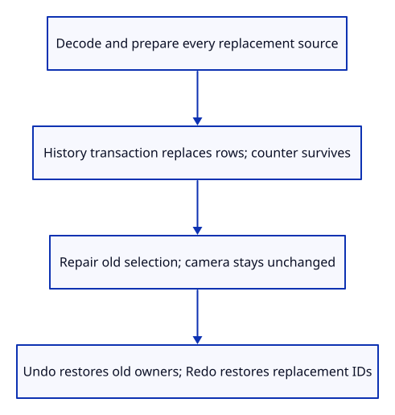
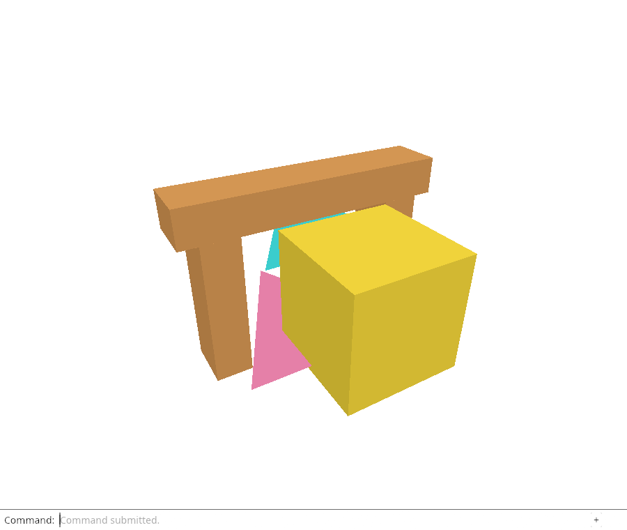

# 30c · Replace a document as one reversible change

**Combined study estimate: 1–2 hours.** Includes reading, typing, reasoning and experiments.

**Typing estimate: 16–32 minutes.** 36 added or changed lines; unchanged context is excluded. [How this is estimated](typing-load.md).

**Today:** Prepare a whole replacement before changing live rows, then commit it through existing history.

**Follow:** Replacement bytes → validated prepared sources → history transaction → new rows with fresh local IDs.

Append and replace are different document operations. Import adds prepared objects to the current rows. Replace removes the current rows and inserts the new prepared document. Both must use the same validation and history boundary.

Add Action::Replace. First call document::load, which prepares every supported source/display pair. Only after that succeeds does History::try_edit enter Scene::replace. A malformed file therefore cannot clear the old drawing.



Scene::replace clears objects and the extra-demo marker, then imports the already prepared document. It deliberately leaves next_id alone. A transaction restores the old scene if insertion fails halfway through; direct callers must use that transaction boundary too.

The editor’s existing selection repair removes a selected old ID after successful replacement. Camera, projection and background are outside document history and remain unchanged. Undo returns the old rows and source allocations; Redo returns the replacement IDs.

This checkpoint connects replacement to the native editor and tests it. The browser still uses append-only Open today. The next lesson exposes Open Replace and gives the file-read bridge an explicit operation mode.

Old objects retained by Undo are still alive. Replacement alone is not a promise that all old CPU or GPU resources have been released; the resource lessons account for those owners.

## Type the change

Continue from [Cancel reads without accepting their late result](30b-cancel.md). Save your own work first: `npm --prefix ../session_tests run course -- save before-30c-replace` (from `session_viewer`).

### 1. `src/scene.rs`

Replace rows while preserving the issued local-ID counter; the caller supplies the transaction.

Find this exact block:

```rust
    pub fn import(&mut self, loaded: crate::document::Loaded) -> Result<(), &'static str> {
```

Replace that block with:

```rust
--8<-- "journey/code/30c-replace-01.rs"
```

### 2. `src/editor.rs`

Name replacement explicitly instead of giving Import a hidden destructive mode.

Find this exact block:

```rust
    Import(Vec<u8>),
```

Replace that block with:

```rust
--8<-- "journey/code/30c-replace-02.rs"
```

### 3. `src/editor.rs`

Validate every source first, then replace as one undoable transaction.

Find this exact block:

```rust
            Action::Import(bytes) => {
```

Replace that block with:

```rust
--8<-- "journey/code/30c-replace-03.rs"
```

### 4. `src/replace_tests.rs`

Prove replacement/Undo/Redo preserve owners, camera state and non-reused local IDs.

Create the file and type:

```rust
--8<-- "journey/code/30c-replace-04.rs"
```

### 5. `src/lib.rs`

Compile the replacement contract.

Find this exact block:

```rust
#[cfg(test)]
mod save_roundtrip_tests;
```

Replace that block with:

```rust
--8<-- "journey/code/30c-replace-05.rs"
```

## Run and look

From `session_viewer`, enter your project folder:

```sh
cd workspace/journey
REGEN_PROTO=0 cargo build --lib --locked --target wasm32-unknown-unknown -j4
REGEN_PROTO=0 CARGO_BUILD_JOBS=4 trunk serve --port 8780
```

Open `http://127.0.0.1:8780/`. If Trunk is already running in this project, leave it running; it rebuilds when you save.

Run the replacement checks below. A valid replacement is one Undo step; an invalid candidate must leave the existing scene unchanged. The browser command is connected next.

**Verified checkpoint in Chrome.**



[What this screenshot checks](release.md).

Run the state checks from your project folder:

```sh
REGEN_PROTO=0 cargo test --lib --locked -j4
```

<details>
<summary>Optional experiment</summary>

In the replacement check, change camera distance and aspect before replacing. Predict why Undo and Redo preserve both values. Explain why setting next_id back to one would make an old selection unsafe.

</details>

## Explain the change

Why must the scene counter survive replacing all its rows?

<details>
<summary>Compare your explanation</summary>

A replacement must not reuse local IDs held by old selection or delayed work. Clearing rows leaves the increasing counter intact. History restoration also retains the highest issued value, while Undo restores the old objects and shared source allocations.

</details>

## Keep your working result

Return to `session_viewer` in a second terminal. Restore experimental edits before comparing:

```sh
npm --prefix ../session_tests run course -- check 30c-replace
npm --prefix ../session_tests run course -- save 30c-replace
```

Check compares your typed source; run the focused check above for behavior. [Recover your work](recovery.md).

<details>
<summary>Where this fits in the finished viewer</summary>

Production replacement stages a new scene before committing and preserves the last valid scene on failure. This flat editor teaches the same atomic boundary; browser cancellation, larger sources and resource release are separate concerns.

</details>

<details>
<summary>Verification notes and browser acceptance</summary>


[Full validation scope](release.md).

To reproduce the scripted acceptance of the reference checkpoint, run from `session_viewer` with the [course bundle server](release.md#reproduce) running on port 8781:

```sh
npm --prefix ../session_tests run course -- capture 30c-replace
```

This uses the verified reference bundle; it does not check or change your typed project.

</details>
