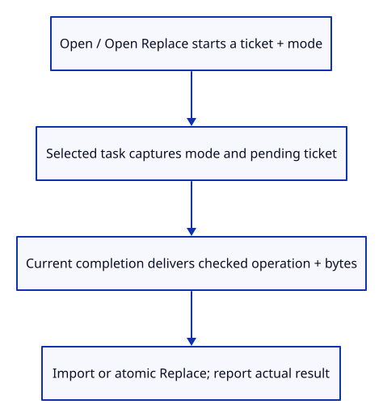
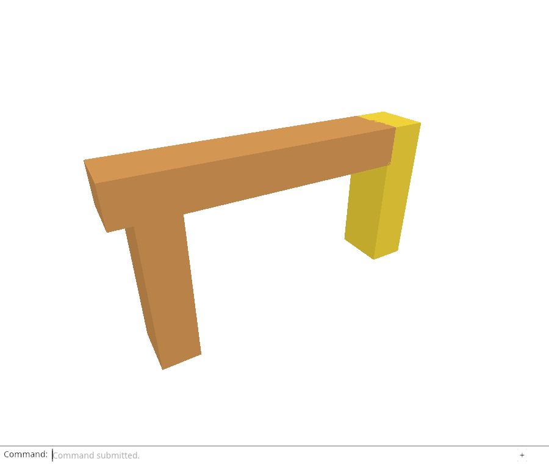

# 30d · Choose append or replace before opening the picker

**Combined study estimate: 1–2 hours.** Includes reading, typing, reasoning and experiments.

**Typing estimate: 27–53 minutes.** 43 added or changed lines; unchanged context is excluded. [How this is estimated](typing-load.md).

**Today:** Carry the selected Open operation through asynchronous file reading and cancel older work immediately.

**Follow:** Open or Open Replace → new ticket plus captured mode → file bytes → explicit editor action.

The native editor can replace a document, but the browser still appends every delivered file. Add Open Replace as a complete command name. Keep Open as our existing append operation so earlier experiments remain meaningful.

Issue a read ticket when either command opens the picker. The chosen operation is stored as a small Mode enum, then copied into the selected file’s task. choose uses the current pending ticket instead of starting another one. A newer picker therefore revokes old delivery even before a file is chosen.



The byte event carries a two-item array: replace flag and Uint8Array. The adapter checks that shape and its byte cap before translating it into Action::Import or Action::Replace. The rest of the editor never needs browser values.

The native file input’s cancel event revokes the pending ticket and appends an Open cancellation notice. It must be distinguished from cancellation on another element. The typed Cancel Open command remains available for a read already in progress.

After a successful transaction, report whether a file was appended or the document was replaced. A failed replacement keeps the old scene; Undo after a successful replacement restores it as one change. Camera and projection stay where the user put them.

## Type the change

Continue from [Replace a document as one reversible change](30c-replace.md). Save your own work first: `npm --prefix ../session_tests run course -- save before-30d-bridge` (from `session_viewer`).

### 1. `src/file_input.rs`

Capture a typed operation value with the selected file instead of consulting mutable state after reading.

Find this exact block:

```rust
pub fn choose(event: &web_sys::Event, request: Rc<RefCell<crate::read_gate::ReadGate>>) {
```

Replace that block with:

```rust
--8<-- "journey/code/30d-bridge-01.rs"
```

### 2. `src/file_input.rs`

A choice with no file revokes pending ownership without editing the scene.

Find this exact block:

```rust
    let Some(file) = input.files().and_then(|files| files.get(0)) else { return; };
```

Replace that block with:

```rust
--8<-- "journey/code/30d-bridge-02.rs"
```

### 3. `src/file_input.rs`

Use the ticket already issued by the Open command.

Find this exact block:

```rust
    let id = match request.borrow_mut().begin() {
        Ok(id) => id,
        Err(error) => {
            wasm_bindgen_futures::spawn_local(async move { failure(error); });
            return;
        }
    };
```

Replace that block with:

```rust
--8<-- "journey/code/30d-bridge-03.rs"
```

### 4. `src/file_input.rs`

Keep the captured mode beside the accepted bytes.

Find this exact block:

```rust
        let result = result.and_then(deliver);
```

Replace that block with:

```rust
--8<-- "journey/code/30d-bridge-04.rs"
```

### 5. `src/file_input.rs`

Include the selected operation in the private byte event.

Find this exact block:

```rust
fn deliver(buffer: JsValue) -> Result<(), JsValue> {
```

Replace that block with:

```rust
--8<-- "journey/code/30d-bridge-05.rs"
```

### 6. `src/file_input.rs`

Use an explicit replace flag and byte array at the browser bridge.

Find this exact block:

```rust
    detail.set_detail(&js_sys::Uint8Array::new(&buffer));
```

Replace that block with:

```rust
--8<-- "journey/code/30d-bridge-06.rs"
```

### 7. `src/file_input.rs`

Translate checked browser payloads into ordinary editor actions.

Find this exact block:

```rust
pub fn bytes(event: &web_sys::Event) -> Option<Vec<u8>> {
    let event = event.dyn_ref::<web_sys::CustomEvent>()?;
    let array = event.detail().dyn_into::<js_sys::Uint8Array>().ok()?;
    if array.length() as usize > crate::document::MAX_BYTES { return None; }
    Some(array.to_vec())
}
```

Replace that block with:

```rust
--8<-- "journey/code/30d-bridge-07.rs"
```

### 8. `src/browser.rs`

Offer replacement as a typed command.

Find this exact block:

```rust
            "Open",
```

Replace that block with:

```rust
--8<-- "journey/code/30d-bridge-08.rs"
```

### 9. `src/browser.rs`

Hold the picker operation in the event closure; each task copies it at selection.

Find this exact block:

```rust
    let request = std::rc::Rc::new(std::cell::RefCell::new(crate::read_gate::ReadGate::default()));
```

Replace that block with:

```rust
--8<-- "journey/code/30d-bridge-09.rs"
```

### 10. `src/browser.rs`

Revoke native picker cancellation and capture the operation when a file is selected.

Find this exact block:

```rust
        let action = if event.type_() == "change" {
            crate::file_input::choose(&event, std::rc::Rc::clone(&request));
```

Replace that block with:

```rust
--8<-- "journey/code/30d-bridge-10.rs"
```

### 11. `src/browser.rs`

Keep browser values outside the editor transaction.

Find this exact block:

```rust
            crate::file_input::bytes(&event).map(Action::Import)
```

Replace that block with:

```rust
--8<-- "journey/code/30d-bridge-11.rs"
```

### 12. `src/browser.rs`

A newer request revokes older work at picker opening, not only after file selection.

Find this exact block:

```rust
            } else if line == "open" {
```

Replace that block with:

```rust
--8<-- "journey/code/30d-bridge-12.rs"
```

### 13. `src/browser.rs`

Remember which successful file action was committed before consuming it.

Find this exact block:

```rust
        if let Some(action) = action {
```

Replace that block with:

```rust
--8<-- "journey/code/30d-bridge-13.rs"
```

### 14. `src/browser.rs`

Report the committed operation without overwriting another command.

Find this exact block:

```rust
                        report("File imported. Undo removes the entire import.");
                        panel.answer("Open", "File imported. Undo removes the entire import.");
```

Replace that block with:

```rust
--8<-- "journey/code/30d-bridge-14.rs"
```

### 15. `src/browser.rs`

Receive the native file-input cancellation event for the viewer lifetime.

Find this exact block:

```rust
    document.add_event_listener_with_callback("change", update.as_ref().unchecked_ref())?;
```

Replace that block with:

```rust
--8<-- "journey/code/30d-bridge-15.rs"
```

## Run and look

From `session_viewer`, enter your project folder:

```sh
cd workspace/journey
REGEN_PROTO=0 cargo build --lib --locked --target wasm32-unknown-unknown -j4
REGEN_PROTO=0 CARGO_BUILD_JOBS=4 trunk serve --port 8780
```

Open `http://127.0.0.1:8780/`. If Trunk is already running in this project, leave it running; it rebuilds when you save.

Type `Open Replace` and choose `sample.pb`, then type `Undo`. The preceding document returns as one transaction. `Open Append` instead keeps existing objects.

**Verified checkpoint in Chrome.**



[What this screenshot checks](release.md).

Run the state checks from your project folder:

```sh
REGEN_PROTO=0 cargo test --lib --locked -j4
```

<details>
<summary>Optional experiment</summary>

Hold a previous read, open Open Replace, cancel the new picker and then let the old read finish. Predict why the old file must stay rejected despite the new picker having no chosen file.

</details>

## Explain the change

Why must a newer Open revoke old work before the new file is chosen?

<details>
<summary>Compare your explanation</summary>

Opening a new picker expresses a new request even if the user cancels it. If the ticket were issued only after choosing a file, an older pending read could still commit behind the newer picker. Begin at the command, capture its mode at selection, and consume that ticket before delivering an outcome.

</details>

## Keep your working result

Return to `session_viewer` in a second terminal. Restore experimental edits before comparing:

```sh
npm --prefix ../session_tests run course -- check 30d-bridge
npm --prefix ../session_tests run course -- save 30d-bridge
```

Check compares your typed source; run the focused check above for behavior. [Recover your work](recovery.md).

<details>
<summary>Where this fits in the finished viewer</summary>

Production scene replacement uses a generation started at request time and stages a whole scene before commit. This checkpoint applies that policy to the flat file picker; later command chapters align the full production vocabulary and loading paths.

</details>

<details>
<summary>Verification notes and browser acceptance</summary>

Chrome opens a newer replacement picker while an old file promise is held, cancels the picker, then releases the old result. It checks that no rows arrive. It also verifies malformed replacement, successful replacement and pixel-identical Undo/Redo before capturing the replaced document.

[Full validation scope](release.md).

To reproduce the scripted acceptance of the reference checkpoint, run from `session_viewer` with the [course bundle server](release.md#reproduce) running on port 8781:

```sh
npm --prefix ../session_tests run course -- capture 30d-bridge
```

This uses the verified reference bundle; it does not check or change your typed project.

</details>
