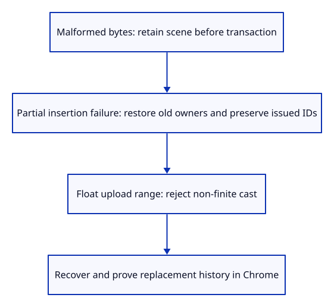
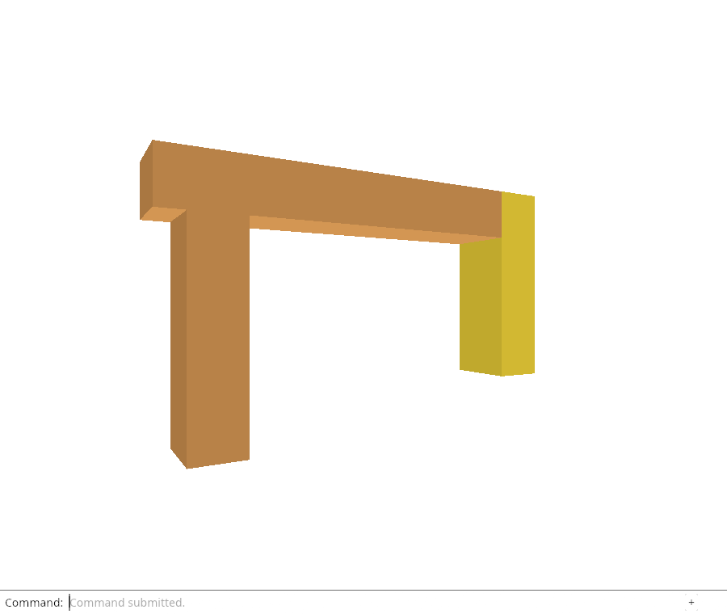

# 30e · Prove recovery at the transaction and display boundaries

**Combined study estimate: 1–2 hours.** Includes reading, typing, reasoning and experiments.

**Typing estimate: 26–51 minutes.** 54 added or changed lines; unchanged context is excluded. [How this is estimated](typing-load.md).

**Today:** Test partial replacement failure, preserved selection/Redo and placement upload limits.

**In the whole viewer:** Connect the browser, drawing and input, then extend the same project. [See the destination](../journey.md#the-destination).

**Follow:** Malformed source or failed insertion → retained old owners and history; double matrix → finite float upload check.

**Before you finish, explain:** Why do we need a failure after the first new row was inserted?

A successful replacement and a malformed-file refusal are useful checks, but they exercise different boundaries. We also need an error after replacement has begun changing rows.

The scene-module check puts next_id one below its limit. The first replacement insertion succeeds; the next cannot allocate another ID. History must restore every old row and allocation. Its restore rule keeps the highest issued counter, so IDs from failed work are not reused.



A separate editor check refuses malformed replacement while selection and Redo are live. It proves failure does not erase either. The earlier successful-replacement check proves the camera stays outside document history.

There is also a display boundary in placement::valid. A matrix value can be finite as a double yet become infinity when our current GPU adapter casts it to float. Check that cast before accepting the matrix. The native test uses f64::MAX to demonstrate the difference and requires the original placement to remain unchanged. The same coefficient in an encoded file must also be refused before construction. This is a limit of the current float upload path, not a change to the retained source precision; later rendering lessons improve coordinate handling.

Chrome repeats the file errors, cancelled newer picker, replacement and Undo/Redo checks against this final endpoint. It also forces adapter unavailability before startup, checks the visible failure fallback, then reloads and restores a working viewer. Its screenshot shows the replaced frame, with an independently moved right post. Native frame checks distinguish selected gold from timber brown rather than treating both as selection.

## Type the change

Continue [Choose append or replace before opening the picker](30d-bridge.md). From `session_viewer`, save your files with `npm --prefix ../session_tests run course -- save before-30e-recovery`. A save keeps your own work; it does not fill in the next lesson.

### 1. `src/placement.rs`

Reject a finite double coefficient that cannot enter the current float uniform.

Find this exact block:

```rust
matrix.iter().all(|value| value.is_finite())
```

Replace that block with:

```rust
--8<-- "journey/code/30e-recovery-01.rs"
```

### 2. `src/scene.rs`

State the full placement boundary in its error.

Find this exact block:

```rust
return Err("Placement must be finite and affine");
```

Replace that block with:

```rust
--8<-- "journey/code/30e-recovery-02.rs"
```

### 3. `src/scene.rs`

Fail during the second insertion, then prove rollback restores the old allocations without recycling issued IDs.

Find this exact block:

```rust
    fn removal_moves_a_row_without_changing_its_identity() {
```

Replace that block with:

```rust
--8<-- "journey/code/30e-recovery-03.rs"
```

### 4. `src/replace_tests.rs`

Test refusal before mutation, selection/Redo retention and the double-to-float upload boundary.

Find this exact block:

```rust
    assert_eq!((editor.camera.distance, editor.camera.aspect), (7.0, 2.0));
}
```

Replace that block with:

```rust
--8<-- "journey/code/30e-recovery-04.rs"
```

## Run and look

From `session_viewer`, enter your project folder:

```sh
cd workspace/journey
REGEN_PROTO=0 cargo build --lib --locked --target wasm32-unknown-unknown -j4
REGEN_PROTO=0 CARGO_BUILD_JOBS=4 trunk serve --port 8780
```

Open `http://127.0.0.1:8780/`. If Trunk is already running in this project, leave it running; it rebuilds when you save.

Run the partial-insertion, malformed-replacement and float-upload checks. Open Replace your specimen, Select Next twice, Move 0.35,0,0.25, View Isometric, Orbit Up and Fit. A failed replacement must keep the last valid document and its existing undo branch.

**Actual Chrome screenshot.**



*Captured from this checkpoint’s browser bundle after its browser checks passed. [Check scope and environment](release.md).*

Run the state checks from your project folder:

```sh
REGEN_PROTO=0 cargo test --lib --locked -j4
```

## Try one small experiment

Temporarily remove History::try_edit from the partial-replacement check. Predict why the old scene disappears when the second insertion fails. Restore the transaction. Then compare f64::MAX with its float cast before reading the range-check answer.

## Explain it in your own words

Trace the values through the files without reading the answer first. If you lose the connection, stop at the last value you can follow.

<details>
<summary>Compare your explanation</summary>

Malformed decoding fails before a transaction starts. It does not test rollback after mutation. Exhausting the ID counter during the second insertion proves History::try_edit restores old rows and shared owners after a partial replacement, while retaining the highest issued counter so failed work cannot cause ID reuse.

</details>

## Keep your working result

Return to `session_viewer` in a second terminal. Restore experimental edits before comparing:

```sh
npm --prefix ../session_tests run course -- check 30e-recovery
npm --prefix ../session_tests run course -- save 30e-recovery
```

The comparison spots typing differences; it does not prove behaviour. Keep three notes: what I changed; the values I followed; the question I still have. [Recover a checkpoint](recovery.md) if an experiment gets tangled.

## Where this grows

Production recovery preserves the last valid scene and checks display representations separately from editable source data. This endpoint proves those boundaries for the current flat mesh editor; full geometry, streaming and coordinate rebasing remain later lessons.

[Validation status and course release](release.md).
