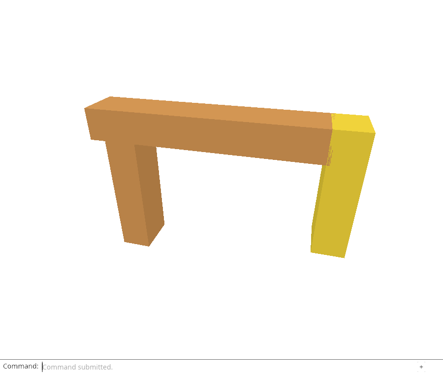
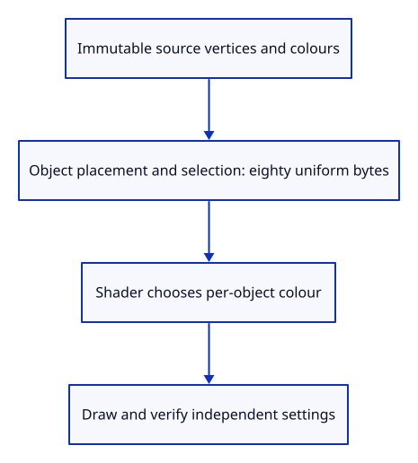

# 31 · Keep selection out of the vertex data

**Typing: 8–15 minutes.** [Estimate](typing-load.md).

Our renderer currently copies gold into every selected vertex during upload. That makes selection part of geometry storage. Before sharing any buffers, separate those two responsibilities.

The first sixty-four bytes still contain the placement matrix. The next sixteen bytes form a vec4 selection field: its first float is one or zero and its remaining floats are zero. We pack all eighty bytes explicitly rather than depending on the layout of a Rust struct.

## Type

Continue from [Prove recovery at the transaction and display boundaries](30e-recovery.md). [Save or recover your work](recovery.md).

### 1. `src/gpu_mesh.rs`

Upload original vertex colours regardless of which object is selected.

<details>
<summary>Locate the existing block</summary>

```rust
            let mut display = *vertex;
            if selected {
                display[3..].copy_from_slice(&[1.0, 0.75, 0.05]);
            }
            for value in display {
```

</details>

Replace that block with:

```rust
--8<-- "journey/code/31-settings-01.rs"
```

### 2. `src/gpu_mesh.rs`

Use one encoder for the complete object uniform.

<details>
<summary>Locate the existing block</summary>

```rust
        let bytes: Vec<u8> = object.model.m.iter()
            .flat_map(|value| (*value as f32).to_ne_bytes()).collect();
```

</details>

Replace that block with:

```rust
--8<-- "journey/code/31-settings-02.rs"
```

### 3. `src/gpu_mesh.rs`

Encode the matrix, selection and padding at their shader offsets.

<details>
<summary>Locate the existing block</summary>

```rust
}

impl GpuMesh {
```

</details>

Replace that block with:

```rust
--8<-- "journey/code/31-settings-03.rs"
```

### 4. `src/triangle.wgsl`

Describe the same eighty-byte object layout in WGSL.

<details>
<summary>Locate the existing block</summary>

```wgsl
@group(1) @binding(0) var<uniform> model: mat4x4<f32>;
```

</details>

Replace that block with:

```wgsl
--8<-- "journey/code/31-settings-04.wgsl"
```

### 5. `src/triangle.wgsl`

Read placement from the object settings structure.

<details>
<summary>Locate the existing block</summary>

```wgsl
    let world = model * vec4<f32>(position, 1.0);
```

</details>

Replace that block with:

```wgsl
--8<-- "journey/code/31-settings-05.wgsl"
```

### 6. `src/triangle.wgsl`

Choose the displayed colour per object without rewriting vertices.

<details>
<summary>Locate the existing block</summary>

```wgsl
    output.colour = colour;
```

</details>

Replace that block with:

```wgsl
--8<-- "journey/code/31-settings-06.wgsl"
```

## Run and check

In your project:

```sh
cd workspace/journey
REGEN_PROTO=0 cargo build --lib --locked --target wasm32-unknown-unknown -j4
REGEN_PROTO=0 CARGO_BUILD_JOBS=4 trunk serve --port 8780
```

Open `http://127.0.0.1:8780/`. Keep an existing Trunk server running; saving rebuilds it.

Select an object and move it. Its colour and placement now come from an object uniform; the original vertex colours and positions stay unchanged.

**Verified checkpoint in Chrome.**



[Verification scope](release.md).

Run the state checks on your computer from your project folder:

```sh
REGEN_PROTO=0 cargo test --lib --locked --target host-tuple -j4
```

<details>
<summary>Code explanation and diagram</summary>

The [WGSL layout rules](https://www.w3.org/TR/WGSL/#alignment-and-size) align both a matrix and a vec4 to sixteen bytes. A four-column matrix occupies sixty-four bytes, so the following field begins at byte sixty-four and the complete uniform occupies eighty.

The shader multiplies by object.model and uses object.selection.x to choose the original colour or our existing gold. Lighting still runs after that choice. Source geometry and its colour values do not change when selection changes.

This endpoint still rebuilds GPU rows after every scene change. It establishes the data boundary; the following lessons change ownership and reuse.

Object placement and selection → eighty uniform bytes → vertex shader; source colours stay unchanged.



Why must selection move before we can share one vertex buffer?

Two objects can use the same geometry while only one is selected. A gold colour written into their shared vertices would affect both. Keep immutable source colours in the vertex buffer and choose the displayed colour from each object’s uniform.

Study estimate, including typing and experiments: 1–2 hours.

</details>

<details>
<summary>Optional experiment</summary>

Temporarily put the selection flag at byte sixty-eight while leaving the shader field unchanged. Predict why the first selection component remains zero. Restore byte sixty-four before continuing.

</details>

<details>
<summary>Check and save your work</summary>

Restore experimental edits, then run from `session_viewer`:

```sh
npm --prefix ../session_tests run course -- check 31-settings
npm --prefix ../session_tests run course -- save 31-settings
```

Source comparison leaves your project untouched. [Save and recovery instructions](recovery.md).

</details>

<details>
<summary>Viewer coverage and verification</summary>

Object presentation must stay separate from shared geometry in the production renderer, including selection, opacity and other display flags. This uniform introduces that boundary without claiming the later rendering modes are complete.


[Full validation scope](release.md).

To reproduce the scripted acceptance of the reference checkpoint, run from `session_viewer` with the [course bundle server](release.md#reproduce) running on port 8781:

```sh
npm --prefix ../session_tests run course -- capture 31-settings
```

This uses the verified reference bundle; it does not check or change your typed project.

</details>
