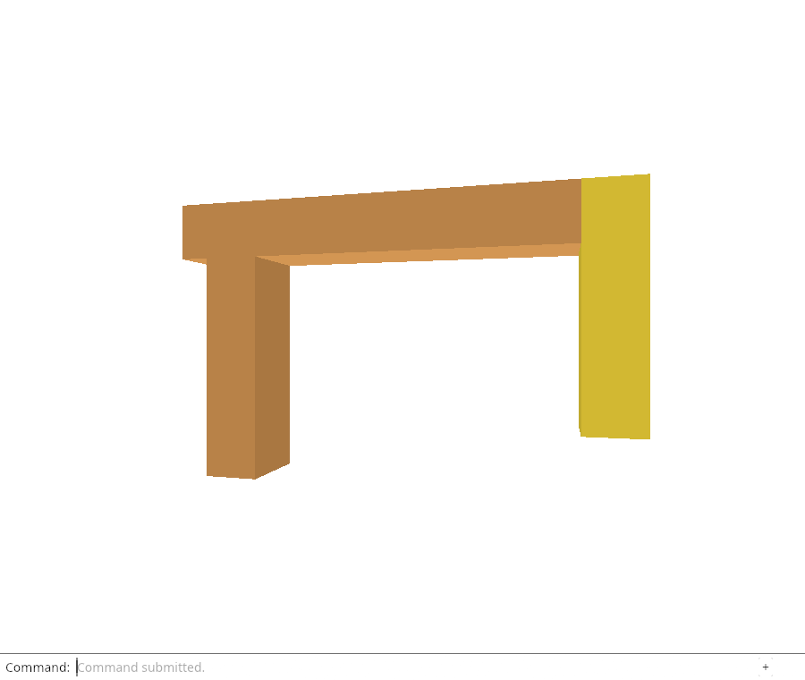
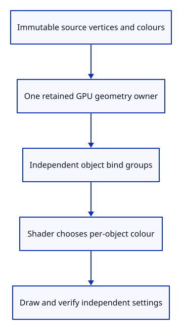

# 31a · Give immutable GPU geometry one owner

**Typing: 19–38 minutes.** [Estimate](typing-load.md).

A GPU row currently owns vertices, indices and placement together. Extract the immutable part into GpuGeometry. It retains the exact CPU-display Rc<Mesh> that produced its buffers; that owner will also make identity safe when we introduce the cache.

GpuMesh becomes one object’s draw state: a shared geometry owner and its own bind group. with_geometry accepts an existing geometry owner, while upload remains a convenient wrapper that creates one. The renderer still calls upload independently at this endpoint. Automatic reuse arrives next.

## Type

Continue from [Keep selection out of the vertex data](31-settings.md). [Save or recover your work](recovery.md).

### 1. `src/gpu_geometry.rs`

Create an owner for immutable buffers and the CPU display allocation that produced them.

Create the file and type:

```rust
--8<-- "journey/code/31a-geometry-01.rs"
```

### 2. `src/lib.rs`

Make geometry storage available to the draw row.

<details>
<summary>Locate the existing block</summary>

```rust
pub mod gpu_mesh;
```

</details>

Replace that block with:

```rust
--8<-- "journey/code/31a-geometry-02.rs"
```

### 3. `src/gpu_mesh.rs`

Use a shared geometry owner.

<details>
<summary>Locate the existing block</summary>

```rust
use crate::scene::Object;
```

</details>

Replace that block with:

```rust
--8<-- "journey/code/31a-geometry-03.rs"
```

### 4. `src/gpu_mesh.rs`

Keep only the geometry owner beside the object bind group.

<details>
<summary>Locate the existing block</summary>

```rust
    vertices: wgpu::Buffer,
    indices: wgpu::Buffer,
    index_count: u32,
```

</details>

Replace that block with:

```rust
--8<-- "journey/code/31a-geometry-04.rs"
```

### 5. `src/gpu_mesh.rs`

Accept an existing geometry owner while keeping object settings independent.

<details>
<summary>Locate the existing block</summary>

```rust
        let mesh = &object.mesh;
        let mut bytes = Vec::with_capacity(mesh.vertices().len() * 24);
        for vertex in mesh.vertices() {
            for value in vertex {
                bytes.extend_from_slice(&value.to_ne_bytes());
            }
        }
        let vertices = device.create_buffer_init(&wgpu::util::BufferInitDescriptor {
            label: Some("mesh vertices"),
            contents: &bytes,
            usage: wgpu::BufferUsages::VERTEX,
        });
        let bytes: Vec<u8> = mesh.indices().iter().flat_map(|index| index.to_ne_bytes()).collect();
        let indices = device.create_buffer_init(&wgpu::util::BufferInitDescriptor {
            label: Some("mesh indices"),
            contents: &bytes,
            usage: wgpu::BufferUsages::INDEX,
        });
```

</details>

Replace that block with:

```rust
--8<-- "journey/code/31a-geometry-05.rs"
```

### 6. `src/gpu_mesh.rs`

Return one draw row without copying its shared geometry.

<details>
<summary>Locate the existing block</summary>

```rust
        Self { vertices, indices, model_group, index_count: mesh.indices().len() as u32 }
```

</details>

Replace that block with:

```rust
--8<-- "journey/code/31a-geometry-06.rs"
```

### 7. `src/gpu_mesh.rs`

Delegate immutable bindings and indexed drawing to the geometry owner.

<details>
<summary>Locate the existing block</summary>

```rust
        pass.set_vertex_buffer(0, self.vertices.slice(..));
        pass.set_index_buffer(self.indices.slice(..), wgpu::IndexFormat::Uint16);
        pass.draw_indexed(0..self.index_count, 0, 0..1);
```

</details>

Replace that block with:

```rust
--8<-- "journey/code/31a-geometry-07.rs"
```

## Run and check

In your project:

```sh
cd workspace/journey
REGEN_PROTO=0 cargo build --lib --locked --target wasm32-unknown-unknown -j4
REGEN_PROTO=0 CARGO_BUILD_JOBS=4 trunk serve --port 8780
```

Open `http://127.0.0.1:8780/`. Keep an existing Trunk server running; saving rebuilds it.

Run the GPU ownership checks below. Two object rows sharing a display must share vertex/index storage while keeping separate uniforms.

**Verified checkpoint in Chrome.**



[Verification scope](release.md).

Run the state checks on your computer from your project folder:

```sh
REGEN_PROTO=0 cargo test --lib --locked --target host-tuple -j4
```

<details>
<summary>Code explanation and diagram</summary>

Follow the two draws. GpuMesh binds its object settings at group one, then GpuGeometry binds its vertex and index buffers. The render pass borrows both; it does not consume either.

The native GPU check constructs two rows from one geometry owner with different placement and selection. It checks shared allocation identity and release before drawing the ordinary lesson scene, whose independently selected rows verify the uniform boundary. This proves the ownership boundary, not automatic scene instancing; the later definition/instance lessons supply that document model.

CPU display Rc → GPU geometry Rc → object row with its own uniform → draw.



What does cloning Rc<GpuGeometry> copy?

It adds an owner of the same geometry allocation. It does not upload another vertex or index buffer. Each GPU row still owns an independent placement/selection uniform, so objects can share geometry without sharing their settings.

Study estimate, including typing and experiments: 1–2 hours.

</details>

<details>
<summary>Optional experiment</summary>

Follow Rc::clone from a geometry owner into two GPU rows. Predict the strong owner count after the local owner is dropped and after each row is dropped. Do not confuse that count with a byte count.

</details>

<details>
<summary>Check and save your work</summary>

Restore experimental edits, then run from `session_viewer`:

```sh
npm --prefix ../session_tests run course -- check 31a-geometry
npm --prefix ../session_tests run course -- save 31a-geometry
```

Source comparison leaves your project untouched. [Save and recovery instructions](recovery.md).

</details>

<details>
<summary>Viewer coverage and verification</summary>

This is the ownership boundary needed for cached uploads and later definition instances. Production packed arenas and large-scene performance remain later work.


[Full validation scope](release.md).

To reproduce the scripted acceptance of the reference checkpoint, run from `session_viewer` with the [course bundle server](release.md#reproduce) running on port 8781:

```sh
npm --prefix ../session_tests run course -- capture 31a-geometry
```

This uses the verified reference bundle; it does not check or change your typed project.

</details>
