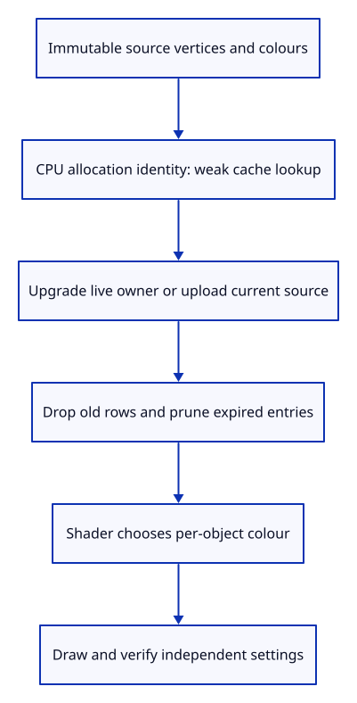
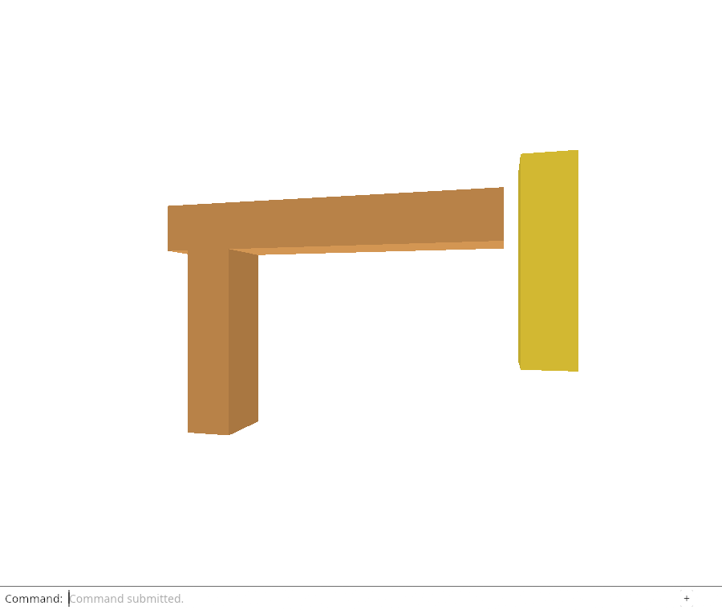

# 31b · Reuse uploads while their geometry is alive

**Combined study estimate: 1–2 hours.** Includes reading, typing, reasoning and experiments.

**Typing estimate: 20–40 minutes.** 51 added or changed lines; unchanged context is excluded. [How this is estimated](typing-load.md).

**Today:** Cache GPU geometry by its retained CPU allocation and release dead cache entries.

**Follow:** Scene row → source allocation identity → weak cache lookup → shared GPU geometry → object settings.

Now the renderer can ask for an existing upload before creating buffers. GeometryCache maps a CPU display address to Weak<GpuGeometry>. The pointer is an identity key only: we never dereference it.



A live GpuGeometry owns its source Rc. Therefore a successful Weak::upgrade cannot accidentally refer to another allocation that reused that address. An expired entry has no reusable buffers; get uploads the current source and replaces it. prune removes expired entries after old GPU rows are dropped. Equal vertex values in different CPU allocations deliberately remain separate keys.

Renderer constructs itself with an empty row list and then synchronizes the initial scene through the same path used for later changes. This avoids a separate startup cache policy. Each scene synchronization still creates new object uniforms, but retained geometry no longer needs another vertex/index upload.

## Type the change

Continue from [Give immutable GPU geometry one owner](31a-geometry.md). Save your own work first: `npm --prefix ../session_tests run course -- save before-31b-cache` (from `session_viewer`).

### 1. `src/geometry_cache.rs`

Keep weak cache entries and cumulative upload evidence without pinning unused GPU buffers.

Create the file and type:

```rust
--8<-- "journey/code/31b-cache-01.rs"
```

### 2. `src/lib.rs`

Expose the geometry cache to the renderer.

Find this exact block:

```rust
pub mod gpu_geometry;
```

Replace that block with:

```rust
--8<-- "journey/code/31b-cache-02.rs"
```

### 3. `src/renderer.rs`

Keep geometry reuse and object allocation counts with the renderer.

Find this exact block:

```rust
    meshes: Vec<GpuMesh>,
```

Replace that block with:

```rust
--8<-- "journey/code/31b-cache-03.rs"
```

### 4. `src/renderer.rs`

Let the same scene synchronization populate startup rows.

Find this exact block:

```rust
        let layout = pipeline.get_bind_group_layout(1);
        let meshes = scene.objects().iter()
            .map(|object| GpuMesh::upload(&device, &layout, object, false)).collect();
```

Delete this block.

### 5. `src/renderer.rs`

Initialize startup through the same ownership path as later edits.

Find this exact block:

```rust
        Self { device, queue, pipeline, meshes, uniform, view_group, depth }
```

Replace that block with:

```rust
--8<-- "journey/code/31b-cache-05.rs"
```

### 6. `src/renderer.rs`

Reuse live geometry before replacing the old GPU rows, then prune dead weak entries.

Find this exact block:

```rust
        self.meshes = scene.objects().iter().map(|object| {
            GpuMesh::upload(&self.device, &layout, object, selected == Some(object.id))
        }).collect();
```

Replace that block with:

```rust
--8<-- "journey/code/31b-cache-06.rs"
```

### 7. `src/renderer.rs`

Report cumulative geometry uploads, settings allocations and the reserved write counters.

Find this exact block:

```rust
    pub fn draw(
```

Replace that block with:

```rust
--8<-- "journey/code/31b-cache-07.rs"
```

### 8. `src/browser.rs`

Wait until the renderer exists before reporting GPU diagnostics.

Find this exact block:

```rust
    inspect(&editor)?;
```

Delete this block.

### 9. `src/browser.rs`

Inspect CPU and GPU state after startup synchronization.

Find this exact block:

```rust
    renderer.resize(Viewport { width, height });
```

Replace that block with:

```rust
--8<-- "journey/code/31b-cache-09.rs"
```

### 10. `src/browser.rs`

Update diagnostics after the actual committed action.

Find this exact block:

```rust
        if let Err(error) = inspect(&editor) {
```

Replace that block with:

```rust
--8<-- "journey/code/31b-cache-10.rs"
```

### 11. `src/browser.rs`

Pass renderer accounting into the private diagnostics function.

Find this exact block:

```rust
fn inspect(editor: &Editor) -> Result<(), JsValue> {
```

Replace that block with:

```rust
--8<-- "journey/code/31b-cache-11.rs"
```

### 12. `src/browser.rs`

Expose counters through a hidden canvas attribute rather than feature controls.

Find this exact block:

```rust
    canvas.set_attribute("data-object-count", &editor.scene.objects().len().to_string())?;
```

Replace that block with:

```rust
--8<-- "journey/code/31b-cache-12.rs"
```

## Run and look

From `session_viewer`, enter your project folder:

```sh
cd workspace/journey
REGEN_PROTO=0 cargo build --lib --locked --target wasm32-unknown-unknown -j4
REGEN_PROTO=0 CARGO_BUILD_JOBS=4 trunk serve --port 8780
```

Open `http://127.0.0.1:8780/`. If Trunk is already running in this project, leave it running; it rebuilds when you save.

Run the cache checks below. A second live owner must reuse the same upload; after the final owner drops, the weak cache must not retain it.

**Verified checkpoint in Chrome.**



[What this screenshot checks](release.md).

Run the state checks from your project folder:

```sh
REGEN_PROTO=0 cargo test --lib --locked -j4
```

<details>
<summary>Optional experiment</summary>

Explain why cloning Rc<Mesh> finds the same upload while constructing a new Mesh with equal vertices does not. Then drop every GPU row and prune; the weak cache must not keep a geometry owner alive.

</details>

## Explain the change

Why must the cache store Weak owners and retain the CPU source inside GpuGeometry?

<details>
<summary>Compare your explanation</summary>

Weak entries do not keep unused GPU geometry alive. A successful upgrade yields a geometry owner that still retains the exact CPU allocation used as the key, so that address cannot have been reused for another live source. If upgrade fails, upload the current source and replace the dead entry.

</details>

## Keep your working result

Return to `session_viewer` in a second terminal. Restore experimental edits before comparing:

```sh
npm --prefix ../session_tests run course -- check 31b-cache
npm --prefix ../session_tests run course -- save 31b-cache
```

Check compares your typed source; run the focused check above for behavior. [Recover your work](recovery.md).

<details>
<summary>Where this fits in the finished viewer</summary>

This cache teaches retained geometry identity and release. The production viewer’s arenas, byte accounting and instancing still need their own later lessons and benchmarks.

</details>

<details>
<summary>Verification notes and browser acceptance</summary>

Hidden canvas diagnostics record cumulative geometry uploads and object-uniform allocations. They are validation data, not visible controls or a performance claim. The native check requests the same source twice, then an equal but independent source, and verifies reuse, ownership and expiration. Chrome confirms selection and Move create no new geometry uploads. The next lesson also retains unchanged object uniforms.

[Full validation scope](release.md).

To reproduce the scripted acceptance of the reference checkpoint, run from `session_viewer` with the [course bundle server](release.md#reproduce) running on port 8781:

```sh
npm --prefix ../session_tests run course -- capture 31b-cache
```

This uses the verified reference bundle; it does not check or change your typed project.

</details>
