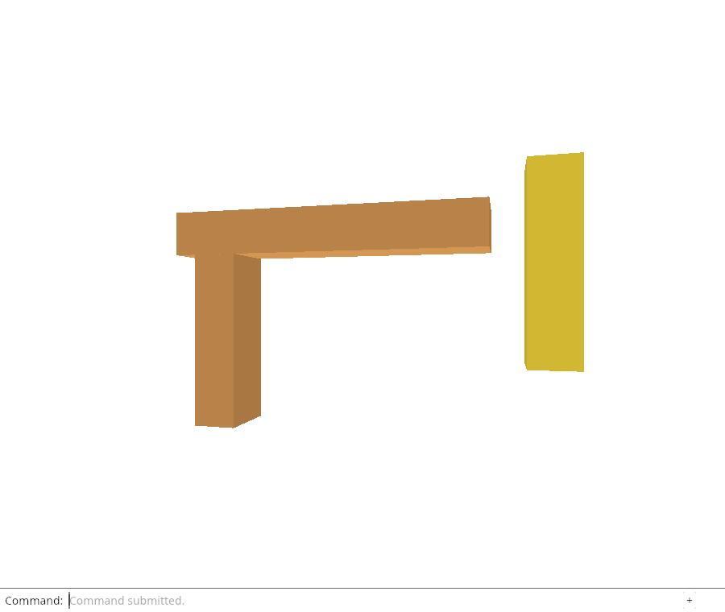
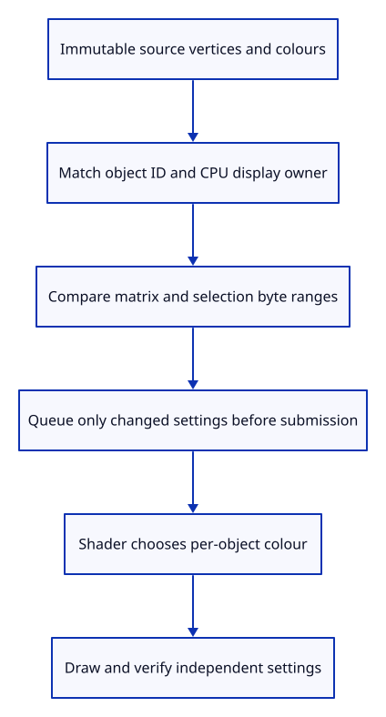

# 31c · Update only changed object settings

**Typing: 20–39 minutes.** [Estimate](typing-load.md).

Retain a GPU row when both its `ObjectId` and CPU display owner match. Reorder retained rows into scene order; drop unmatched rows before pruning the weak cache.

## Type

Continue from [Reuse uploads while their geometry is alive](31b-cache.md). [Save or recover your work](recovery.md).

### 1. `src/gpu_mesh.rs`

Retain row identity, its writable settings buffer and the bytes last sent.

<details>
<summary>Locate the existing block</summary>

```rust
    model_group: wgpu::BindGroup,
```

</details>

Replace that block with:

```rust
--8<-- "journey/code/31c-incremental-01.rs"
```

### 2. `src/gpu_mesh.rs`

Allow queued updates to the settings buffer.

<details>
<summary>Locate the existing block</summary>

```rust
            usage: wgpu::BufferUsages::UNIFORM,
```

</details>

Replace that block with:

```rust
--8<-- "journey/code/31c-incremental-02.rs"
```

### 3. `src/gpu_mesh.rs`

Keep settings ownership beside the bind group.

<details>
<summary>Locate the existing block</summary>

```rust
        Self { geometry, model_group }
```

</details>

Replace that block with:

```rust
--8<-- "journey/code/31c-incremental-03.rs"
```

### 4. `src/gpu_mesh.rs`

Queue only changed matrix or selection ranges and count their actual calls and bytes.

<details>
<summary>Locate the existing block</summary>

```rust
    pub fn draw(&self, pass: &mut wgpu::RenderPass<'_>) {
```

</details>

Replace that block with:

```rust
--8<-- "journey/code/31c-incremental-04.rs"
```

### 5. `src/renderer.rs`

Accumulate settings write evidence.

<details>
<summary>Locate the existing block</summary>

```rust
    settings_allocations: usize,
```

</details>

Replace that block with:

```rust
--8<-- "journey/code/31c-incremental-05.rs"
```

### 6. `src/renderer.rs`

Initialize the cumulative write counters.

<details>
<summary>Locate the existing block</summary>

```rust
            geometry: Default::default(), settings_allocations: 0, uniform, view_group, depth };
```

</details>

Replace that block with:

```rust
--8<-- "journey/code/31c-incremental-06.rs"
```

### 7. `src/renderer.rs`

Retain matching GPU rows, preserve scene draw order and drop unused rows before cache pruning.

<details>
<summary>Locate the existing block</summary>

```rust
        let mut meshes = Vec::with_capacity(scene.objects().len());
        for object in scene.objects() {
            let geometry = self.geometry.get(&self.device, &object.mesh);
            meshes.push(GpuMesh::with_geometry(&self.device, &layout, object,
                selected == Some(object.id), geometry));
            self.settings_allocations += 1;
        }
        self.meshes = meshes;
        self.geometry.prune();
```

</details>

Replace that block with:

```rust
--8<-- "journey/code/31c-incremental-07.rs"
```

### 8. `src/renderer.rs`

Report actual update calls and bytes rather than reserved zeros.

<details>
<summary>Locate the existing block</summary>

```rust
        [self.geometry.uploads, self.settings_allocations, 0, 0]
```

</details>

Replace that block with:

```rust
--8<-- "journey/code/31c-incremental-08.rs"
```

## Run and check

In your project:

```sh
cd workspace/journey
REGEN_PROTO=0 cargo build --lib --locked --target wasm32-unknown-unknown -j4
REGEN_PROTO=0 CARGO_BUILD_JOBS=4 trunk serve --port 8780
```

Open `http://127.0.0.1:8780/`. Keep an existing Trunk server running; saving rebuilds it.

Move a selected object, then Undo. Run the GPU counter checks: these changes update only the matrix range, without reuploading vertex or index buffers.

**Verified checkpoint in Chrome.**



[Verification scope](release.md).

Run the state checks on your computer from your project folder:

```sh
REGEN_PROTO=0 cargo test --lib --locked --target host-tuple -j4
```

<details>
<summary>Code explanation and diagram</summary>

Store the last eighty encoded uniform bytes. Compare the 64-byte matrix and 16-byte selection ranges separately: Move writes the matrix, selection writes its flag, and unchanged values write nothing. Compare encoded floats so an invisible double change causes no upload.

Add `COPY_DST`. Queue writes execute before the next draw submission; offsets 0 and 64 and lengths 64 and 16 meet four-byte alignment. Hidden counters track actual range writes and bytes. See [wgpu's write contract](https://docs.rs/wgpu/29.0.4/wgpu/struct.Queue.html#method.write_buffer).

Scene row → retained GPU row → matrix or selection byte difference → queued range write → next draw.



Why must row reuse compare both ObjectId and the geometry owner?

ObjectId identifies the document row, but a geometry edit may replace its display allocation. Reuse settings and geometry only when both identities match. Otherwise request the correct upload and construct a new GPU row. Matching rows update only changed matrix or selection bytes.

Study estimate, including typing and experiments: 1–2 hours.

</details>

<details>
<summary>Optional experiment</summary>

Select the same row again without changing placement, or synchronize the same scene directly in the native check. Predict zero additional writes. Explain why a deleted row may need a fresh upload when Undo restores it: the cache deliberately has only weak ownership.

</details>

<details>
<summary>Check and save your work</summary>

Restore experimental edits, then run from `session_viewer`:

```sh
npm --prefix ../session_tests run course -- check 31c-incremental
npm --prefix ../session_tests run course -- save 31c-incremental
```

Source comparison leaves your project untouched. [Save and recovery instructions](recovery.md).

</details>

<details>
<summary>Viewer coverage and verification</summary>

Incremental ownership is a prerequisite for production arenas, resource accounting and large-scene responsiveness. Their complete packing and performance acceptance remain later lessons.

Native GPU and Chrome checks verify no allocation during selection or Move, no writes for unchanged settings, exact selection and Move/Undo pixel round trips, and release/reupload after deleting and undoing a row. Deleting clears selection, and document Undo restores the row without restoring that selection. The checks explicitly reselect the row before comparing its original gold pixels. These counters describe the calls made by this renderer; they do not claim driver memory size or frame-time performance.

[Full validation scope](release.md).

To reproduce the scripted acceptance of the reference checkpoint, run from `session_viewer` with the [course bundle server](release.md#reproduce) running on port 8781:

```sh
npm --prefix ../session_tests run course -- capture 31c-incremental
```

This uses the verified reference bundle; it does not check or change your typed project.

</details>
