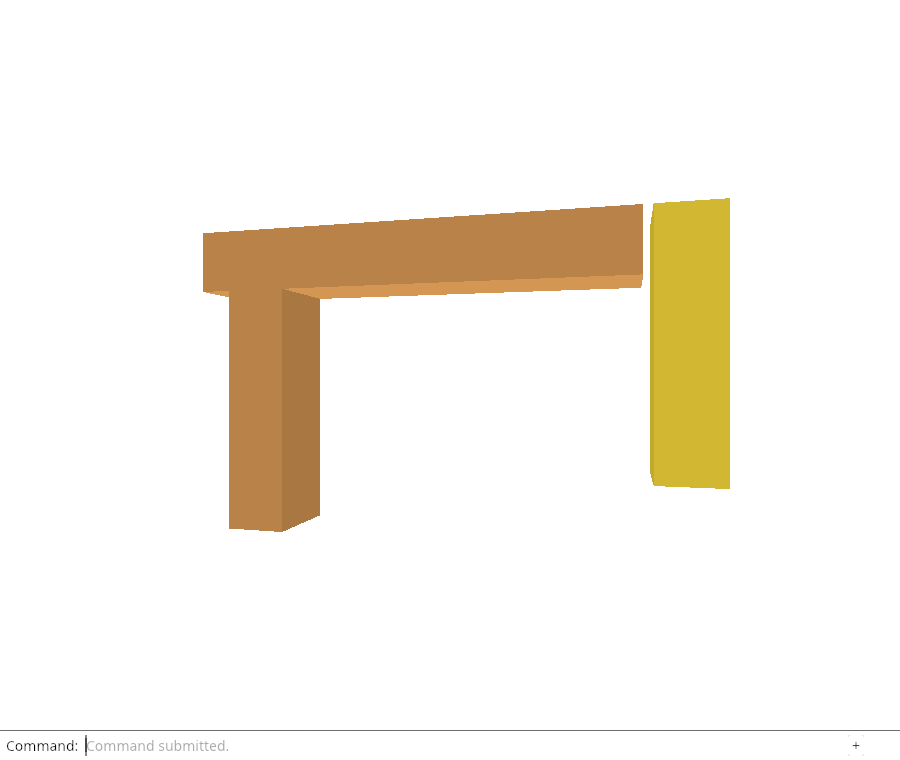
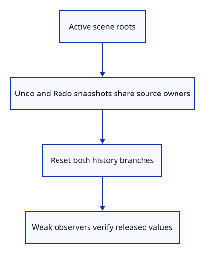

# 32 · Find the owners retained by history

**Typing: 15–30 minutes.** [Estimate](typing-load.md).

Deleting a row removes it from drawing, but Undo can bring it back. That requires an owner somewhere. Our History keeps scene snapshots whose rows clone Rc owners rather than copying mesh payloads.

## Type

Continue from [Update only changed object settings](31c-incremental.md). [Save or recover your work](recovery.md).

### 1. `src/history.rs`

Expose borrowed snapshot roots and an explicit reset of both branches.

<details>
<summary>Locate the existing block</summary>

```rust
    pub fn edit(&mut self, scene: &mut Scene, action: impl FnOnce(&mut Scene)) {
```

</details>

Replace that block with:

```rust
--8<-- "journey/code/32-history-01.rs"
```

### 2. `src/history.rs`

Prove deletion differs from dropping the owners retained by Undo and Redo.

<details>
<summary>Locate the existing block</summary>

```rust
    #[test]
    fn undo_restores_identity_and_shares_the_original_mesh() {
```

</details>

Replace that block with:

```rust
--8<-- "journey/code/32-history-02.rs"
```

## Run and check

In your project:

```sh
cd workspace/journey
REGEN_PROTO=0 cargo build --lib --locked --target wasm32-unknown-unknown -j4
REGEN_PROTO=0 CARGO_BUILD_JOBS=4 trunk serve --port 8780
```

Open `http://127.0.0.1:8780/`. Keep an existing Trunk server running; saving rebuilds it.

Run the history checks below. After edits and Undo, inspect both branches; releasing history must empty both retained roots without changing active rows.

**Verified checkpoint in Chrome.**



[Verification scope](release.md).

Run the state checks on your computer from your project folder:

```sh
REGEN_PROTO=0 cargo test --lib --locked --target host-tuple -j4
```

<details>
<summary>Code explanation and diagram</summary>

Add a borrowed iterator over both history branches. It lets accounting inspect the roots without cloning their owners. clear replaces History with its empty default, dropping the snapshots and their vector storage. Ordinary edits still keep history; this explicit reset will be used by document close.

The first test removes a row, confirms history retains its source/display values, then clears history and confirms those values are gone. The second leaves an extra object only in Redo and proves clearing both branches prevents it from returning.

[Weak::upgrade](https://doc.rust-lang.org/std/rc/struct.Weak.html#method.upgrade) lets a check observe whether a value still has an owner. A failed upgrade proves the managed value is gone; the Weak control allocation itself remains until its weak references are dropped. It is not a measurement of process memory.

The browser still behaves as before at this endpoint. We are making the ownership roots inspectable before wiring a destructive document operation into commands.

Scene snapshots → shared source/display owners → history reset → ownership tests.



Why can deleting every visible row leave its source alive?

Undo and Redo hold scene snapshots. Their rows share the original source and display owners so history can restore them. Removing visible rows does not remove those snapshot owners. Closing a document must drop both history branches as well as the active rows.

Study estimate, including typing and experiments: 1–2 hours.

</details>

<details>
<summary>Optional experiment</summary>

Keep a cloned Rc of a removed display in a test scope. Predict why clearing history will no longer make its Weak upgrade fail until that extra owner is dropped.

</details>

<details>
<summary>Check and save your work</summary>

Restore experimental edits, then run from `session_viewer`:

```sh
npm --prefix ../session_tests run course -- check 32-history
npm --prefix ../session_tests run course -- save 32-history
```

Source comparison leaves your project untouched. [Save and recovery instructions](recovery.md).

</details>

<details>
<summary>Viewer coverage and verification</summary>

History ownership matters for source release, document replacement and large scenes. Production source unloading also retains display and tree metadata; its later lessons are distinct from closing the document.


[Full validation scope](release.md).

To reproduce the scripted acceptance of the reference checkpoint, run from `session_viewer` with the [course bundle server](release.md#reproduce) running on port 8781:

```sh
npm --prefix ../session_tests run course -- capture 32-history
```

This uses the verified reference bundle; it does not check or change your typed project.

</details>
