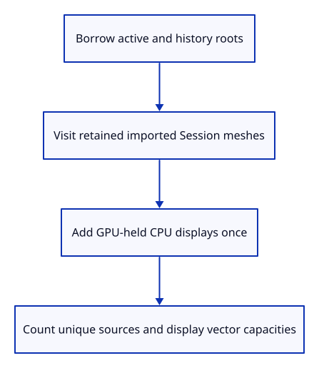
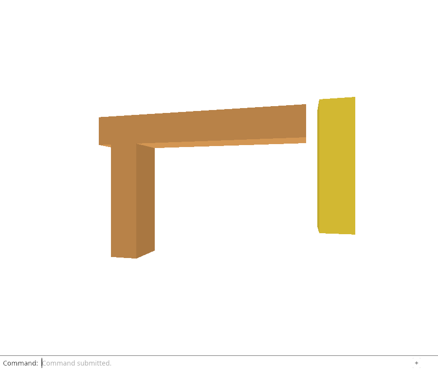

# 32a · Count shared CPU displays once

**Combined study estimate: 1–2 hours.** Includes reading, typing, reasoning and experiments.

**Typing estimate: 30–60 minutes.** 72 added or changed lines; unchanged context is excluded. [How this is estimated](typing-load.md).

**Today:** Account for active/history rows, retained sources/documents and unique display payloads.

**Follow:** Borrowed scene roots and GPU display owners → identity sets → scoped CPU ledger.

Counting a mesh once for every snapshot would exaggerate its memory. Count row records separately, then use allocation identities to count each shared source, document and derived display once.



The six CPU fields are: owned row records across all scene roots, unique kernel meshes, unique imported documents, unique derived displays, display vector-capacity bytes, and scene roots. These are a scoped ledger, not total heap memory. Display bytes include vertex/index Vec capacities; kernel payload, row strings, hash tables, allocator overhead and other application state are not estimated here. Later source accounting extends the geometry families.

An imported document can retain a kernel mesh after its last display row is removed. Visit every mesh owned by each distinct retained Session, as well as each row’s required geometry. GPU geometry retains only its CPU display, so add those display owners through a second borrowed iterator.

HashSet uses pointer identity without dereferencing a raw pointer. All identities come from borrowed live Rc owners during this count. No stored count keeps a document alive.

The tests compare a scene with its shared snapshot and remove an imported row while other rows keep its source document alive. Another display with deliberately reserved spare capacity checks that the ledger counts capacity rather than length.

## Type the change

Continue from [Find the owners retained by history](32-history.md). Save your own work first: `npm --prefix ../session_tests run course -- save before-32a-cpu` (from `session_viewer`).

### 1. `src/mesh.rs`

Count allocated display-vector capacity rather than just occupied elements.

Find this exact block:

```rust
    pub fn vertices(&self) -> &[[f32; 6]] {
```

Replace that block with:

```rust
--8<-- "journey/code/32a-cpu-01.rs"
```

### 2. `src/editor.rs`

Inspect active and retained snapshot roots without creating new owners.

Find this exact block:

```rust
    pub fn apply(&mut self, action: Action) -> Result<Change, &'static str> {
```

Replace that block with:

```rust
--8<-- "journey/code/32a-cpu-02.rs"
```

### 3. `src/renderer.rs`

Expose borrowed live geometry owners for accounting and weak lifetime checks.

Find this exact block:

```rust
    pub fn stats(&self) -> [usize; 4] {
```

Replace that block with:

```rust
--8<-- "journey/code/32a-cpu-03.rs"
```

### 4. `src/memory.rs`

Count unique live owners and known display capacities across editor and GPU roots.

Create the file and type:

```rust
--8<-- "journey/code/32a-cpu-04.rs"
```

### 5. `src/lib.rs`

Expose the scoped ownership ledger.

Find this exact block:

```rust
pub mod mesh;
```

Replace that block with:

```rust
--8<-- "journey/code/32a-cpu-05.rs"
```

### 6. `src/browser.rs`

Publish accounting only through private canvas diagnostics.

Find this exact block:

```rust
    canvas.set_attribute("data-gpu-stats", &format!("{:?}", renderer.stats()))?;
```

Replace that block with:

```rust
--8<-- "journey/code/32a-cpu-06.rs"
```

## Run and look

From `session_viewer`, enter your project folder:

```sh
cd workspace/journey
REGEN_PROTO=0 cargo build --lib --locked --target wasm32-unknown-unknown -j4
REGEN_PROTO=0 CARGO_BUILD_JOBS=4 trunk serve --port 8780
```

Open `http://127.0.0.1:8780/`. If Trunk is already running in this project, leave it running; it rebuilds when you save.

Run the CPU accounting checks below. One display shared by active rows and history must be counted once, while every row remains counted.

**Verified checkpoint in Chrome.**



[What this screenshot checks](release.md).

Run the state checks from your project folder:

```sh
REGEN_PROTO=0 cargo test --lib --locked -j4
```

<details>
<summary>Optional experiment</summary>

Compare a Vec with length three and capacity sixteen. Explain why its payload allocation is larger than its currently occupied elements. Then explain which memory categories this ledger deliberately does not claim to measure.

</details>

## Explain the change

Why does the CPU ledger include display owners held by GPU geometry?

<details>
<summary>Compare your explanation</summary>

GpuGeometry retains the CPU display that produced its buffers. That owner can outlive the editor rows, especially between closing the editor and synchronizing the renderer. Count that retained display once alongside active/history displays; do not mistake zero visible rows for zero live display payload.

</details>

## Keep your working result

Return to `session_viewer` in a second terminal. Restore experimental edits before comparing:

```sh
npm --prefix ../session_tests run course -- check 32a-cpu
npm --prefix ../session_tests run course -- save 32a-cpu
```

Check compares your typed source; run the focused check above for behavior. [Recover your work](recovery.md).

<details>
<summary>Where this fits in the finished viewer</summary>

Production source accounting covers every kernel geometry family and cached scans. This mesh-stage ledger teaches unique ownership and known display payload; full source categories remain a required later extension.

</details>

<details>
<summary>Verification notes and browser acceptance</summary>


[Full validation scope](release.md).

To reproduce the scripted acceptance of the reference checkpoint, run from `session_viewer` with the [course bundle server](release.md#reproduce) running on port 8781:

```sh
npm --prefix ../session_tests run course -- capture 32a-cpu
```

This uses the verified reference bundle; it does not check or change your typed project.

</details>
