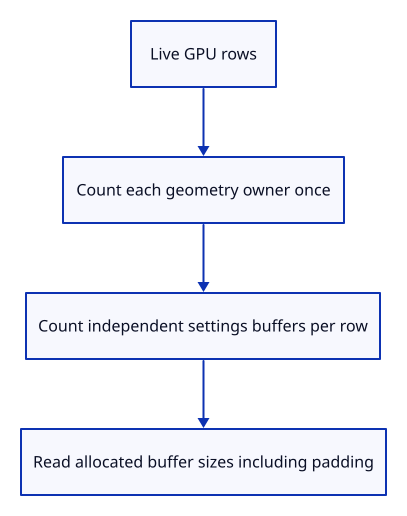
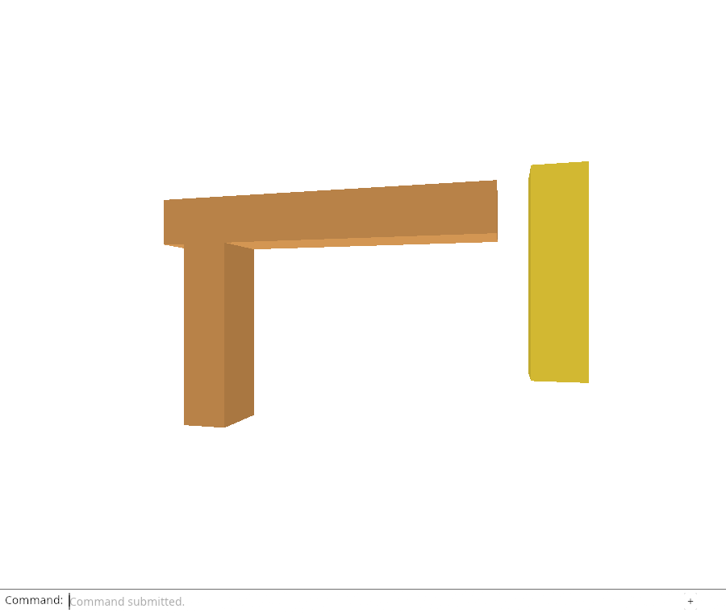

# 32b · Count each shared GPU buffer once

**Combined study estimate: 1–2 hours.** Includes reading, typing, reasoning and experiments.

**Typing estimate: 7–14 minutes.** 19 added or changed lines; unchanged context is excluded. [How this is estimated](typing-load.md).

**Today:** Measure live document buffer sizes separately from cumulative allocation counters.

**In the whole viewer:** Connect the browser, drawing and input, then extend the same project. [See the destination](../journey.md#the-destination).

**Follow:** Live GPU rows → unique geometry owners and independent settings → buffer-size ledger.

**Before you finish, explain:** Why can index buffer bytes exceed the six index bytes we supplied?

The upload counters tell us how much work happened over time. They cannot tell us how much document storage is alive now. Add a live GPU ledger that visits each geometry allocation once and every object-settings buffer separately.



Its four fields are unique geometry owners, their vertex/index buffer bytes, object-settings buffers, and settings-buffer bytes. [Buffer::size](https://docs.rs/wgpu/29.0.4/wgpu/struct.Buffer.html#method.size) reports the buffer size selected at creation. The ledger excludes camera/depth/dock resources, pending staging work, driver overhead and memory pooling; it is document buffer ownership, not a driver-memory measurement.

The native GPU proof creates two rows sharing one three-vertex geometry. It expects one seventy-two-byte vertex buffer, one eight-byte index buffer, and two eighty-byte settings buffers. That exercises sharing and alignment with an independent known input.

The browser exposes data-gpu-usage alongside data-cpu-usage. After document close these live document figures must become zero, while cumulative uploads remain a useful record of work already performed.

## Type the change

Continue [Count shared CPU displays once](32a-cpu.md). From `session_viewer`, save your files with `npm --prefix ../session_tests run course -- save before-32b-gpu`. A save keeps your own work; it does not fill in the next lesson.

### 1. `src/gpu_geometry.rs`

Read actual buffer sizes, including initialization alignment.

Find this exact block:

```rust
    pub fn draw(&self, pass: &mut wgpu::RenderPass<'_>) {
```

Replace that block with:

```rust
--8<-- "journey/code/32b-gpu-01.rs"
```

### 2. `src/gpu_mesh.rs`

Report the independent settings buffer owned by one GPU row.

Find this exact block:

```rust
    pub fn update(&mut self, queue: &wgpu::Queue, object: &Object, selected: bool) -> [usize; 2] {
```

Replace that block with:

```rust
--8<-- "journey/code/32b-gpu-02.rs"
```

### 3. `src/memory.rs`

Count shared geometry once while retaining each row’s separate settings cost.

Find this exact block:

```rust
#[cfg(test)]
mod tests {
```

Replace that block with:

```rust
--8<-- "journey/code/32b-gpu-03.rs"
```

### 4. `src/renderer.rs`

Distinguish live document resources from cumulative upload/write counters.

Find this exact block:

```rust
    pub fn stats(&self) -> [usize; 4] {
```

Replace that block with:

```rust
--8<-- "journey/code/32b-gpu-04.rs"
```

### 5. `src/browser.rs`

Expose live document buffer sizes without adding runtime controls.

Find this exact block:

```rust
    canvas.set_attribute("data-cpu-usage", &format!("{cpu:?}"))?;
```

Replace that block with:

```rust
--8<-- "journey/code/32b-gpu-05.rs"
```

## Run and look

From `session_viewer`, enter your project folder:

```sh
cd workspace/journey
REGEN_PROTO=0 cargo build --lib --locked --target wasm32-unknown-unknown -j4
REGEN_PROTO=0 CARGO_BUILD_JOBS=4 trunk serve --port 8780
```

Open `http://127.0.0.1:8780/`. If Trunk is already running in this project, leave it running; it rebuilds when you save.

Read data-gpu-usage after selecting and moving the specimen. Live geometry and settings counts stay at three. Compare these live values with data-gpu-stats, whose cumulative counters continue increasing when new documents are uploaded.

**Actual Chrome screenshot.**



*Captured from this checkpoint’s browser bundle after its browser checks passed. [Check scope and environment](release.md).*

Run the state checks from your project folder:

```sh
REGEN_PROTO=0 cargo test --lib --locked -j4
```

## Try one small experiment

For three u16 indices, calculate six payload bytes and eight allocated upload bytes. Then calculate two object uniforms sharing that geometry. Explain why adding geometry bytes for both rows would be wrong.

## Explain it in your own words

Trace the values through the files without reading the answer first. If you lose the connection, stop at the last value you can follow.

<details>
<summary>Compare your explanation</summary>

Buffer initialization rounds its allocation to the copy-alignment requirement. Three u16 indices carry six payload bytes but this upload has an eight-byte GPU buffer. Read Buffer::size for allocated buffer size rather than equating it with the source slice length.

</details>

## Keep your working result

Return to `session_viewer` in a second terminal. Restore experimental edits before comparing:

```sh
npm --prefix ../session_tests run course -- check 32b-gpu
npm --prefix ../session_tests run course -- save 32b-gpu
```

The comparison spots typing differences; it does not prove behaviour. Keep three notes: what I changed; the values I followed; the question I still have. [Recover a checkpoint](recovery.md) if an experiment gets tangled.

## Where this grows

Production accounting also includes packed arenas, textures, staging and renderer infrastructure. This chapter establishes exact document-buffer sharing before those later resource families are introduced.

[Validation status and course release](release.md).
