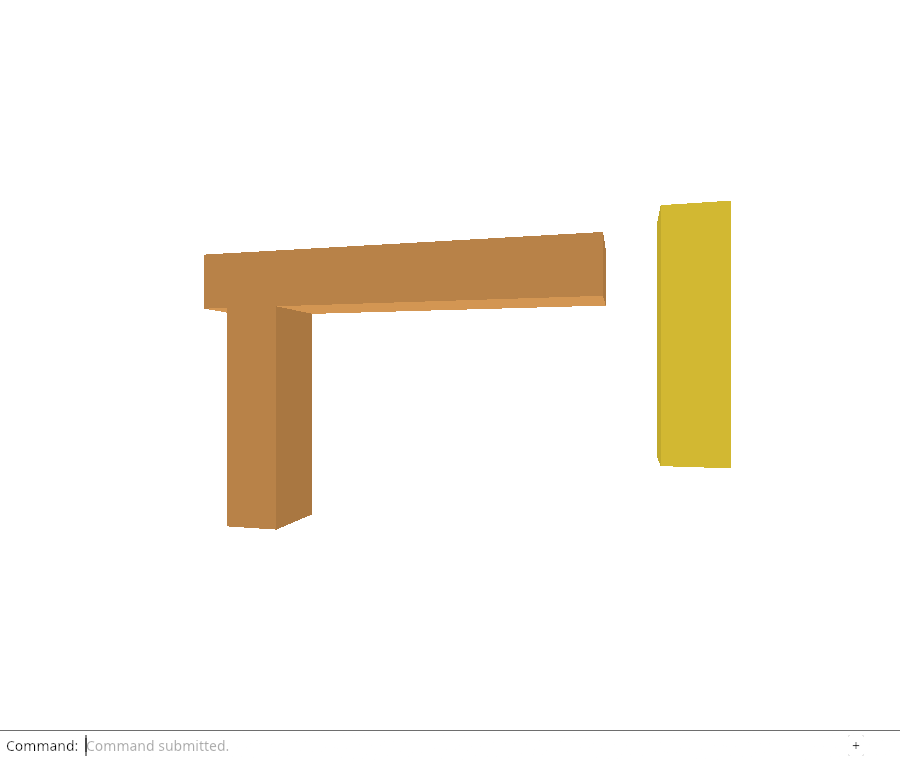
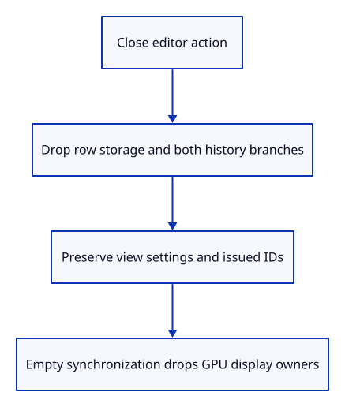

# 32c · Close the document without resetting the view

**Typing: 20–40 minutes.** [Estimate](typing-load.md).

Close is different from Delete and Open Replace. Delete is an undoable edit. Replacement is one transaction that lets Undo recover the previous document. Close ends that document history entirely.

Scene::clear drops its row-vector storage and extra-row marker without resetting next_id. Replace reuses that clearing operation inside its existing transaction. Action::Close calls it directly, clears both history branches and clears selection. It returns a scene change so the normal renderer synchronization can release old GPU rows.

## Type

Continue from [Count each shared GPU buffer once](32b-gpu.md). [Save or recover your work](recovery.md).

### 1. `src/scene.rs`

Release row storage while preserving issued identities; reuse this inside atomic replacement.

<details>
<summary>Locate the existing block</summary>

```rust
    pub fn replace(&mut self, loaded: crate::document::Loaded) -> Result<(), &'static str> {
        self.objects.clear();
        self.extra = None;
        self.import(loaded)
    }
```

</details>

Replace that block with:

```rust
--8<-- "journey/code/32c-close-01.rs"
```

### 2. `src/editor.rs`

Give closing a typed editor action.

<details>
<summary>Locate the existing block</summary>

```rust
    Replace(Vec<u8>),
```

</details>

Replace that block with:

```rust
--8<-- "journey/code/32c-close-02.rs"
```

### 3. `src/editor.rs`

Close outside undoable document edits and preserve application view settings.

<details>
<summary>Locate the existing block</summary>

```rust
            Action::Replace(bytes) => {
```

</details>

Replace that block with:

```rust
--8<-- "journey/code/32c-close-03.rs"
```

### 4. `src/editor.rs`

Check source release, both history branches, identity reuse and view preservation.

<details>
<summary>Locate the existing block</summary>

```rust
    #[test]
    fn resetting_the_view_preserves_its_current_aspect() {
```

</details>

Replace that block with:

```rust
--8<-- "journey/code/32c-close-04.rs"
```

## Run and check

In your project:

```sh
cd workspace/journey
REGEN_PROTO=0 cargo build --lib --locked --target wasm32-unknown-unknown -j4
REGEN_PROTO=0 CARGO_BUILD_JOBS=4 trunk serve --port 8780
```

Open `http://127.0.0.1:8780/`. Keep an existing Trunk server running; saving rebuilds it.

Run the close checks below. Closing empties active rows, Undo and Redo while preserving camera and ID issuance. The typed Close command follows next.

**Verified checkpoint in Chrome.**



[Verification scope](release.md).

Run the state checks on your computer from your project folder:

```sh
REGEN_PROTO=0 cargo test --lib --locked --target host-tuple -j4
```

<details>
<summary>Code explanation and diagram</summary>

The tests create both old document and Redo roots, close, and require empty rows, no surviving history and a later object ID that was never used by the old document. They also check that camera and background settings remain unchanged and repeated close is harmless.

The native GPU proof closes the editor first, then synchronizes an empty scene. Kernel sources/documents are released when the editor roots disappear; CPU displays held by GPU geometry remain until those draw rows are dropped. The browser command is connected in the next lesson.

Close action → scene storage release and history reset → empty renderer synchronization.



Why does Close keep next_id even though it drops every row?

Old asynchronous work may still refer to an issued local identity. Reusing those identities would make it ambiguous which document row was meant. Empty the row storage and history, clear selection, but keep the monotonically issued counter. Camera and background are application settings and remain outside document close.

Study estimate, including typing and experiments: 1–2 hours.

</details>

<details>
<summary>Optional experiment</summary>

Compare calling Delete three times with calling Close once. Predict which sources history retains in each case, and whether Undo can restore the old document.

</details>

<details>
<summary>Check and save your work</summary>

Restore experimental edits, then run from `session_viewer`:

```sh
npm --prefix ../session_tests run course -- check 32c-close
npm --prefix ../session_tests run course -- save 32c-close
```

Source comparison leaves your project untouched. [Save and recovery instructions](recovery.md).

</details>

<details>
<summary>Viewer coverage and verification</summary>

Closing, replacing, unloading source-only data and recovering a released source have different contracts. The following source-unload/reload lessons preserve visible display rows instead of emptying them.


[Full validation scope](release.md).

To reproduce the scripted acceptance of the reference checkpoint, run from `session_viewer` with the [course bundle server](release.md#reproduce) running on port 8781:

```sh
npm --prefix ../session_tests run course -- capture 32c-close
```

This uses the verified reference bundle; it does not check or change your typed project.

</details>
