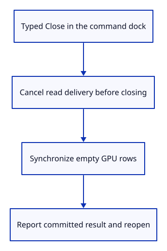
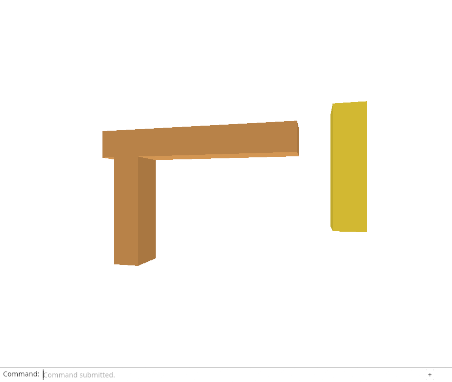

# 32d · Close through the command line and revoke reads

**Combined study estimate: 1–2 hours.** Includes reading, typing, reasoning and experiments.

**Typing estimate: 5–9 minutes.** 10 added or changed lines; unchanged context is excluded. [How this is estimated](typing-load.md).

**Today:** Wire Close into the dock and cancel pending delivery before closing the editor.

**In the whole viewer:** Connect the browser, drawing and input, then extend the same project. [See the destination](../journey.md#the-destination).

**Follow:** Typed Close → read-ticket cancellation → editor close → empty GPU rows → dock result.

**Before you finish, explain:** Why must Close revoke a pending read before it drops the document?

Now expose the ordinary editor operation as Close in the real command dock. There is no feature button or keyboard shortcut. The command cancels ReadGate before returning Action::Close.



Remember which action was submitted before apply consumes it. After a successful scene change, report Document closed. through the dock. This describes an operation whose rows and renderer synchronization actually completed; it does not invent a success on failure.

Chrome holds a real File.arrayBuffer result, types Close, and releases the old promise afterwards. The scene must stay empty and command history must not acquire a late result. It also tries Undo and Redo after close, checks live CPU/GPU document ledgers, and imports a new specimen without reloading the page.

The final screenshot shows the reopened specimen rather than pretending that a blank page alone proves resource release. The check verifies the empty drawing before reopening, and the native proof observes old source and GPU geometry values through Weak references.

Close preserves camera/background state and the viewer’s GPU device. The next listener-lifetime chapter addresses ending the whole viewer, which is a different lifetime.

## Type the change

Continue [Close the document without resetting the view](32c-close.md). From `session_viewer`, save your files with `npm --prefix ../session_tests run course -- save before-32d-command`. A save keeps your own work; it does not fill in the next lesson.

### 1. `src/browser.rs`

Offer closing only through the actual dock vocabulary.

Find this exact block:

```rust
            "Cancel Open",
```

Replace that block with:

```rust
--8<-- "journey/code/32d-command-01.rs"
```

### 2. `src/browser.rs`

Revoke pending file ownership before the editor closes.

Find this exact block:

```rust
            if line == "cancel open" {
```

Replace that block with:

```rust
--8<-- "journey/code/32d-command-02.rs"
```

### 3. `src/browser.rs`

Retain the submitted operation kind across action consumption.

Find this exact block:

```rust
            let replacement = matches!(&action, Action::Replace(_));
```

Replace that block with:

```rust
--8<-- "journey/code/32d-command-03.rs"
```

### 4. `src/browser.rs`

Report close only after its scene operation and renderer synchronization succeed.

Find this exact block:

```rust
                    if event.type_() == "viewer-file" {
```

Replace that block with:

```rust
--8<-- "journey/code/32d-command-04.rs"
```

## Run and look

From `session_viewer`, enter your project folder:

```sh
cd workspace/journey
cargo build --lib --locked --target wasm32-unknown-unknown -j4
CARGO_BUILD_JOBS=4 trunk serve --port 8780
```

Open `http://127.0.0.1:8780/`. If Trunk is already running in this project, leave it running; it rebuilds when you save.

Open a specimen, Move a post, then type Close. The drawing becomes empty and Undo/Redo cannot restore the closed document. Open the specimen again in the same page; selection and Move must work normally.

**Actual Chrome screenshot.**



*Captured from this checkpoint’s browser bundle after its browser checks passed. [Check scope and environment](release.md).*

Run the state checks from your project folder:

```sh
cargo test --lib --locked -j4
```

## Try one small experiment

Start a file read, then close before it resolves. Predict why cancelling the ticket must happen before a late result can import into the empty scene. Compare this with merely clearing visible rows.

## Explain it in your own words

Trace the values through the files without reading the answer first. If you lose the connection, stop at the last value you can follow.

<details>
<summary>Compare your explanation</summary>

A read can finish after the old document was closed. Without ticket cancellation, its result would import old data into the now-empty scene. Revoke the request at command execution; the file task checks ownership before delivery, so both late success and late failure remain silent.

</details>

## Keep your working result

Return to `session_viewer` in a second terminal. Restore experimental edits before comparing:

```sh
npm --prefix ../session_tests run course -- check 32d-command
npm --prefix ../session_tests run course -- save 32d-command
```

The comparison spots typing differences; it does not prove behaviour. Keep three notes: what I changed; the values I followed; the question I still have. [Recover a checkpoint](recovery.md) if an experiment gets tangled.

## Where this grows

The browser owns asynchronous delivery while the editor owns document close. Keeping those responsibilities explicit will also protect later released-source reloads and viewer shutdown.

[Validation status and course release](release.md).
