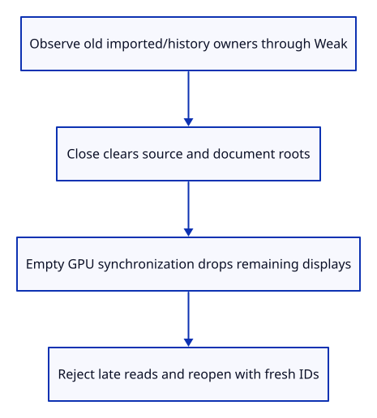
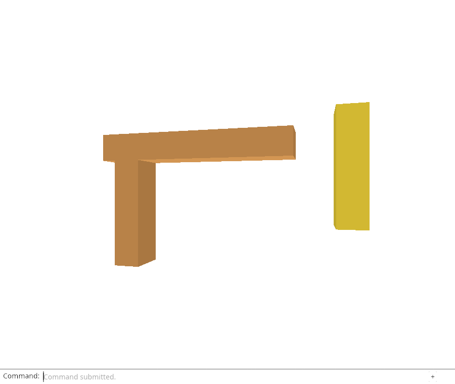

# 32e · Prove release does not retain the old document

**Combined study estimate: 1–2 hours.** Includes reading, typing, reasoning and experiments.

**Typing estimate: 14–28 minutes.** 23 added or changed lines; unchanged context is excluded. [How this is estimated](typing-load.md).

**Today:** Check imported history owners, the CPU/GPU release boundary, late read failures and reopening.

**Follow:** Weak old owners → Close → editor roots gone → empty GPU synchronization → fresh document IDs.

Finish the ownership argument with imported documents and retained history, not just generated demo triangles. The source-only state check records Weak observers across active and undo/redo roots, closes, and verifies that none can recover an old value. Reopening must issue fresh local IDs.



The native GPU proof makes the two release moments explicit. Before synchronization, old GPU geometry still owns the CPU displays used by its buffers. After synchronizing the empty scene, its Weak observers cannot upgrade, live document buffer usage is zero, and the cumulative upload counters have not been reset.

## Type the change

Continue from [Close through the command line and revoke reads](32d-command.md). Save your own work first: `npm --prefix ../session_tests run course -- save before-32e-release` (from `session_viewer`).

### 1. `src/editor.rs`

Verify imported source/document release across history and fresh identities after reopening.

Find this exact block:

```rust
    #[test]
    fn resetting_the_view_preserves_its_current_aspect() {
```

Replace that block with:

```rust
--8<-- "journey/code/32e-release-01.rs"
```

## Run and look

From `session_viewer`, enter your project folder:

```sh
cd workspace/journey
REGEN_PROTO=0 cargo build --lib --locked --target wasm32-unknown-unknown -j4
REGEN_PROTO=0 CARGO_BUILD_JOBS=4 trunk serve --port 8780
```

Open `http://127.0.0.1:8780/`. If Trunk is already running in this project, leave it running; it rebuilds when you save.

Run the release checks below. After Close and empty GPU synchronization, weak observers must find no old document or display owner. The viewer can still open another file.

**Verified checkpoint in Chrome.**



[What this screenshot checks](release.md).

Run the state checks from your project folder:

```sh
REGEN_PROTO=0 cargo test --lib --locked -j4
```

<details>
<summary>Optional experiment</summary>

Keep only Weak observers of an old imported document, then close it. Explain why they can prove the value was dropped while still retaining small control allocations themselves. Do not use process memory graphs as a substitute for ownership checks.

</details>

## Explain the change

What does a zero live document ledger prove, and what does it not prove?

<details>
<summary>Compare your explanation</summary>

It proves the scoped roots and document buffer owners counted by this viewer are gone. Weak checks separately prove the old managed source/display values are dropped. It does not establish process RSS or immediate driver-memory reclamation: other renderer resources, queued GPU work, allocator caches and weak control allocations have separate lifetimes.

</details>

## Keep your working result

Return to `session_viewer` in a second terminal. Restore experimental edits before comparing:

```sh
npm --prefix ../session_tests run course -- check 32e-release
npm --prefix ../session_tests run course -- save 32e-release
```

Check compares your typed source; run the focused check above for behavior. [Recover your work](recovery.md).

<details>
<summary>Where this fits in the finished viewer</summary>

Next we retain display rows while unloading editable source data, then rehydrate that source for editing. Browser listener shutdown, device recovery and all production source/resource families remain separate required lessons.

</details>

<details>
<summary>Verification notes and browser acceptance</summary>

Chrome checks both a late successful read and a late rejected read after Close. Neither may change scene rows, history or result text. A new file request must still succeed afterwards. It also refuses Save while empty without downloading a file.

The CPU ledger remains scoped to mesh ownership and derived display-vector capacity. The GPU ledger counts document vertex/index/settings buffers. Production source categories, arena/texture accounting and source-only unload with rehydration remain explicitly planned; these checks do not replace those later acceptance requirements.

[Full validation scope](release.md).

To reproduce the scripted acceptance of the reference checkpoint, run from `session_viewer` with the [course bundle server](release.md#reproduce) running on port 8781:

```sh
npm --prefix ../session_tests run course -- capture 32e-release
```

This uses the verified reference bundle; it does not check or change your typed project.

</details>
