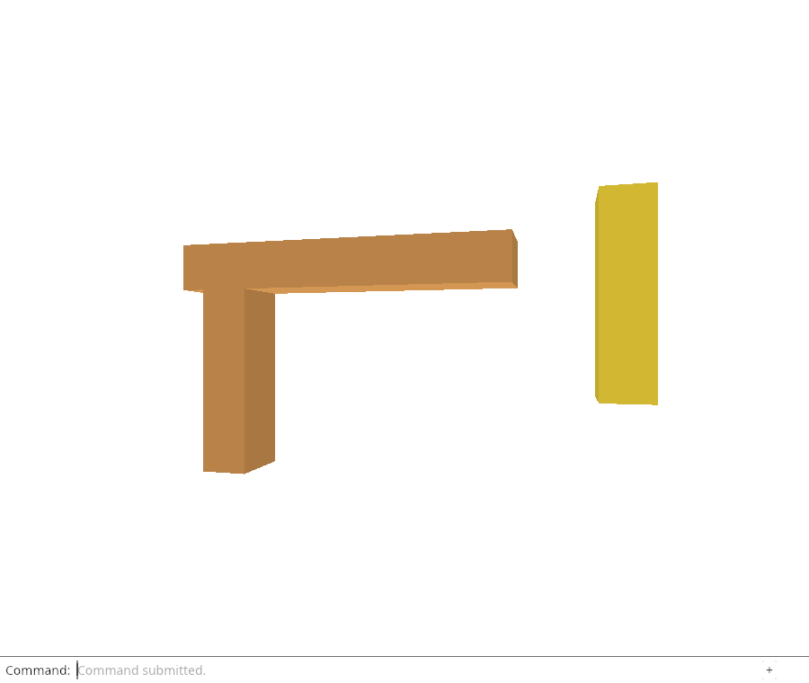
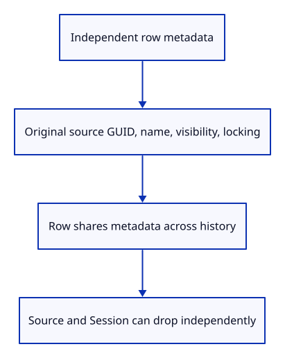

# 32f · Keep row metadata separate from editable geometry

**Typing: 28–56 minutes.** [Estimate](typing-load.md).

Source unloading keeps the picture while dropping eligible editable kernel data. Before dropping any owner, give each row the small descriptive values it will still need. The display mesh, placement and local ObjectId already live on the row. Names and flags currently live inside the kernel mesh.

## Type

Continue from [Prove release does not retain the old document](32e-release.md). [Save or recover your work](recovery.md).

### 1. `src/lib.rs`

Give independently retained row metadata its own small module.

<details>
<summary>Locate the existing block</summary>

```rust
pub mod prepared;
```

</details>

Replace that block with:

```rust
--8<-- "journey/code/32f-metadata-01.rs"
```

### 2. `src/row_metadata.rs`

Copy source identity and flags without copying or retaining kernel payload; test independent lifetime and history.

Create the file and type:

```rust
--8<-- "journey/code/32f-metadata-02.rs"
```

### 3. `src/scene.rs`

Retain descriptive values independently of the editable source.

<details>
<summary>Locate the existing block</summary>

```rust
    pub guid: String,
```

</details>

Replace that block with:

```rust
--8<-- "journey/code/32f-metadata-03.rs"
```

### 4. `src/scene.rs`

Capture metadata before transferring prepared source owners into the row.

<details>
<summary>Locate the existing block</summary>

```rust
        self.objects.push(Object { id, guid, mesh: Rc::new(prepared.display), geometry: prepared.geometry,
```

</details>

Replace that block with:

```rust
--8<-- "journey/code/32f-metadata-04.rs"
```

### 5. `src/browser.rs`

Expose row values through hidden inspection for actual Chrome import/history checks.

<details>
<summary>Locate the existing block</summary>

```rust
    canvas.set_attribute("data-object-count", &editor.scene.objects().len().to_string())?;
```

</details>

Replace that block with:

```rust
--8<-- "journey/code/32f-metadata-05.rs"
```

## Run and check

In your project:

```sh
cd workspace/journey
REGEN_PROTO=0 cargo build --lib --locked --target wasm32-unknown-unknown -j4
REGEN_PROTO=0 CARGO_BUILD_JOBS=4 trunk serve --port 8780
```

Open `http://127.0.0.1:8780/`. Keep an existing Trunk server running; saving rebuilds it.

Run the metadata checks below. Names, GUIDs and visible/locked flags survive after the editable source owner drops; metadata must not retain that source.

**Verified checkpoint in Chrome.**



[Verification scope](release.md).

Run the state checks from your project folder:

```sh
REGEN_PROTO=0 cargo test --lib --locked -j4
```

<details>
<summary>Code explanation and diagram</summary>

RowMetadata copies the original source GUID, name, is_visible and is_locked when Scene inserts a prepared mesh. These are owned strings and booleans, with no Rc to the kernel mesh or imported Session. The row shares an Rc<RowMetadata> across history snapshots: Move changes placement, so it does not need to copy or alter metadata. Later attribute edits will replace or copy this metadata deliberately.

Keep source_guid distinct from Object.guid. Repeated imports can have the same source GUID but need different saved identities. This is the distinction introduced in lesson 29; it now remains available without borrowing a kernel mesh.

This endpoint does not unload a source yet. Both source and display still exist. Visibility and locking are preserved as values; their full drawing/editing policy is taught later in the course.

Prepared source → independent row metadata → shared scene snapshots → source ownership proof.



Why is a row’s original source GUID separate from its saved object GUID?

The original source GUID locates the mesh in the imported document. The saved object GUID distinguishes duplicate imports in this viewer. Forking the saved identity must not change the original identity used to restore a released source.

Study estimate, including typing and experiments: 1–2 hours.

</details>

<details>
<summary>Optional experiment</summary>

Replace one row’s metadata Rc in a test with newly owned values. Predict why an older scene snapshot must keep the original values. Do not mutate a shared metadata allocation behind history.

</details>

<details>
<summary>Check and save your work</summary>

Restore experimental edits, then run from `session_viewer`:

```sh
npm --prefix ../session_tests run course -- check 32f-metadata
npm --prefix ../session_tests run course -- save 32f-metadata
```

Source comparison leaves your project untouched. [Save and recovery instructions](recovery.md).

</details>

<details>
<summary>Viewer coverage and verification</summary>

Production source release retains shape/name/tree information while its editable Session is unloaded. This row boundary prepares that same lifetime distinction; release across active/history roots and guarded rehydration remain required next steps.

The native check retains only metadata and Weak observers, closes the editor, and proves the old kernel value is gone while the name and flags remain readable. Another check follows duplicate imports, Move and Undo. Chrome inspects a hidden diagnostic attribute to compare the same metadata through import and history; no interface button or teaching panel is added.

[Full validation scope](release.md).

To reproduce the scripted acceptance of the reference checkpoint, run from `session_viewer` with the [course bundle server](release.md#reproduce) running on port 8781:

```sh
npm --prefix ../session_tests run course -- capture 32f-metadata
```

This uses the verified reference bundle; it does not check or change your typed project.

</details>
