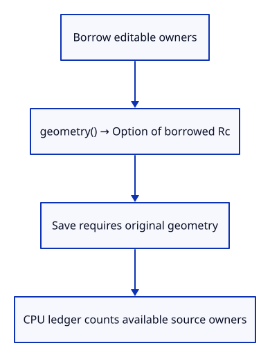
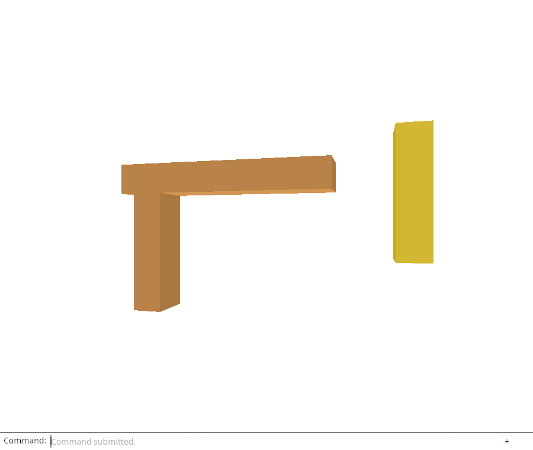

# 32fa · Ask whether an editable source is available

**Combined study estimate: 1–2 hours.** Includes reading, typing, reasoning and experiments.

**Typing estimate: 14–27 minutes.** 22 added or changed lines; unchanged context is excluded. [How this is estimated](typing-load.md).

**Today:** Route saving, source accounting and owner checks through borrowed source accessors.

**Follow:** Scene row → Option of borrowed editable geometry/provenance → checked source consumers.

Introduce `geometry()` and `source()` before making source storage optional. Both return borrowed optional owners. At this stage every row still has geometry; generated rows have no imported-session provenance.

Save uses `geometry().ok_or(...)` and `?` to return a clear error if geometry is missing. It never substitutes derived float display vertices for the editable source.

Accounting visits only available kernel and session owners while counting rows and displays independently. Migrate ownership checks to the same accessors; fixture `unwrap` asserts a known loaded source, while application Save returns `Result`.

Fields remain public during this migration. The next lesson completes it and prevents bypassing the access boundary.



## Type the change

Continue from [Keep row metadata separate from editable geometry](32f-metadata.md). Save your own work first: `npm --prefix ../session_tests run course -- save before-32fa-access` (from `session_viewer`).

### 1. `src/scene.rs`

Borrow source owners through an API that can express later source absence.

<details>
<summary>Locate the existing block</summary>

```rust
impl Object {
    pub fn world_point(&self, vertex: [f32; 6]) -> [f64; 3] {
```

</details>

Replace that block with:

```rust
--8<-- "journey/code/32fa-access-01.rs"
```

### 2. `src/document.rs`

Require original editable geometry instead of silently exporting display floats.

<details>
<summary>Locate the existing block</summary>

```rust
        let mut mesh = object.geometry.to_proto();
```

</details>

Replace that block with:

```rust
--8<-- "journey/code/32fa-access-02.rs"
```

### 3. `src/memory.rs`

Count kernel owners only when they are available.

<details>
<summary>Locate the existing block</summary>

```rust
            sources.insert(Rc::as_ptr(&object.geometry));
```

</details>

Replace that block with:

```rust
--8<-- "journey/code/32fa-access-03.rs"
```

### 4. `src/memory.rs`

Keep provenance absence independent of row/display accounting.

<details>
<summary>Locate the existing block</summary>

```rust
            if let Some(source) = &object.source {
```

</details>

Replace that block with:

```rust
--8<-- "journey/code/32fa-access-04.rs"
```

### 5. `src/source_tests.rs`

Update generated_source_and_display_survive_move_and_history through borrowed source access while preserving every existing assertion.

<details>
<summary>Locate the existing block</summary>

```rust
fn generated_source_and_display_survive_move_and_history() {
    let mut editor = Editor::default();
    editor.apply(Action::AddBox).unwrap();
    for _ in 0..3 { editor.apply(Action::SelectNext).unwrap(); }
    let object = &editor.scene.objects()[2];
    let geometry = Rc::clone(&object.geometry);
    let display = Rc::clone(&object.mesh);
    let point = geometry.vertex_point(0).unwrap();
    let guid = geometry.guid().to_owned();
    let before = object.model.m;
    editor.apply(Action::Translate([2.0, -1.0, 0.5])).unwrap();
    let moved = editor.scene.objects()[2].model.m;
    editor.apply(Action::Undo).unwrap();
    assert_eq!(editor.scene.objects()[2].model.m, before);
    editor.apply(Action::Redo).unwrap();
    let restored = &editor.scene.objects()[2];
    assert_eq!(restored.model.m, moved);
    assert!(Rc::ptr_eq(&geometry, &restored.geometry));
    assert!(Rc::ptr_eq(&display, &restored.mesh));
    assert_eq!(restored.geometry.vertex_point(0).unwrap(), point);
    assert_eq!(restored.geometry.guid(), guid);
    assert!(restored.source.is_none());
}
```

</details>

Replace that block with:

```rust
--8<-- "journey/code/32fa-access-05.rs"
```

### 6. `src/source_tests.rs`

Update imported_source_survives_a_change_of_display_row through borrowed source access while preserving every existing assertion.

<details>
<summary>Locate the existing block</summary>

```rust
fn imported_source_survives_a_change_of_display_row() {
    let mut editor = Editor::default();
    editor.apply(Action::Import(specimen::bytes())).unwrap();
    let imported = editor.scene.objects()[2].clone();
    let first = editor.scene.objects()[0].id;
    let second = editor.scene.objects()[1].id;
    editor.scene.remove(first); editor.scene.remove(second);
    let current = &editor.scene.objects()[0];
    assert_eq!(current.id, imported.id);
    assert!(Rc::ptr_eq(&current.geometry, &imported.geometry));
    let source = current.source.as_ref().unwrap();
    assert_eq!(current.geometry.guid(), source.guid);
    assert!(source.document.objects.meshes.iter().any(|m| m.guid() == source.guid));
    assert!(Rc::ptr_eq(&source.document, &imported.source.as_ref().unwrap().document));
}
```

</details>

Replace that block with:

```rust
--8<-- "journey/code/32fa-access-06.rs"
```

### 7. `src/imported_source_tests.rs`

Update import_shares_the_retained_sessions_source_allocation through borrowed source access while preserving every existing assertion.

<details>
<summary>Locate the existing block</summary>

```rust
fn import_shares_the_retained_sessions_source_allocation() {
    let mut editor = Editor::default();
    editor.apply(Action::Import(specimen::bytes())).unwrap();
    let imported = editor.scene.objects()[2].clone();
    let geometry = Rc::clone(&imported.geometry);
    let source = imported.source.as_ref().unwrap();
    assert!(source.document.objects.meshes.iter().any(|m| Rc::ptr_eq(m, &geometry)));
    let first = editor.scene.objects()[0].id;
    let second = editor.scene.objects()[1].id;
    editor.scene.remove(first); editor.scene.remove(second);
    let moved_row = &editor.scene.objects()[0];
    assert_eq!(moved_row.id, imported.id);
    assert!(Rc::ptr_eq(&moved_row.geometry, &geometry));
}
```

</details>

Replace that block with:

```rust
--8<-- "journey/code/32fa-access-07.rs"
```

### 8. `src/snapshot_tests.rs`

Update snapshot_uses_live_local_sources_and_separate_placements through borrowed source access while preserving every existing assertion.

<details>
<summary>Locate the existing block</summary>

```rust
fn snapshot_uses_live_local_sources_and_separate_placements() {
    let mut editor = Editor::default();
    editor.apply(Action::SelectNext).unwrap();
    editor.apply(Action::Delete).unwrap();
    editor.apply(Action::AddBox).unwrap();
    let object = editor.scene.objects().last().unwrap().clone();
    let source = object.geometry.to_proto();
    let message = proto::Session::decode(document::snapshot(&editor.scene).unwrap().as_slice()).unwrap();
    let meshes = &message.objects.as_ref().unwrap().meshes;
    assert_eq!(meshes.len(), 2);
    let saved = meshes.iter().find(|mesh| mesh.guid == object.guid).unwrap();
    assert_eq!(saved.vertices, source.vertices);
    assert_eq!(saved.faces, source.faces);
    assert_eq!(saved.objectcolor, source.objectcolor);
    assert_eq!((saved.is_visible, saved.is_locked), (source.is_visible, source.is_locked));
    let placement = message.xforms.iter().find(|entry| entry.guid == object.guid).unwrap();
    assert_eq!(placement.xform.as_ref().unwrap().matrix, object.model.m.to_vec());
    assert_eq!(message.tree.unwrap().root.unwrap().children.len(), meshes.len());
    assert_eq!(object.geometry.guid(), source.guid);
    editor.apply(Action::Undo).unwrap();
    assert_eq!(editor.scene.objects().len(), 1, "Saving must not create a history entry");
}
```

</details>

Replace that block with:

```rust
--8<-- "journey/code/32fa-access-08.rs"
```

## Run and look

From `session_viewer`, enter your project folder:

```sh
cd workspace/journey
REGEN_PROTO=0 cargo build --lib --locked --target wasm32-unknown-unknown -j4
REGEN_PROTO=0 CARGO_BUILD_JOBS=4 trunk serve --port 8780
```

Open `http://127.0.0.1:8780/`. If Trunk is already running in this project, leave it running; it rebuilds when you save.

Run the source-access checks below. Saving and accounting borrow the available source through its accessor rather than owning another copy.

**Verified checkpoint in Chrome.**



[What this screenshot checks](release.md).

Run the state checks from your project folder:

```sh
REGEN_PROTO=0 cargo test --lib --locked -j4
```

<details>
<summary>Optional experiment</summary>

Compare Rc::clone(row.geometry().unwrap()) with merely calling row.geometry(). Predict which expression adds a strong owner and how that affects a later Weak release check.

</details>

## Explain the change

Does Option<&Rc<Mesh>> add another mesh owner?

<details>
<summary>Compare your explanation</summary>

No. It borrows the Rc stored by the row. Merely asking for a source neither clones the owner nor copies the geometry. Some indicates an available editable source; the later unloaded state returns None. Saving must handle that absence rather than serializing drawing floats.

</details>

## Keep your working result

Return to `session_viewer` in a second terminal. Restore experimental edits before comparing:

```sh
npm --prefix ../session_tests run course -- check 32fa-access
npm --prefix ../session_tests run course -- save 32fa-access
```

Check compares your typed source; run the focused check above for behavior. [Recover your work](recovery.md).

<details>
<summary>Where this fits in the finished viewer</summary>

Source release needs an explicit absence state and reload ownership. These borrowed accessors prepare that state without changing renderer geometry or weakening the save format.

</details>

<details>
<summary>Verification notes and browser acceptance</summary>


[Full validation scope](release.md).

To reproduce the scripted acceptance of the reference checkpoint, run from `session_viewer` with the [course bundle server](release.md#reproduce) running on port 8781:

```sh
npm --prefix ../session_tests run course -- capture 32fa-access
```

This uses the verified reference bundle; it does not check or change your typed project.

</details>
