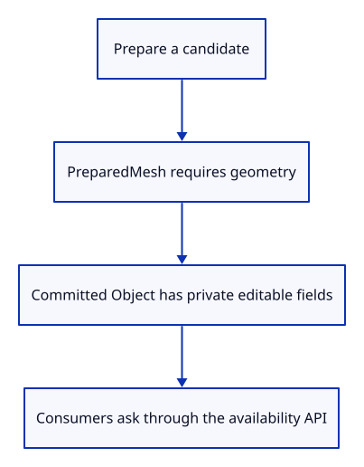
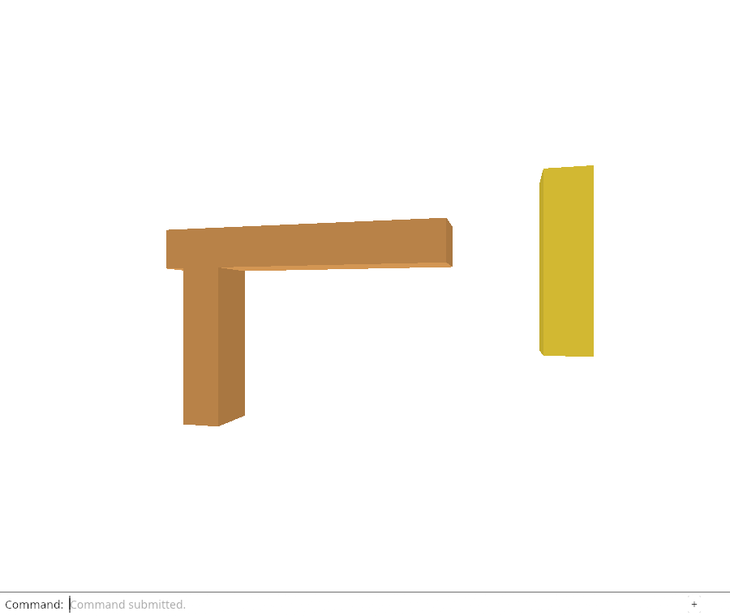

# 32fb · Make editable ownership a private row boundary

**Combined study estimate: 1–2 hours.** Includes reading, typing, reasoning and experiments.

**Typing estimate: 16–31 minutes.** 19 added or changed lines; unchanged context is excluded. [How this is estimated](typing-load.md).

**Today:** Finish migrating owner checks and prevent other modules from bypassing source availability.

**Follow:** Remaining native ownership proofs → borrowed accessors → private source fields.

Finish migrating consumers to `geometry()` and `source()`, then make Object's editable-owner fields private. Direct field access outside the row now fails to compile.

Keep `PreparedMesh.geometry` mandatory: a prepared insertion requires valid geometry. Keep `GpuMesh.geometry` unchanged: it owns display buffers, not editable kernel data.

Rows retain public identity, saved GUID, metadata, model and derived mesh. Source storage can next become Loaded or Released behind its borrowed accessors without changing drawing or history placements. No source unload happens in this step.



## Type the change

Continue from [Ask whether an editable source is available](32fa-access.md). Save your own work first: `npm --prefix ../session_tests run course -- save before-32fb-boundary` (from `session_viewer`).

### 1. `src/editor.rs`

Update repeated_close_is_empty_and_drops_sources_without_gpu_owners through borrowed source access while preserving every existing assertion.

<details>
<summary>Locate the existing block</summary>

```rust
    fn repeated_close_is_empty_and_drops_sources_without_gpu_owners() {
        let mut editor = Editor::default();
        let display = std::rc::Rc::downgrade(&editor.scene.objects()[0].mesh);
        let source = std::rc::Rc::downgrade(&editor.scene.objects()[0].geometry);
        editor.apply(Action::Close).unwrap(); editor.apply(Action::Close).unwrap();
        assert!(display.upgrade().is_none() && source.upgrade().is_none());
        assert_eq!(crate::memory::cpu(editor.scenes(), std::iter::empty()), [0, 0, 0, 0, 0, 1]);
    }
```

</details>

Replace that block with:

```rust
--8<-- "journey/code/32fb-boundary-01.rs"
```

### 2. `src/editor.rs`

Update close_releases_imported_history_documents_and_reopening_uses_fresh_ids through borrowed source access while preserving every existing assertion.

<details>
<summary>Locate the existing block</summary>

```rust
    fn close_releases_imported_history_documents_and_reopening_uses_fresh_ids() {
        use std::rc::Rc;
        let mut editor = Editor::default();
        let bytes = crate::specimen::bytes();
        editor.apply(Action::Import(bytes.clone())).unwrap();
        editor.apply(Action::Replace(bytes.clone())).unwrap();
        let displays: Vec<_> = editor.scenes().flat_map(|scene| scene.objects().iter()
            .map(|row| Rc::downgrade(&row.mesh))).collect();
        let sources: Vec<_> = editor.scenes().flat_map(|scene| scene.objects().iter()
            .map(|row| Rc::downgrade(&row.geometry))).collect();
        let documents: Vec<_> = editor.scenes().flat_map(|scene| scene.objects().iter()
            .filter_map(|row| row.source.as_ref().map(|source| Rc::downgrade(&source.document)))).collect();
        let old: Vec<_> = editor.scenes().flat_map(|scene| scene.objects().iter().map(|row| row.id)).collect();
        assert!(!documents.is_empty());
        editor.apply(Action::Close).unwrap();
        assert!(displays.iter().all(|owner| owner.upgrade().is_none()));
        assert!(sources.iter().all(|owner| owner.upgrade().is_none()));
        assert!(documents.iter().all(|owner| owner.upgrade().is_none()));
        editor.apply(Action::Import(bytes)).unwrap();
        assert!(editor.scene.objects().iter().all(|row| !old.contains(&row.id)));
    }
```

</details>

Replace that block with:

```rust
--8<-- "journey/code/32fb-boundary-02.rs"
```

### 3. `src/history.rs`

Update cleared_history_releases_a_deleted_source_and_display through borrowed source access while preserving every existing assertion.

<details>
<summary>Locate the existing block</summary>

```rust
    fn cleared_history_releases_a_deleted_source_and_display() {
        let mut scene = Scene::demo();
        let mut history = History::default();
        let id = scene.objects()[0].id;
        let display = Rc::downgrade(&scene.objects()[0].mesh);
        let source = Rc::downgrade(&scene.objects()[0].geometry);
        history.edit(&mut scene, |scene| { scene.remove(id); });
        assert!(display.upgrade().is_some() && source.upgrade().is_some());
        assert_eq!(history.scenes().count(), 1);
        history.clear();
        assert!(display.upgrade().is_none() && source.upgrade().is_none());
        assert!(!history.undo(&mut scene) && !history.redo(&mut scene));
        assert_eq!(scene.objects().len(), 1);
    }
```

</details>

Replace that block with:

```rust
--8<-- "journey/code/32fb-boundary-03.rs"
```

### 4. `src/file_identity_tests.rs`

Update duplicate_imports_keep_distinct_stored_identity_through_history through borrowed source access while preserving every existing assertion.

<details>
<summary>Locate the existing block</summary>

```rust
fn duplicate_imports_keep_distinct_stored_identity_through_history() {
    let mut editor = Editor::default();
    let bytes = specimen::bytes();
    editor.apply(Action::Import(bytes.clone())).unwrap();
    editor.apply(Action::Import(bytes)).unwrap();
    let objects = editor.scene.objects();
    assert_eq!(objects.len(), 8);
    let distinct: HashSet<_> = objects.iter().map(|object| object.guid.as_str()).collect();
    assert_eq!(distinct.len(), objects.len());
    assert_eq!(objects[2].guid, objects[2].geometry.guid());
    assert_eq!(objects[2].geometry.guid(), objects[5].geometry.guid());
    assert_eq!(objects[2].source.as_ref().unwrap().guid, objects[5].source.as_ref().unwrap().guid);
    assert_ne!(objects[2].guid, objects[5].guid);
    assert!(uuid::Uuid::parse_str(&objects[5].guid).is_ok());
    let copy = objects[5].clone();
    editor.apply(Action::SelectNext).unwrap();
    editor.apply(Action::Delete).unwrap();
    let current = editor.scene.objects().iter().find(|object| object.id == copy.id).unwrap();
    assert_eq!(current.guid, copy.guid);
    editor.apply(Action::Undo).unwrap();
    editor.apply(Action::Redo).unwrap();
    let current = editor.scene.objects().iter().find(|object| object.id == copy.id).unwrap();
    assert_eq!(current.guid, copy.guid);
    assert_eq!(current.geometry.guid(), copy.geometry.guid());
}
```

</details>

Replace that block with:

```rust
--8<-- "journey/code/32fb-boundary-04.rs"
```

### 5. `src/document_tests.rs`

Update import_retains_source_and_undo_removes_the_whole_file through borrowed source access while preserving every existing assertion.

<details>
<summary>Locate the existing block</summary>

```rust
fn import_retains_source_and_undo_removes_the_whole_file() {
    let mut editor = Editor::default();
    editor.apply(Action::Import(specimen::bytes())).unwrap();
    assert_eq!(editor.scene.objects().len(), 5);
    let source = editor.scene.objects()[2].source.as_ref().unwrap();
    let document = Rc::clone(&source.document);
    let guid = source.guid.clone();
    let id = editor.scene.objects()[2].id;
    assert_eq!(document.name, "Three-piece frame");
    assert!(document.objects.meshes.iter().any(|mesh| mesh.guid() == guid));
    editor.apply(Action::Undo).unwrap();
    assert_eq!(editor.scene.objects().len(), 2);
    editor.apply(Action::Redo).unwrap();
    let restored = &editor.scene.objects()[2];
    assert_eq!(restored.id, id);
    assert!(Rc::ptr_eq(&restored.source.as_ref().unwrap().document, &document));
}
```

</details>

Replace that block with:

```rust
--8<-- "journey/code/32fb-boundary-05.rs"
```

### 6. `src/document_tests.rs`

Update repeated_imports_keep_distinct_viewer_ids_and_original_source_guids through borrowed source access while preserving every existing assertion.

<details>
<summary>Locate the existing block</summary>

```rust
fn repeated_imports_keep_distinct_viewer_ids_and_original_source_guids() {
    let bytes = specimen::bytes();
    let mut editor = Editor::default();
    editor.apply(Action::Import(bytes.clone())).unwrap();
    editor.apply(Action::Import(bytes)).unwrap();
    let objects = editor.scene.objects();
    assert_ne!(objects[2].id, objects[5].id);
    assert_eq!(objects[2].source.as_ref().unwrap().guid, objects[5].source.as_ref().unwrap().guid);
    assert!(!Rc::ptr_eq(&objects[2].source.as_ref().unwrap().document, &objects[5].source.as_ref().unwrap().document));
}
```

</details>

Replace that block with:

```rust
--8<-- "journey/code/32fb-boundary-06.rs"
```

### 7. `src/replace_tests.rs`

Update replacement_history_retains_camera_and_distinct_local_identity through borrowed source access while preserving every existing assertion.

<details>
<summary>Locate the existing block</summary>

```rust
fn replacement_history_retains_camera_and_distinct_local_identity() {
    let mut editor = Editor::default();
    editor.apply(Action::SelectNext).unwrap();
    let old = editor.scene.objects()[0].clone();
    editor.camera.distance = 7.0; editor.camera.aspect = 2.0;
    editor.apply(Action::Replace(specimen::bytes())).unwrap();
    let ids: Vec<_> = editor.scene.objects().iter().map(|object| object.id).collect();
    assert_eq!(ids.len(), 3);
    assert!(!editor.scene.contains(old.id));
    assert!(editor.selected.is_none());
    editor.apply(Action::Undo).unwrap();
    assert_eq!(editor.scene.objects().len(), 2);
    assert_eq!(editor.scene.objects()[0].id, old.id);
    assert!(Rc::ptr_eq(&editor.scene.objects()[0].geometry, &old.geometry));
    assert!(Rc::ptr_eq(&editor.scene.objects()[0].mesh, &old.mesh));
    editor.apply(Action::Redo).unwrap();
    assert_eq!(editor.scene.objects().iter().map(|object| object.id).collect::<Vec<_>>(), ids);
    assert_eq!((editor.camera.distance, editor.camera.aspect), (7.0, 2.0));
}
```

</details>

Replace that block with:

```rust
--8<-- "journey/code/32fb-boundary-07.rs"
```

### 8. `src/replace_tests.rs`

Update refused_replacement_preserves_selection_source_owners_and_redo through borrowed source access while preserving every existing assertion.

<details>
<summary>Locate the existing block</summary>

```rust
fn refused_replacement_preserves_selection_source_owners_and_redo() {
    let mut editor = Editor::default();
    editor.apply(Action::AddBox).unwrap(); editor.apply(Action::Undo).unwrap();
    editor.apply(Action::SelectNext).unwrap();
    let selected = editor.selected;
    let old = editor.scene.objects()[0].clone();
    assert!(editor.apply(Action::Replace(vec![255])).is_err());
    assert_eq!(editor.selected, selected);
    assert_eq!(editor.scene.objects().len(), 2);
    assert!(Rc::ptr_eq(&editor.scene.objects()[0].geometry, &old.geometry));
    editor.apply(Action::Redo).unwrap();
    assert_eq!(editor.scene.objects().len(), 3);
}
```

</details>

Replace that block with:

```rust
--8<-- "journey/code/32fb-boundary-08.rs"
```

### 9. `src/save_roundtrip_tests.rs`

Update both_imported_copies_reopen_with_their_stored_identity through borrowed source access while preserving every existing assertion.

<details>
<summary>Locate the existing block</summary>

```rust
fn both_imported_copies_reopen_with_their_stored_identity() {
    let mut editor = Editor::default();
    let bytes = specimen::bytes();
    editor.apply(Action::Import(bytes.clone())).unwrap();
    editor.apply(Action::Import(bytes)).unwrap();
    let saved = document::snapshot(&editor.scene).unwrap();
    let reopened = document::load(&saved).unwrap();
    assert_eq!(reopened.meshes.len(), editor.scene.objects().len());
    for object in editor.scene.objects() {
        let prepared = reopened.meshes.iter().find(|mesh| mesh.geometry.guid() == object.guid).unwrap();
        assert_eq!(prepared.model.m, object.model.m);
        assert_eq!(prepared.geometry.name, object.geometry.name);
    }
    assert_eq!(editor.scene.objects()[2].geometry.guid(), editor.scene.objects()[5].geometry.guid());
    assert_ne!(editor.scene.objects()[2].guid, editor.scene.objects()[5].guid);
}
```

</details>

Replace that block with:

```rust
--8<-- "journey/code/32fb-boundary-09.rs"
```

### 10. `src/row_metadata.rs`

Update metadata_does_not_keep_a_closed_kernel_source_alive through borrowed source access while preserving every existing assertion.

<details>
<summary>Locate the existing block</summary>

```rust
    fn metadata_does_not_keep_a_closed_kernel_source_alive() {
        let mut editor = Editor::default();
        let mut mesh = session_rust::Mesh::create_box(1.0, 1.0, 1.0);
        mesh.name = "Released beam".into(); mesh.is_visible = false; mesh.is_locked = true;
        let id = editor.scene.insert(crate::prepared::PreparedMesh::new(mesh).unwrap()).unwrap();
        let row = editor.scene.objects().iter().find(|row| row.id == id).unwrap();
        let weak = Rc::downgrade(&row.geometry);
        let metadata = Rc::clone(&row.metadata);
        editor.apply(Action::Close).unwrap();
        assert!(weak.upgrade().is_none());
        assert_eq!(metadata.name, "Released beam");
        assert!(!metadata.is_visible && metadata.is_locked);
        assert!(!metadata.source_guid.is_empty());
    }
```

</details>

Replace that block with:

```rust
--8<-- "journey/code/32fb-boundary-10.rs"
```

### 11. `src/scene.rs`

Confine editable kernel storage to the scene row implementation.

<details>
<summary>Locate the existing block</summary>

```rust
    pub geometry: Rc<session_rust::Mesh>,
```

</details>

Replace that block with:

```rust
--8<-- "journey/code/32fb-boundary-11.rs"
```

### 12. `src/scene.rs`

Prevent other modules from bypassing imported-source availability.

<details>
<summary>Locate the existing block</summary>

```rust
    pub source: Option<crate::document::Source>,
```

</details>

Replace that block with:

```rust
--8<-- "journey/code/32fb-boundary-12.rs"
```

## Run and look

From `session_viewer`, enter your project folder:

```sh
cd workspace/journey
REGEN_PROTO=0 cargo build --lib --locked --target wasm32-unknown-unknown -j4
REGEN_PROTO=0 CARGO_BUILD_JOBS=4 trunk serve --port 8780
```

Open `http://127.0.0.1:8780/`. If Trunk is already running in this project, leave it running; it rebuilds when you save.

Build and run the checks below. Other modules must use the source accessor; the private row field prevents bypassing source availability.

**Verified checkpoint in Chrome.**



[What this screenshot checks](release.md).

Run the state checks from your project folder:

```sh
REGEN_PROTO=0 cargo test --lib --locked -j4
```

<details>
<summary>Optional experiment</summary>

Try reading object.geometry directly from document.rs and predict the compiler error. Explain why a renderer’s row.geometry or a prepared candidate’s geometry can remain valid even after this row source field becomes private.

</details>

## Explain the change

Why keep PreparedMesh geometry mandatory when Object geometry is accessed optionally?

<details>
<summary>Compare your explanation</summary>

PreparedMesh is a validated candidate ready to insert, so its original geometry must exist. A committed Object has a longer lifetime: its display can remain after editable geometry is unloaded. The preparation boundary and residency boundary have different contracts.

</details>

## Keep your working result

Return to `session_viewer` in a second terminal. Restore experimental edits before comparing:

```sh
npm --prefix ../session_tests run course -- check 32fb-boundary
npm --prefix ../session_tests run course -- save 32fb-boundary
```

Check compares your typed source; run the focused check above for behavior. [Recover your work](recovery.md).

<details>
<summary>Where this fits in the finished viewer</summary>

Next add reload origin/version information, release eligible imported owners across active and history roots, and restore them atomically. A source-only unload must not masquerade as Close.

</details>

<details>
<summary>Verification notes and browser acceptance</summary>

Existing allocation identity, exact source coordinates, history and Weak-expiration checks retain their assertions while adopting the borrowed interface.

[Full validation scope](release.md).

To reproduce the scripted acceptance of the reference checkpoint, run from `session_viewer` with the [course bundle server](release.md#reproduce) running on port 8781:

```sh
npm --prefix ../session_tests run course -- capture 32fb-boundary
```

This uses the verified reference bundle; it does not check or change your typed project.

</details>
