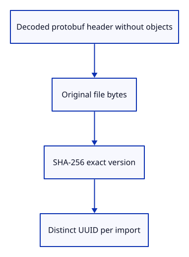

# 32fc · Record a reload version without retaining geometry

**Combined study estimate: 1–2 hours.** Includes reading, typing, reasoning and experiments.

**Typing estimate: 21–41 minutes.** 52 added or changed lines; unchanged context is excluded. [How this is estimated](typing-load.md).

**Today:** Own a small document header, a distinct import ID and an exact file fingerprint.

**Follow:** Own a small document header, a distinct import ID and an exact file fingerprint..

An unloaded row will need enough information to find its source again. Define Origin as owned document metadata plus an import ID and FileVersion. Its header retains the source name, GUID, tree, graph, bounds and original placement entries. It deliberately has no objects or definitions.

FileVersion hashes the original bytes with SHA-256. It is a byte-version identifier, not an authentication scheme. An immutable selected File must return that same version when fetched through its later Blob URL. A server that reserializes equivalent protobuf maps may produce different bytes; mutable-server policies belong to the later publication/streaming lessons.

UUID separates two imports of the same file. None of these values owns a kernel Mesh or Session. The native tests include the standard SHA-256 abc vector, changed bytes, independent origin identities and a geometry-free header. Add the pinned dependency and use the supplied lock, while typing this module yourself.



## Type the change

Continue from [Make editable ownership a private row boundary](32fb-boundary.md). Save your own work first: `npm --prefix ../session_tests run course -- save before-32fc-version` (from `session_viewer`).

### 1. `Cargo.toml`

Pin SHA-256 for immutable file-version checks.

Find this exact block:

```toml
prost = "=0.14.4"
```

Replace that block with:

```toml
--8<-- "journey/code/32fc-version-01.toml"
```

### 2. `src/lib.rs`

Introduce geometry-free reload metadata.

Find this exact block:

```rust
pub mod row_metadata;
```

Replace that block with:

```rust
--8<-- "journey/code/32fc-version-02.rs"
```

### 3. `src/origin.rs`

Keep descriptive protobuf data and a byte version without retaining kernel objects.

Create the file and type:

```rust
--8<-- "journey/code/32fc-version-03.rs"
```

## Run and look

After typing the manifest, run this from `session_viewer` to select the fixed dependency versions. It updates Cargo.lock, preserves the previous lock, and installs any supplied binary font assets. It does not write implementation code:

```sh
npm --prefix ../session_tests run course -- dependencies 32fc-version
```

From `session_viewer`, enter your project folder:

```sh
cd workspace/journey
REGEN_PROTO=0 cargo build --lib --locked --target wasm32-unknown-unknown -j4
REGEN_PROTO=0 CARGO_BUILD_JOBS=4 trunk serve --port 8780
```

Open `http://127.0.0.1:8780/`. If Trunk is already running in this project, leave it running; it rebuilds when you save.

Run the version checks below. Changing one file byte changes its fingerprint; importing the same bytes again gets a distinct import ID. The browser picture is unchanged.

**Verified checkpoint in Chrome.**


[What this screenshot checks](release.md).

Run the state checks from your project folder:

```sh
REGEN_PROTO=0 cargo test --lib --locked -j4
```

<details>
<summary>Optional experiment</summary>

Change one source byte and predict the version comparison. Then import identical bytes twice and explain why their origin IDs should differ.

</details>

## Explain the change

Why can two imports share a file fingerprint but still need different origin IDs?

<details>
<summary>Compare your explanation</summary>

A fingerprint identifies the exact bytes. An origin ID identifies one import into this viewer. Repeated imports can share bytes and source GUIDs while having independent rows, history and reload lifetimes.

</details>

## Keep your working result

Return to `session_viewer` in a second terminal. Restore experimental edits before comparing:

```sh
npm --prefix ../session_tests run course -- check 32fc-version
npm --prefix ../session_tests run course -- save 32fc-version
```

Check compares your typed source; run the focused check above for behavior. [Recover your work](recovery.md).

<details>
<summary>Where this fits in the finished viewer</summary>

Production released sources retain document/tree metadata. This module prepares that ownership boundary; selected immutable files have an exact byte version, while the later HTTP publication flow needs its own version policy.

</details>

<details>
<summary>Verification notes and browser acceptance</summary>


[Full validation scope](release.md).

To reproduce the scripted acceptance of the reference checkpoint, run from `session_viewer` with the [course bundle server](release.md#reproduce) running on port 8781:

```sh
npm --prefix ../session_tests run course -- capture 32fc-version
```

This uses the verified reference bundle; it does not check or change your typed project.

</details>
