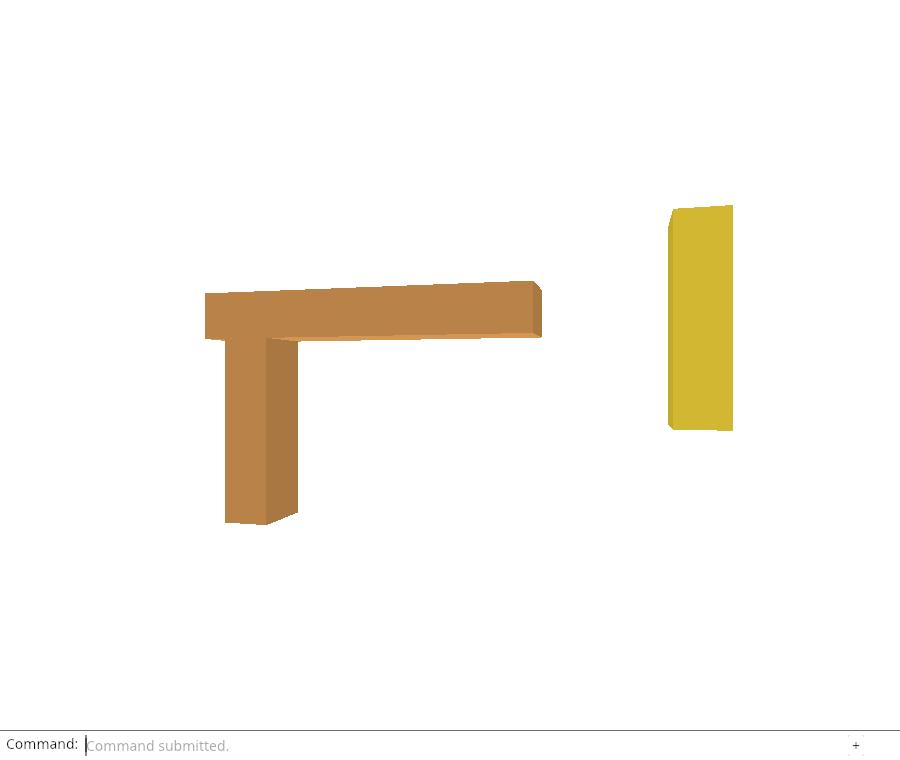
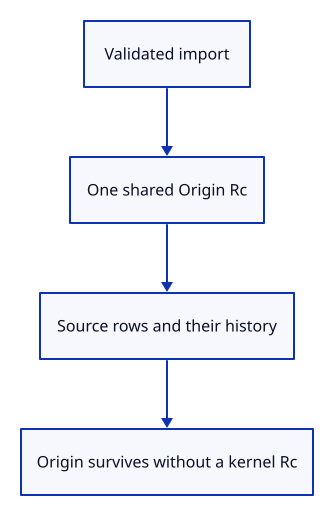

# 32fd · Attach one origin to an imported document

**Typing: 22–44 minutes.** [Estimate](typing-load.md).

Construct an Origin after decoding and validation, before moving the protobuf into the kernel Session. Every prepared row shares the same Rc<Origin> through its Source. A second import gets a different Origin even when its file bytes are identical.

## Type

Continue from [Record a reload version without retaining geometry](32fc-version.md). [Save or recover your work](recovery.md).

### 1. `src/document.rs`

Retain reload metadata separately from the kernel Session.

<details>
<summary>Locate the existing block</summary>

```rust
    pub guid: String,
```

</details>

Replace that block with:

```rust
--8<-- "journey/code/32fd-origin-01.rs"
```

### 2. `src/document.rs`

Record accepted original bytes and a geometry-free header before kernel construction.

<details>
<summary>Locate the existing block</summary>

```rust
    let document = Rc::new(Session::from_proto(message).map_err(|_| "Cannot construct session")?);
```

</details>

Replace that block with:

```rust
--8<-- "journey/code/32fd-origin-02.rs"
```

### 3. `src/document.rs`

Share one import origin among all its source rows.

<details>
<summary>Locate the existing block</summary>

```rust
            document: Rc::clone(&document), guid: mesh.guid().to_owned(),
```

</details>

Replace that block with:

```rust
--8<-- "journey/code/32fd-origin-03.rs"
```

### 4. `src/lib.rs`

Check source ownership independently of drawing.

<details>
<summary>Locate the existing block</summary>

```rust
pub mod origin;
```

</details>

Replace that block with:

```rust
--8<-- "journey/code/32fd-origin-04.rs"
```

### 5. `src/origin_tests.rs`

Observe true kernel expiration while retaining only header/version metadata.

Create the file and type:

```rust
--8<-- "journey/code/32fd-origin-05.rs"
```

### 6. `src/browser.rs`

Inspect shared import identity and exact versions without adding controls.

<details>
<summary>Locate the existing block</summary>

```rust
    canvas.set_attribute("data-row-metadata", &serde_json::to_string(&metadata)
```

</details>

Replace that block with:

```rust
--8<-- "journey/code/32fd-origin-06.rs"
```

## Run and check

In your project:

```sh
cd workspace/journey
REGEN_PROTO=0 cargo build --lib --locked --target wasm32-unknown-unknown -j4
REGEN_PROTO=0 CARGO_BUILD_JOBS=4 trunk serve --port 8780
```

Open `http://127.0.0.1:8780/`. Keep an existing Trunk server running; saving rebuilds it.

Run the origin checks below. Rows from one import share its small origin header through history without retaining the original document.

**Verified checkpoint in Chrome.**



[Verification scope](release.md).

Run the state checks on your computer from your project folder:

```sh
REGEN_PROTO=0 cargo test --lib --locked --target host-tuple -j4
```

<details>
<summary>Code explanation and diagram</summary>

The native check records Weak observers, retains only the Origin, and closes the editor. The Session and kernel value must disappear while the original header remains readable. Another check follows one shared origin through Move and Undo.

Share one geometry-free origin across imported rows and history..



Does retaining an Origin after Close keep the imported Session alive?

No. It owns copied header values and a version, not the Session Rc or any kernel mesh Rc. Weak checks can prove the Session and its meshes are dropped while the retained origin remains readable.

Study estimate, including typing and experiments: 1–2 hours.

</details>

<details>
<summary>Optional experiment</summary>

Clone Source instead of only Origin in the ownership check and predict which Weak observations remain alive.

</details>

<details>
<summary>Check and save your work</summary>

Restore experimental edits, then run from `session_viewer`:

```sh
npm --prefix ../session_tests run course -- check 32fd-origin
npm --prefix ../session_tests run course -- save 32fd-origin
```

Source comparison leaves your project untouched. [Save and recovery instructions](recovery.md).

</details>

<details>
<summary>Viewer coverage and verification</summary>

Origin identity is separate from saved row GUID and original source GUID. This prevents a later completion for one duplicate import from being adopted by another.

Chrome exposes origin identity and the byte fingerprint in a hidden attribute. It checks that three rows of one import share an origin, duplicate imports have different origins but the same version, and history preserves them. No reload location or unload command exists yet.

[Full validation scope](release.md).

To reproduce the scripted acceptance of the reference checkpoint, run from `session_viewer` with the [course bundle server](release.md#reproduce) running on port 8781:

```sh
npm --prefix ../session_tests run course -- capture 32fd-origin
```

This uses the verified reference bundle; it does not check or change your typed project.

</details>
