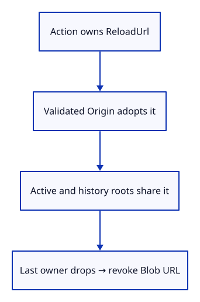
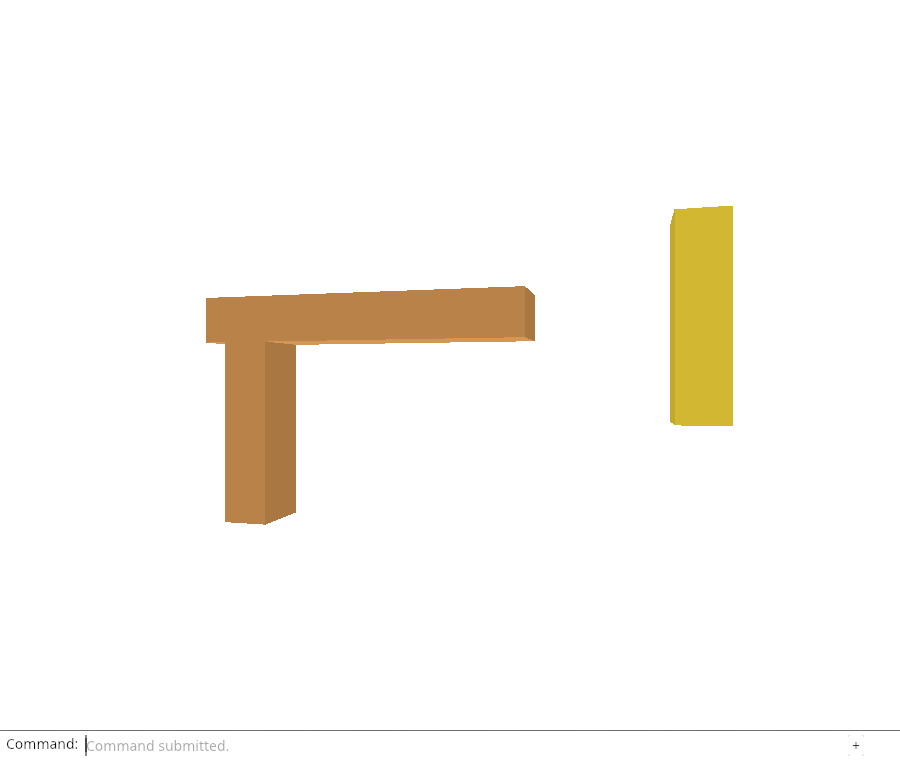

# 32fe · Give a reload URL an explicit owner

**Combined study estimate: 1–2 hours.** Includes reading, typing, reasoning and experiments.

**Typing estimate: 24–48 minutes.** 49 added or changed lines; unchanged context is excluded. [How this is estimated](typing-load.md).

**Today:** Retain an owned Blob URL through imports and history, then release it with its last owner.

**In the whole viewer:** Connect the browser, drawing and input, then extend the same project. [See the destination](../journey.md#the-destination).

**Follow:** Retain an owned Blob URL through imports and history, then release it with its last owner..

**Before you finish, explain:** Why must URL ownership exist before validation can fail?

A version says which bytes a row expects; it does not provide a way to read them again. Add ReloadUrl, an owner of one URL created by this viewer. Its Drop implementation revokes the browser Blob URL. Native checks observe its Rc lifetime through Weak; actual browser revocation is tested after the next adapter endpoint.

Origin can retain an optional Rc<ReloadUrl>. Generated data and ordinary native load calls have no reload location and will be protected from unload. load_at accepts an already owned URL; it validates the file and adopts the location into the same Origin shared by all rows.

Add ImportAt and ReplaceAt to the editor while keeping the existing Import/Replace fixtures. The new actions hold the URL before loading, so failure drops their owner normally. History shares the Origin, keeping the reload location alive until the last relevant snapshot is gone. The browser still uses its old file adapter at this checkpoint.



## Type the change

Continue [Attach one origin to an imported document](32fd-origin.md). From `session_viewer`, save your files with `npm --prefix ../session_tests run course -- save before-32fe-location`. A save keeps your own work; it does not fill in the next lesson.

### 1. `src/lib.rs`

Keep browser URL lifetime explicit and independent of kernel ownership.

Find this exact block:

```rust
pub mod origin;
```

Replace that block with:

```rust
--8<-- "journey/code/32fe-location-01.rs"
```

### 2. `src/reload_url.rs`

Revoke a viewer-created Blob URL when its actual resource owner drops.

Create the file and type:

```rust
--8<-- "journey/code/32fe-location-02.rs"
```

### 3. `src/origin.rs`

Retain an optional reload location without retaining geometry.

Find this exact block:

```rust
    pub version: FileVersion,
```

Replace that block with:

```rust
--8<-- "journey/code/32fe-location-03.rs"
```

### 4. `src/origin.rs`

Ordinary native loads start without an owned browser location.

Find this exact block:

```rust
        Self { id: uuid::Uuid::new_v4(), header, version: FileVersion::of(bytes) }
```

Replace that block with:

```rust
--8<-- "journey/code/32fe-location-04.rs"
```

### 5. `src/document.rs`

Accept location ownership before a read/validation error can occur.

Find this exact block:

```rust
pub fn load(bytes: &[u8]) -> Result<Loaded, &'static str> {
```

Replace that block with:

```rust
--8<-- "journey/code/32fe-location-05.rs"
```

### 6. `src/document.rs`

Adopt the already owned URL only into validated source metadata.

Find this exact block:

```rust
    let origin = Rc::new(crate::origin::Origin::new(&message, bytes));
```

Replace that block with:

```rust
--8<-- "journey/code/32fe-location-06.rs"
```

### 7. `src/editor.rs`

Keep a URL owner alive until an import commits or fails.

Find this exact block:

```rust
    Replace(Vec<u8>),
```

Replace that block with:

```rust
--8<-- "journey/code/32fe-location-07.rs"
```

### 8. `src/editor.rs`

Preserve the same atomic insertion and replacement policy for located files.

Find this exact block:

```rust
            Action::AddBox => {
```

Replace that block with:

```rust
--8<-- "journey/code/32fe-location-08.rs"
```

### 9. `src/origin_tests.rs`

Prove successful/history and failed-import URL lifetimes with Weak observers.

Find this exact block:

```rust
use crate::editor::{Action, Editor};
use std::rc::Rc;

#[test]
fn origin_does_not_pin_a_closed_source_document() {
    let mut editor = Editor::default(); editor.apply(Action::Replace(crate::specimen::bytes())).unwrap();
    let row = &editor.scene.objects()[0]; let source = row.source().unwrap();
    let origin = Rc::clone(&source.origin);
    let document = Rc::downgrade(&source.document); let mesh = Rc::downgrade(row.geometry().unwrap());
    assert!(editor.scene.objects().iter().all(|row| Rc::ptr_eq(&row.source().unwrap().origin, &origin)));
    editor.apply(Action::Close).unwrap();
    assert!(document.upgrade().is_none() && mesh.upgrade().is_none());
    assert_eq!(origin.header.name, "Three-piece frame"); assert!(origin.header.objects.is_none());
}

#[test]
fn duplicate_imports_and_history_keep_their_own_origins() {
    let mut editor = Editor::default(); let bytes = crate::specimen::bytes();
    editor.apply(Action::Replace(bytes.clone())).unwrap(); editor.apply(Action::Import(bytes)).unwrap();
    let first = Rc::clone(&editor.scene.objects()[0].source().unwrap().origin);
    let second = Rc::clone(&editor.scene.objects()[3].source().unwrap().origin);
    assert_ne!(first.id, second.id); assert_eq!(first.version, second.version);
    editor.apply(Action::SelectNext).unwrap(); editor.apply(Action::Translate([0.25, 0.0, 0.0])).unwrap();
    editor.apply(Action::Undo).unwrap();
    assert!(Rc::ptr_eq(&first, &editor.scene.objects()[0].source().unwrap().origin));
    assert!(Rc::ptr_eq(&second, &editor.scene.objects()[3].source().unwrap().origin));
}
```

Replace that block with:

```rust
--8<-- "journey/code/32fe-location-09.rs"
```

## Run and look

From `session_viewer`, enter your project folder:

```sh
cd workspace/journey
cargo build --lib --locked --target wasm32-unknown-unknown -j4
CARGO_BUILD_JOBS=4 trunk serve --port 8780
```

Open `http://127.0.0.1:8780/`. If Trunk is already running in this project, leave it running; it rebuilds when you save.

Run the URL lifetime tests: successful import/history retain an owned location, Close releases it, and invalid input cannot leave a location alive.

**Actual Chrome screenshot.**



*Captured from this checkpoint’s browser bundle after its browser checks passed. [Check scope and environment](release.md).*

Run the state checks from your project folder:

```sh
cargo test --lib --locked -j4
```

## Try one small experiment

Retain a separate Rc<ReloadUrl> in a caller scope and explain why closing the editor cannot revoke that caller’s resource yet.

## Explain it in your own words

Trace the values through the files without reading the answer first. If you lose the connection, stop at the last value you can follow.

<details>
<summary>Compare your explanation</summary>

Creating a Blob URL allocates a browser resource. If decoding or insertion fails, an action-local owner must still revoke it. A successful import shares that owner through its Origin; Close releases it only after active and history roots are gone.

</details>

## Keep your working result

Return to `session_viewer` in a second terminal. Restore experimental edits before comparing:

```sh
npm --prefix ../session_tests run course -- check 32fe-location
npm --prefix ../session_tests run course -- save 32fe-location
```

The comparison spots typing differences; it does not prove behaviour. Keep three notes: what I changed; the values I followed; the question I still have. [Recover a checkpoint](recovery.md) if an experiment gets tangled.

## Where this grows

This owner is for viewer-created Blob URLs. The later published HTTP locations have different ownership and caching rules; they must not be treated as owned Blob resources.

[Validation status and course release](release.md).
