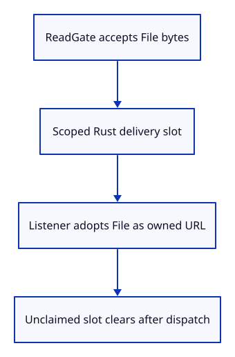
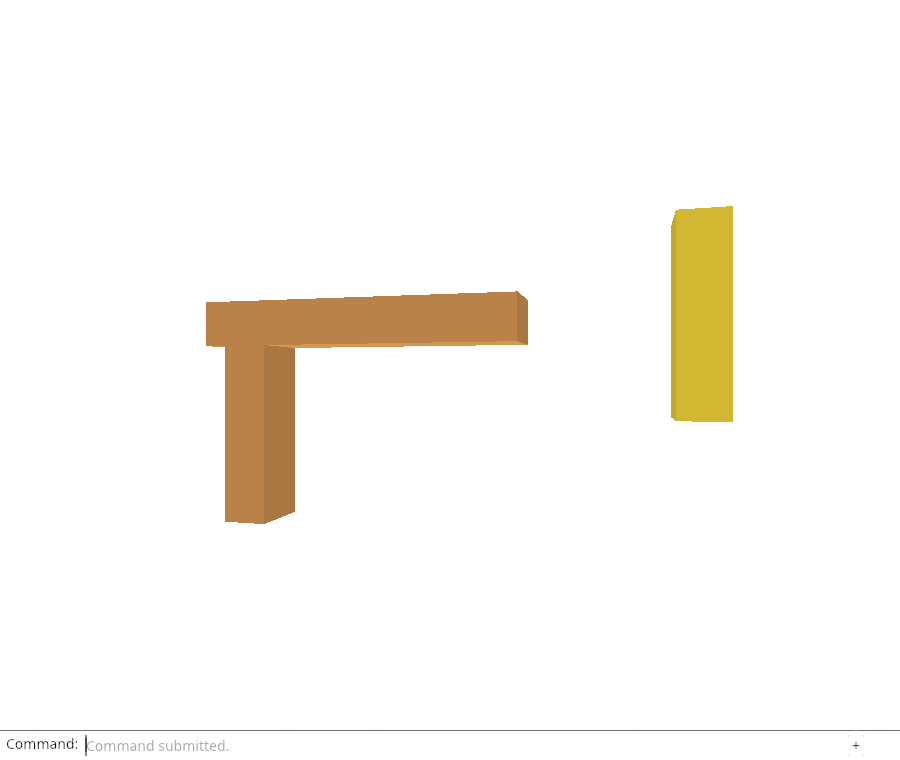

# 32ff · Adopt the selected file as a reloadable source

**Combined study estimate: 1–2 hours.** Includes reading, typing, reasoning and experiments.

**Typing estimate: 24–47 minutes.** 31 added or changed lines; unchanged context is excluded. [How this is estimated](typing-load.md).

**Today:** Transfer the accepted File through synchronous delivery and create its URL at adoption.

**In the whole viewer:** Connect the browser, drawing and input, then extend the same project. [See the destination](../journey.md#the-destination).

**Follow:** Transfer the accepted File through synchronous delivery and create its URL at adoption..

**Before you finish, explain:** Why not create a Blob URL as soon as the user selects a file?

The browser already owns asynchronous file delivery through ReadGate. Add one shared delivery slot holding the accepted File only during the viewer-file dispatch. After the read finishes and its ticket is accepted, the producer places the File in this slot, dispatches, then clears any unclaimed value.

The listener validates the event payload, takes the File, creates ReloadUrl and builds ImportAt or ReplaceAt. An error creating the URL is reported through the Open history entry. A malformed file creates an owner that is dropped when editor loading fails; a stale read never creates a URL.

The slot is a Rust handoff, not a persistent cache of file bytes or kernel sources. It also prevents an unrelated external viewer-file event from manufacturing a located import without an accepted File. Later listener teardown cancels work and releases this handoff lifetime.

Chrome checks real fetches from adopted URLs, invalid-import revocation, cancelled reads with no new URLs, URL retention through Undo/Redo and revocation after Close. Recordings use the browser’s URL methods, while the resulting drawing remains the same command-only viewer.



## Type the change

Continue [Give a reload URL an explicit owner](32fe-location.md). From `session_viewer`, save your files with `npm --prefix ../session_tests run course -- save before-32ff-bridge`. A save keeps your own work; it does not fill in the next lesson.

### 1. `src/file_input.rs`

Hold an accepted File only across one synchronous editor delivery.

Find this exact block:

```rust
pub enum Mode { Append, Replace }
```

Replace that block with:

```rust
--8<-- "journey/code/32ff-bridge-01.rs"
```

### 2. `src/file_input.rs`

Give the accepted read access to its scoped handoff slot.

Find this exact block:

```rust
pub fn choose(event: &web_sys::Event, request: Rc<RefCell<crate::read_gate::ReadGate>>, mode: Mode) {
```

Replace that block with:

```rust
--8<-- "journey/code/32ff-bridge-02.rs"
```

### 3. `src/file_input.rs`

Transfer the File only after request ownership has been accepted.

Find this exact block:

```rust
        let result = result.and_then(|buffer| deliver(buffer, mode));
```

Replace that block with:

```rust
--8<-- "journey/code/32ff-bridge-03.rs"
```

### 4. `src/file_input.rs`

Pair bytes with their retained immutable File during dispatch.

Find this exact block:

```rust
fn deliver(buffer: JsValue, mode: Mode) -> Result<(), JsValue> {
```

Replace that block with:

```rust
--8<-- "journey/code/32ff-bridge-04.rs"
```

### 5. `src/file_input.rs`

Always drop an unclaimed File after synchronous delivery, including dispatch failure.

Find this exact block:

```rust
    web_sys::window().ok_or("No browser window")?.dispatch_event(&event)?;
    Ok(())
```

Replace that block with:

```rust
--8<-- "journey/code/32ff-bridge-05.rs"
```

### 6. `src/file_input.rs`

Adopt URL ownership only for a validated event with an accepted File.

Find this exact block:

```rust
pub fn action(event: &web_sys::Event) -> Option<crate::editor::Action> {
    let event = event.dyn_ref::<web_sys::CustomEvent>()?;
    let payload = event.detail().dyn_into::<js_sys::Array>().ok()?;
    if payload.length() != 2 { return None; }
    let replace = payload.get(0).as_bool()?;
    let array = payload.get(1).dyn_into::<js_sys::Uint8Array>().ok()?;
    if array.length() as usize > crate::document::MAX_BYTES { return None; }
    Some(if replace { crate::editor::Action::Replace(array.to_vec()) }
        else { crate::editor::Action::Import(array.to_vec()) })
}
```

Replace that block with:

```rust
--8<-- "journey/code/32ff-bridge-06.rs"
```

### 7. `src/browser.rs`

Share one scoped delivery slot between reader and editor callback.

Find this exact block:

```rust
    let read_mode = std::cell::Cell::new(crate::file_input::Mode::Append);
```

Replace that block with:

```rust
--8<-- "journey/code/32ff-bridge-07.rs"
```

### 8. `src/browser.rs`

Keep request tickets and File adoption in the same delivery path.

Find this exact block:

```rust
            crate::file_input::choose(&event, std::rc::Rc::clone(&request), read_mode.get());
```

Replace that block with:

```rust
--8<-- "journey/code/32ff-bridge-08.rs"
```

### 9. `src/browser.rs`

Report adoption failure without claiming an import committed.

Find this exact block:

```rust
            crate::file_input::action(&event)
```

Replace that block with:

```rust
--8<-- "journey/code/32ff-bridge-09.rs"
```

### 10. `src/browser.rs`

Keep Replace success reporting accurate for the located action.

Find this exact block:

```rust
            let replacement = matches!(&action, Action::Replace(_));
```

Replace that block with:

```rust
--8<-- "journey/code/32ff-bridge-10.rs"
```

### 11. `src/browser.rs`

Expose only hidden origin URL inspection for actual lifetime checks.

Find this exact block:

```rust
        (&row.guid, source.origin.id.to_string(), source.origin.version.hex()))).collect();
```

Replace that block with:

```rust
--8<-- "journey/code/32ff-bridge-11.rs"
```

## Run and look

From `session_viewer`, enter your project folder:

```sh
cd workspace/journey
REGEN_PROTO=0 cargo build --lib --locked --target wasm32-unknown-unknown -j4
REGEN_PROTO=0 CARGO_BUILD_JOBS=4 trunk serve --port 8780
```

Open `http://127.0.0.1:8780/`. If Trunk is already running in this project, leave it running; it rebuilds when you save.

Open a specimen, inspect the owned origin URL, and fetch its bytes. Duplicate imports get distinct URLs and origin IDs. Close and confirm their URLs are revoked; cancelled reads must never allocate one.

**Actual Chrome screenshot.**



*Captured from this checkpoint’s browser bundle after its browser checks passed. [Check scope and environment](release.md).*

Run the state checks from your project folder:

```sh
REGEN_PROTO=0 cargo test --lib --locked -j4
```

## Try one small experiment

Remove the final delivery-slot cleanup in a scratch copy and predict what happens if no listener adopts its File. Keep the production implementation unchanged after the experiment.

## Explain it in your own words

Trace the values through the files without reading the answer first. If you lose the connection, stop at the last value you can follow.

<details>
<summary>Compare your explanation</summary>

Its read may be cancelled, superseded or rejected before adoption. Keep the File while reading, finish the request ticket first, and create the URL only when the synchronous editor callback accepts delivery. Clear any unclaimed delivery slot afterwards.

</details>

## Keep your working result

Return to `session_viewer` in a second terminal. Restore experimental edits before comparing:

```sh
npm --prefix ../session_tests run course -- check 32ff-bridge
npm --prefix ../session_tests run course -- save 32ff-bridge
```

The comparison spots typing differences; it does not prove behaviour. Keep three notes: what I changed; the values I followed; the question I still have. [Recover a checkpoint](recovery.md) if an experiment gets tangled.

## Where this grows

Accepted immutable Files now have a reload path and exact byte version. Source residency can change next without inventing URLs from kernel geometry or drawing floats.

[Validation status and course release](release.md).
