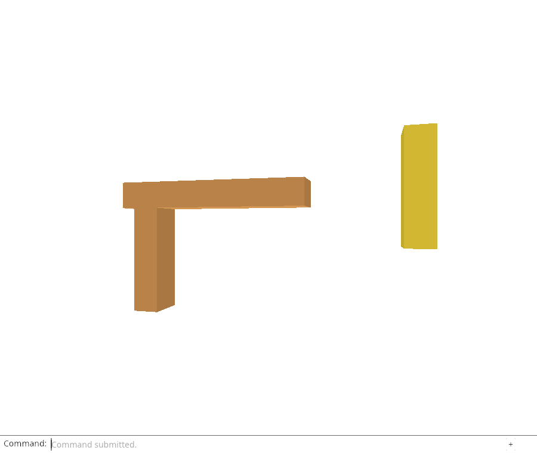
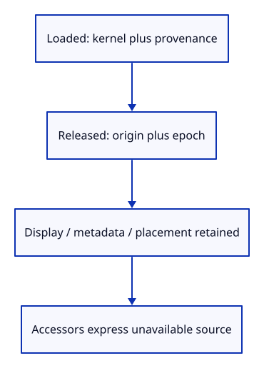

# 32fg · Separate loaded and released editable ownership

**Typing: 18–35 minutes.** [Estimate](typing-load.md).

Replace Object’s private geometry/source fields with EditSource. Loaded owns the required kernel geometry and optional imported Source. Released owns an Origin and epoch. Generated Loaded rows have geometry but no imported Origin.

## Type

Continue from [Adopt the selected file as a reloadable source](32ff-bridge.md). [Save or recover your work](recovery.md).

### 1. `src/lib.rs`

Confine source residency representation to the viewer implementation.

<details>
<summary>Locate the existing block</summary>

```rust
pub mod reload_url;
```

</details>

Replace that block with:

```rust
--8<-- "journey/code/32fg-state-01.rs"
```

### 2. `src/edit_source.rs`

Keep Released ownership free of kernel mesh and Session values.

Create the file and type:

```rust
--8<-- "journey/code/32fg-state-02.rs"
```

### 3. `src/scene.rs`

Retain public display fields while replacing only editable ownership.

<details>
<summary>Locate the existing block</summary>

```rust
    geometry: Rc<session_rust::Mesh>,
    pub model: session_rust::Xform,
    source: Option<crate::document::Source>,
```

</details>

Replace that block with:

```rust
--8<-- "journey/code/32fg-state-03.rs"
```

### 4. `src/scene.rs`

Borrow loaded owners safely while retaining origin and epoch in the released state.

<details>
<summary>Locate the existing block</summary>

```rust
    pub fn geometry(&self) -> Option<&Rc<session_rust::Mesh>> { Some(&self.geometry) }

    pub fn source(&self) -> Option<&crate::document::Source> { self.source.as_ref() }
```

</details>

Replace that block with:

```rust
--8<-- "journey/code/32fg-state-04.rs"
```

### 5. `src/scene.rs`

Preserve the validated insertion contract and display owner.

<details>
<summary>Locate the existing block</summary>

```rust
        self.objects.push(Object { id, guid, metadata, mesh: Rc::new(prepared.display), geometry: prepared.geometry,
            model: prepared.model, source: prepared.source });
```

</details>

Replace that block with:

```rust
--8<-- "journey/code/32fg-state-05.rs"
```

### 6. `src/scene.rs`

Keep partial-replacement ownership assertions through the existing accessor boundary.

<details>
<summary>Locate the existing block</summary>

```rust
            assert!(Rc::ptr_eq(&object.geometry, &old.geometry));
```

</details>

Replace that block with:

```rust
--8<-- "journey/code/32fg-state-06.rs"
```

### 7. `src/browser.rs`

Retain origin inspection even when editable kernel ownership is absent.

<details>
<summary>Locate the existing block</summary>

```rust
    let origins: Vec<_> = editor.scene.objects().iter().filter_map(|row| row.source().map(|source|
        (&row.guid, source.origin.id.to_string(), source.origin.version.hex(),
            source.origin.location.as_ref().map(|location| location.value())))).collect();
```

</details>

Replace that block with:

```rust
--8<-- "journey/code/32fg-state-07.rs"
```

## Run and check

In your project:

```sh
cd workspace/journey
REGEN_PROTO=0 cargo build --lib --locked --target wasm32-unknown-unknown -j4
REGEN_PROTO=0 CARGO_BUILD_JOBS=4 trunk serve --port 8780
```

Open `http://127.0.0.1:8780/`. Keep an existing Trunk server running; saving rebuilds it.

Run the residency checks below. A cold row has no editable source but retains display, metadata, identity and placement. Browser unloading comes later.

**Verified checkpoint in Chrome.**



[Verification scope](release.md).

Run the state checks on your computer from your project folder:

```sh
REGEN_PROTO=0 cargo test --lib --locked --target host-tuple -j4
```

<details>
<summary>Code explanation and diagram</summary>

Keep geometry() and source() total: they return None for Released rather than panicking or substituting a display mesh. origin() remains available in either imported state. release_epoch() distinguishes a current release from a later release cycle.

Scene insertion still requires PreparedMesh geometry. It captures metadata, creates the display Rc, and adopts Loaded ownership. The renderer still sees exactly the same mesh/model/id fields. At this endpoint no code unloads a row yet; existing precision, history and close tests must pass unchanged through the new representation.

Represent source residency without changing retained display, identity or placement..



Which owners remain in a Released row?

Its retained row data still owns the display mesh, metadata and placement. Editable storage owns only a geometry-free Origin and release epoch. It cannot retain the old kernel Mesh or Session.

Study estimate, including typing and experiments: 1–2 hours.

</details>

<details>
<summary>Optional experiment</summary>

Follow the Rc edges in Loaded and Released. Explain why adding a kernel Rc to Released would defeat unloading even if source() returned None.

</details>

<details>
<summary>Check and save your work</summary>

Restore experimental edits, then run from `session_viewer`:

```sh
npm --prefix ../session_tests run course -- check 32fg-state
npm --prefix ../session_tests run course -- save 32fg-state
```

Source comparison leaves your project untouched. [Save and recovery instructions](recovery.md).

</details>

<details>
<summary>Viewer coverage and verification</summary>

The private representation now expresses the production distinction between retained display rows and resident editable source. The next policy prevents releasing generated or modified sources.


[Full validation scope](release.md).

To reproduce the scripted acceptance of the reference checkpoint, run from `session_viewer` with the [course bundle server](release.md#reproduce) running on port 8781:

```sh
npm --prefix ../session_tests run course -- capture 32fg-state
```

This uses the verified reference bundle; it does not check or change your typed project.

</details>
