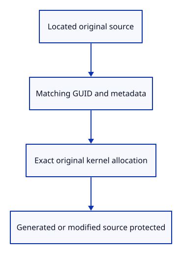
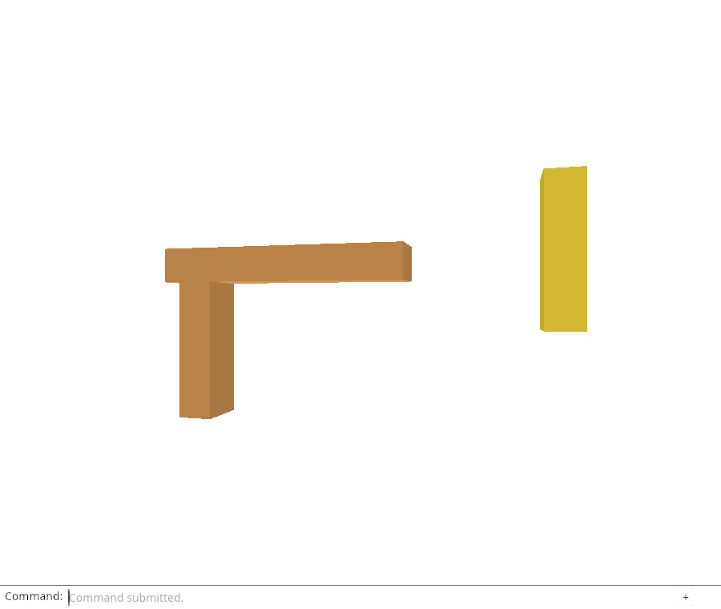

# 32fh · Protect sources that cannot be unloaded faithfully

**Combined study estimate: 1–2 hours.** Includes reading, typing, reasoning and experiments.

**Typing estimate: 21–41 minutes.** 35 added or changed lines; unchanged context is excluded. [How this is estimated](typing-load.md).

**Today:** Require a reload location, original kernel allocation and unchanged row metadata.

**Follow:** Require a reload location, original kernel allocation and unchanged row metadata..

A release policy must preserve data that cannot be restored. Generated rows have no imported source. Imports without a location cannot be read again. A new kernel allocation or edited source metadata must not silently revert to the original file.

can_unload checks a located Loaded source, its original GUID, name/visibility/locking metadata, and the exact kernel allocation retained by its imported Session. The allocation check distinguishes original data from a modified replacement even when its values happen to compare equal. Model placement is separate row state, so Move does not make an otherwise original source ineligible.

Add borrowed mutable row access for the forthcoming residency pass, and Scene::unload as the operation on a previously validated set of origins. It changes only editable ownership to Released. The editor-wide origin validation comes next; no dock command exists yet.

Native policy tests protect generated/unlocated sources, changed flags and replacement kernel owners. The whole-origin check in the next lesson will inspect active, Undo and Redo roots before any mutation.



## Type the change

Continue from [Separate loaded and released editable ownership](32fg-state.md). Save your own work first: `npm --prefix ../session_tests run course -- save before-32fh-policy` (from `session_viewer`).

### 1. `src/scene.rs`

Only original, located imported sources can be restored by their original file.

<details>
<summary>Locate the existing block</summary>

```rust
    pub fn world_point(&self, vertex: [f32; 6]) -> [f64; 3] {
```

</details>

Replace that block with:

```rust
--8<-- "journey/code/32fh-policy-01.rs"
```

### 2. `src/scene.rs`

Apply a validated origin set without touching retained display/model/metadata owners.

<details>
<summary>Locate the existing block</summary>

```rust
    pub fn insert(&mut self, prepared: PreparedMesh) -> Result<ObjectId, &'static str> {
```

</details>

Replace that block with:

```rust
--8<-- "journey/code/32fh-policy-02.rs"
```

### 3. `src/scene.rs`

Prove the conditions that protect data not faithfully reloadable from the original file.

<details>
<summary>Locate the existing block</summary>

```rust
    #[test]
    fn partial_replacement_failure_restores_owners_without_reusing_ids() {
```

</details>

Replace that block with:

```rust
--8<-- "journey/code/32fh-policy-03.rs"
```

## Run and look

From `session_viewer`, enter your project folder:

```sh
cd workspace/journey
REGEN_PROTO=0 cargo build --lib --locked --target wasm32-unknown-unknown -j4
REGEN_PROTO=0 CARGO_BUILD_JOBS=4 trunk serve --port 8780
```

Open `http://127.0.0.1:8780/`. If Trunk is already running in this project, leave it running; it rebuilds when you save.

Run the unload-policy checks below. Only unmodified rows with a usable source location are eligible; protected rows remain loaded.

**Verified checkpoint in Chrome.**



[What this screenshot checks](release.md).

Run the state checks from your project folder:

```sh
REGEN_PROTO=0 cargo test --lib --locked -j4
```

<details>
<summary>Optional experiment</summary>

Change only placement in a fixture, then change a source flag. Explain why the first remains reloadable while the second must be protected at this endpoint.

</details>

## Explain the change

Why does one modified history row protect every row of that origin?

<details>
<summary>Compare your explanation</summary>

They share one reload source. Reloading its original bytes cannot reproduce modified kernel data in that snapshot. Protect the whole origin whenever any retained row no longer matches the original source contract.

</details>

## Keep your working result

Return to `session_viewer` in a second terminal. Restore experimental edits before comparing:

```sh
npm --prefix ../session_tests run course -- check 32fh-policy
npm --prefix ../session_tests run course -- save 32fh-policy
```

Check compares your typed source; run the focused check above for behavior. [Recover your work](recovery.md).

<details>
<summary>Where this fits in the finished viewer</summary>

Production avoids unloading edited source documents. Our scene-snapshot history requires checking every retained origin row before releasing their shared sources.

</details>

<details>
<summary>Verification notes and browser acceptance</summary>


[Full validation scope](release.md).

To reproduce the scripted acceptance of the reference checkpoint, run from `session_viewer` with the [course bundle server](release.md#reproduce) running on port 8781:

```sh
npm --prefix ../session_tests run course -- capture 32fh-policy
```

This uses the verified reference bundle; it does not check or change your typed project.

</details>
