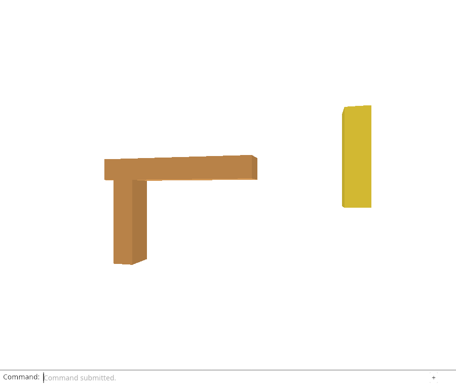
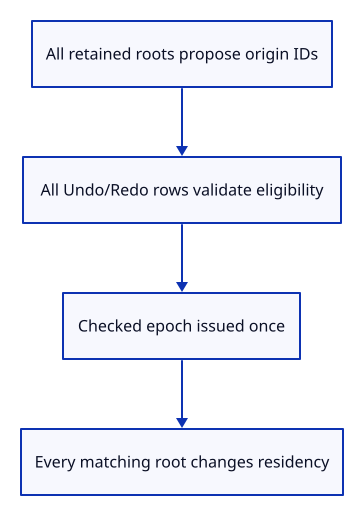

# 32fi · Unload sources across active and history roots

**Typing: 16–32 minutes.** [Estimate](typing-load.md).

Plan source unloading before mutating. Collect eligible origins across active, Undo and Redo roots; exclude any origin with a protected row. An empty plan returns an error.

Issue a checked release epoch, then unload matching rows in every retained root. This changes residency, not document history, and preserves placements. Close keeps the epoch counter so reopened documents cannot reuse completion tokens.

## Type

Continue from [Protect sources that cannot be unloaded faithfully](32fh-policy.md). [Save or recover your work](recovery.md).

### 1. `src/history.rs`

Visit both history branches without cloning or dropping their rows.

<details>
<summary>Locate the existing block</summary>

```rust
    pub fn clear(&mut self) {
```

</details>

Replace that block with:

```rust
--8<-- "journey/code/32fi-history-01.rs"
```

### 2. `src/editor.rs`

Add a residency operation distinct from document close.

<details>
<summary>Locate the existing block</summary>

```rust
    Close,
```

</details>

Replace that block with:

```rust
--8<-- "journey/code/32fi-history-02.rs"
```

### 3. `src/editor.rs`

Issue epochs independently of document history and Close.

<details>
<summary>Locate the existing block</summary>

```rust
    history: History,
```

</details>

Replace that block with:

```rust
--8<-- "journey/code/32fi-history-03.rs"
```

### 4. `src/editor.rs`

Start the first viewer-owned release sequence without wraparound.

<details>
<summary>Locate the existing block</summary>

```rust
            history: History::default(),
```

</details>

Replace that block with:

```rust
--8<-- "journey/code/32fi-history-04.rs"
```

### 5. `src/editor.rs`

Validate every retained origin row before issuing an epoch or changing any owner.

<details>
<summary>Locate the existing block</summary>

```rust
    pub fn apply(&mut self, action: Action) -> Result<Change, &'static str> {
```

</details>

Replace that block with:

```rust
--8<-- "journey/code/32fi-history-05.rs"
```

### 6. `src/editor.rs`

Keep source unloading out of document Undo transactions.

<details>
<summary>Locate the existing block</summary>

```rust
            Action::Close => {
```

</details>

Replace that block with:

```rust
--8<-- "journey/code/32fi-history-06.rs"
```

### 7. `src/scene.rs`

Refuse an edit until its original editable source has been restored.

<details>
<summary>Locate the existing block</summary>

```rust
        object.model = model;
```

</details>

Replace that block with:

```rust
--8<-- "journey/code/32fi-history-07.rs"
```

### 8. `src/editor.rs`

Keep selection/history unchanged when a cold edit requires hydration.

<details>
<summary>Locate the existing block</summary>

```rust
            Action::Delete => {
                if let Some(id) = self.selected.take() {
```

</details>

Replace that block with:

```rust
--8<-- "journey/code/32fi-history-08.rs"
```

## Run and check

In your project:

```sh
cd workspace/journey
REGEN_PROTO=0 cargo build --lib --locked --target wasm32-unknown-unknown -j4
REGEN_PROTO=0 CARGO_BUILD_JOBS=4 trunk serve --port 8780
```

Open `http://127.0.0.1:8780/`. Keep an existing Trunk server running; saving rebuilds it.

Run the history-release checks below. Releasing an origin must visit matching active, Undo and Redo rows while retaining their display and placement.

**Verified checkpoint in Chrome.**



[Verification scope](release.md).

Run the state checks from your project folder:

```sh
REGEN_PROTO=0 cargo test --lib --locked -j4
```

<details>
<summary>Code explanation and diagram</summary>

Cold Move and Delete currently return reload-required errors; Save refuses missing geometry. Drawing, picking and camera use retained display state. Automatic restoration comes later.

The native frame checks unloaded source/document expiration and retained display/GPU owners. The next endpoint adds the dock command and moved-object history checks.

Release a validated whole-origin set without clearing Undo/Redo or changing placements..



Why is unloading only the current Scene insufficient?

Its Undo and Redo rows retain the same kernel owners. They would keep the source alive and later restore a different residency. Convert every retained row of a validated origin together while keeping its separate placement and display owner.

Study estimate, including typing and experiments: 1–2 hours.

</details>

<details>
<summary>Optional experiment</summary>

Keep an external clone of Source in a fixture and explain why the editor can release its own roots while that external owner still keeps the kernel alive.

</details>

<details>
<summary>Check and save your work</summary>

Restore experimental edits, then run from `session_viewer`:

```sh
npm --prefix ../session_tests run course -- check 32fi-history
npm --prefix ../session_tests run course -- save 32fi-history
```

Source comparison leaves your project untouched. [Save and recovery instructions](recovery.md).

</details>

<details>
<summary>Viewer coverage and verification</summary>

This models source residency across our shared Scene snapshots without clearing history. Guarded hydration and automatic edit replay remain required before claiming complete source-release parity.


[Full validation scope](release.md).

To reproduce the scripted acceptance of the reference checkpoint, run from `session_viewer` with the [course bundle server](release.md#reproduce) running on port 8781:

```sh
npm --prefix ../session_tests run course -- capture 32fi-history
```

This uses the verified reference bundle; it does not check or change your typed project.

</details>
