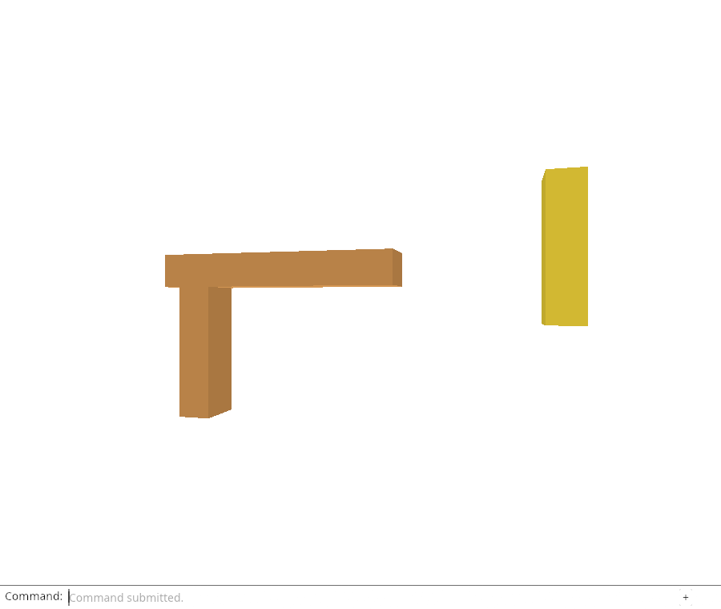
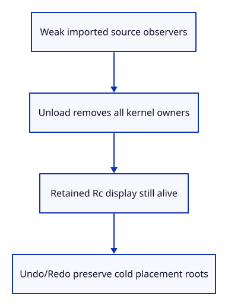

# 32fj · Prove unloading preserves placed history

**Typing: 19–38 minutes.** [Estimate](typing-load.md).

Use a located imported document and a real placement edit. Retain its derived display Rc, record Weak observers of the kernel mesh and Session, and unload. The old editable values must disappear while the row’s local ID, saved GUID, display owner, placement and camera remain.

## Type

Continue from [Unload sources across active and history roots](32fi-history.md). [Save or recover your work](recovery.md).

### 1. `src/lib.rs`

Verify actual source release independently of GPU drawing.

<details>
<summary>Locate the existing block</summary>

```rust
mod origin_tests;
```

</details>

Replace that block with:

```rust
--8<-- "journey/code/32fj-proof-01.rs"
```

### 2. `src/unload_tests.rs`

Prove old source values expire while placed drawing data and history remain available.

Create the file and type:

```rust
--8<-- "journey/code/32fj-proof-02.rs"
```

## Run and check

In your project:

```sh
cd workspace/journey
REGEN_PROTO=0 cargo build --lib --locked --target wasm32-unknown-unknown -j4
REGEN_PROTO=0 CARGO_BUILD_JOBS=4 trunk serve --port 8780
```

Open `http://127.0.0.1:8780/`. Keep an existing Trunk server running; saving rebuilds it.

Run the weak-owner checks below. After source release, the original source allocation must expire while its retained display still draws.

**Verified checkpoint in Chrome.**



[Verification scope](release.md).

Run the state checks on your computer from your project folder:

```sh
REGEN_PROTO=0 cargo test --lib --locked --target host-tuple -j4
```

<details>
<summary>Code explanation and diagram</summary>

An unavailable-source Save or Move must refuse without consuming Undo. Undo then restores the earlier placement and Redo restores the moved placement; both keep the origin’s release epoch. This is residency travel across existing document history, not an undo command for unloading.

The next endpoint exposes the same operation in Chrome and adds GPU retention proof. Rehydration and automatic edit replay remain separate required work.

Weak kernel/document observers → unload all roots → retained display → cold model-history travel.



What proves source unloading did not secretly clear the document history?

Record the number of scene roots and an earlier model matrix, unload, and Undo the prior Move. The roots remain and the earlier placement returns while that row still has no editable source. Weak observers separately prove the old kernel values are gone.

Study estimate, including typing and experiments: 1–2 hours.

</details>

<details>
<summary>Optional experiment</summary>

Retain only the Origin rather than the display Rc in the fixture. Predict which owners survive and which Weak values expire.

</details>

<details>
<summary>Check and save your work</summary>

Restore experimental edits, then run from `session_viewer`:

```sh
npm --prefix ../session_tests run course -- check 32fj-proof
npm --prefix ../session_tests run course -- save 32fj-proof
```

Source comparison leaves your project untouched. [Save and recovery instructions](recovery.md).

</details>

<details>
<summary>Viewer coverage and verification</summary>

This proof covers the current immutable imported mesh subset. The full source reload flow and all production geometry/resource families remain required.


[Full validation scope](release.md).

To reproduce the scripted acceptance of the reference checkpoint, run from `session_viewer` with the [course bundle server](release.md#reproduce) running on port 8781:

```sh
npm --prefix ../session_tests run course -- capture 32fj-proof
```

This uses the verified reference bundle; it does not check or change your typed project.

</details>
