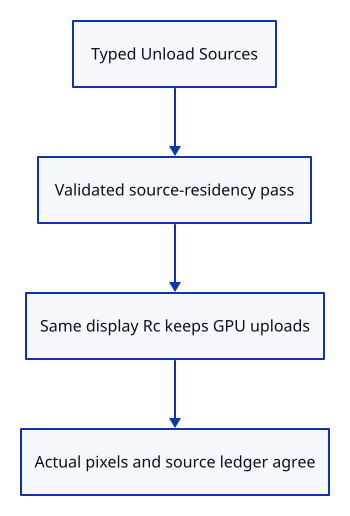
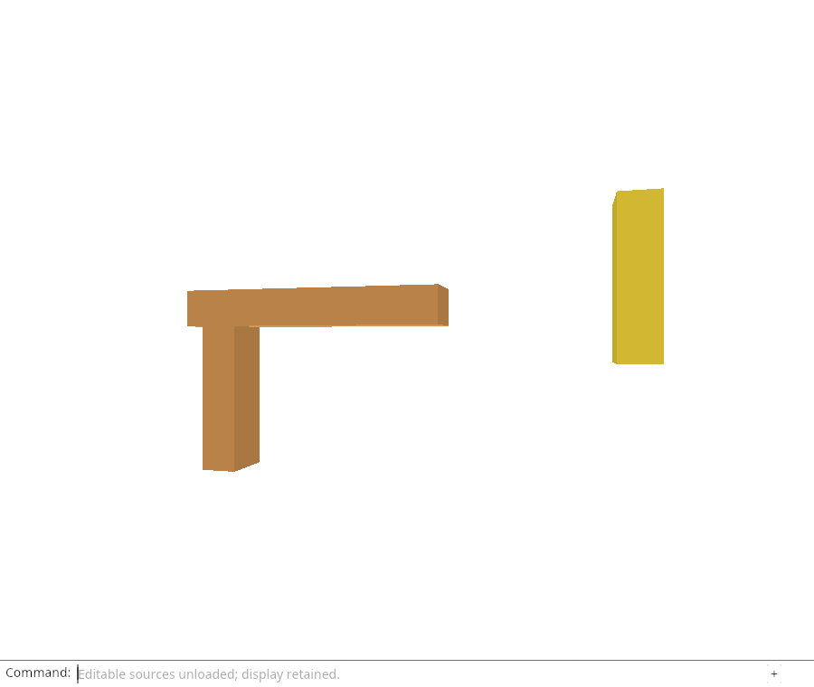

# 32fk · Unload editable sources through the command line

**Combined study estimate: 1–2 hours.** Includes reading, typing, reasoning and experiments.

**Typing estimate: 8–16 minutes.** 13 added or changed lines; unchanged context is excluded. [How this is estimated](typing-load.md).

**Today:** Keep the drawing and GPU allocations while the dock unloads eligible imported sources.

**In the whole viewer:** Connect the browser, drawing and input, then extend the same project. [See the destination](../journey.md#the-destination).

**Follow:** Keep the drawing and GPU allocations while the dock unloads eligible imported sources..

**Before you finish, explain:** Why should renderer allocation counters stay unchanged during source unloading?

Expose Unload Sources through the existing dock vocabulary. It is a typed feature command with no button or keyboard shortcut. Remember the action kind before apply consumes it, then report success only after the editor residency pass and renderer synchronization succeed.

Hidden residency inspection lists each row’s source availability and release epoch. Origin inspection continues to expose the retained metadata and Blob location. The browser checks exact scene pixels, unchanged GPU counters, decreased resident-source accounting, preserved metadata and model-history behavior.

A failed cold Move, Delete or Save must explain that reload is required without downloading float approximations or consuming history. Camera/picking still work, and Undo restores earlier placement while keeping that source cold. Close clears the retained roots and revokes their owned URLs.

This finishes display-preserving unloading for the current mesh subset. It does not finish rehydration or automatic edit replay. Those are the next required lessons, followed by the other production geometry and resource families.



## Type the change

Continue [Prove unloading preserves placed history](32fj-proof.md). From `session_viewer`, save your files with `npm --prefix ../session_tests run course -- save before-32fk-command`. A save keeps your own work; it does not fill in the next lesson.

### 1. `src/browser.rs`

Offer residency changes through the real command dock.

Find this exact block:

```rust
            "Close",
```

Replace that block with:

```rust
--8<-- "journey/code/32fk-command-01.rs"
```

### 2. `src/browser.rs`

Keep unload separate from Close and from keyboard shortcuts.

Find this exact block:

```rust
            if line == "close" {
```

Replace that block with:

```rust
--8<-- "journey/code/32fk-command-02.rs"
```

### 3. `src/browser.rs`

Retain the submitted action kind across consumption.

Find this exact block:

```rust
            let closing = matches!(&action, Action::Close);
```

Replace that block with:

```rust
--8<-- "journey/code/32fk-command-03.rs"
```

### 4. `src/browser.rs`

Report success only after validated residency and renderer synchronization complete.

Find this exact block:

```rust
                    if closing {
```

Replace that block with:

```rust
--8<-- "journey/code/32fk-command-04.rs"
```

### 5. `src/browser.rs`

Inspect loaded/released state without adding runtime teaching controls.

Find this exact block:

```rust
    canvas.set_attribute("data-source-origins", &serde_json::to_string(&origins)
```

Replace that block with:

```rust
--8<-- "journey/code/32fk-command-05.rs"
```

## Run and look

From `session_viewer`, enter your project folder:

```sh
cd workspace/journey
cargo build --lib --locked --target wasm32-unknown-unknown -j4
CARGO_BUILD_JOBS=4 trunk serve --port 8780
```

Open `http://127.0.0.1:8780/`. If Trunk is already running in this project, leave it running; it rebuilds when you save.

Open the specimen and Move a post. Type Unload Sources: the scene should look identical. Try Move, Delete and Save, then Undo the previous placement. The display stays usable while source edits correctly await reload.

**Actual Chrome screenshot.**



*Captured from this checkpoint’s browser bundle after its browser checks passed. [Check scope and environment](release.md).*

Run the state checks from your project folder:

```sh
cargo test --lib --locked -j4
```

## Try one small experiment

Compare data-gpu-stats before and after unloading. Then Undo a placement and explain why a settings write can occur without a new geometry upload.

## Explain it in your own words

Trace the values through the files without reading the answer first. If you lose the connection, stop at the last value you can follow.

<details>
<summary>Compare your explanation</summary>

The scene rows keep their IDs, display Rc values, selection and model matrices. Renderer synchronization therefore retains the same GPU geometry and settings; only editable CPU ownership changes.

</details>

## Keep your working result

Return to `session_viewer` in a second terminal. Restore experimental edits before comparing:

```sh
npm --prefix ../session_tests run course -- check 32fk-command
npm --prefix ../session_tests run course -- save 32fk-command
```

The comparison spots typing differences; it does not prove behaviour. Keep three notes: what I changed; the values I followed; the question I still have. [Recover a checkpoint](recovery.md) if an experiment gets tangled.

## Where this grows

Production distinguishes display-only files from resident editable Sessions. This endpoint demonstrates that distinction with real Chrome pixels and managed owner checks, while the next lessons complete reload-before-edit behavior.

[Validation status and course release](release.md).
