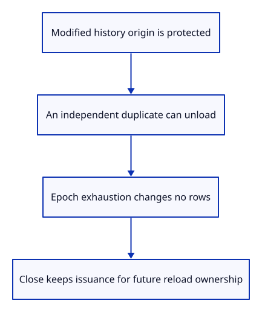
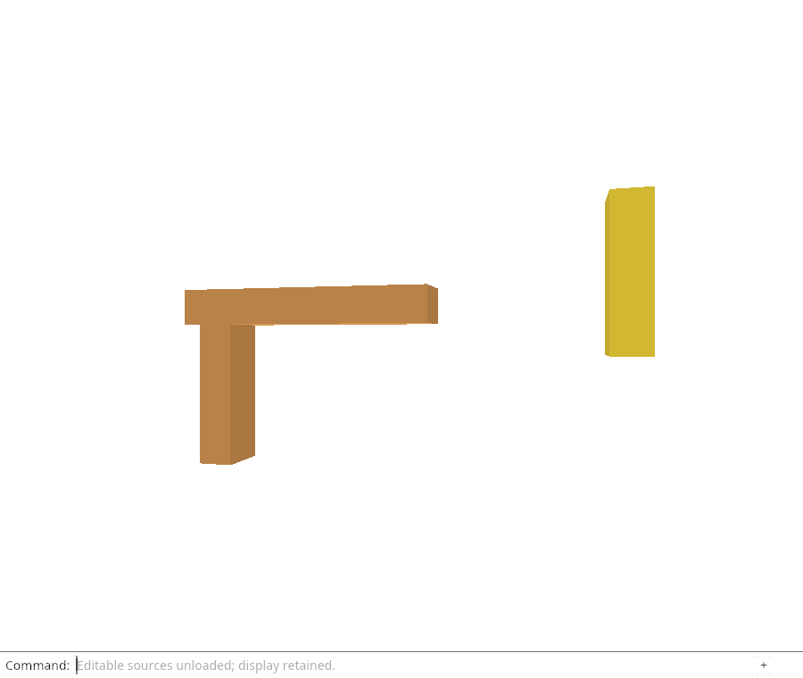

# 32fl · Protect history and future reload tickets

**Combined study estimate: 1–2 hours.** Includes reading, typing, reasoning and experiments.

**Typing estimate: 25–50 minutes.** 42 added or changed lines; unchanged context is excluded. [How this is estimated](typing-load.md).

**Today:** Verify whole-origin protection, independent duplicate imports and checked release epochs.

**Follow:** Modified history origin → protection; independent origin → release; exhausted epoch → no mutation.

Add the cases that a simple active-row check would miss. A modified metadata row exists only in history, while the active original still looks eligible. Protect that entire origin. A second import of identical bytes has its own Origin and can unload independently.



The epoch test forces exhaustion and verifies that no row becomes cold. It then releases, closes, reopens and releases again: the new rows receive the next epoch rather than reusing one.

## Type the change

Continue from [Unload editable sources through the command line](32fk-command.md). Save your own work first: `npm --prefix ../session_tests run course -- save before-32fl-guards` (from `session_viewer`).

### 1. `src/editor.rs`

Check modified history, independent imports and exhausted/reopened release issuance.

<details>
<summary>Locate the existing block</summary>

```rust
    #[test]
    fn close_ends_history_and_keeps_issued_ids_and_view_settings() {
```

</details>

Replace that block with:

```rust
--8<-- "journey/code/32fl-guards-01.rs"
```

## Run and look

From `session_viewer`, enter your project folder:

```sh
cd workspace/journey
REGEN_PROTO=0 cargo build --lib --locked --target wasm32-unknown-unknown -j4
REGEN_PROTO=0 CARGO_BUILD_JOBS=4 trunk serve --port 8780
```

Open `http://127.0.0.1:8780/`. If Trunk is already running in this project, leave it running; it rebuilds when you save.

Run the unload guard checks below. A modified history row must protect its origin; duplicate imports and exhausted epochs must not release the wrong source.

**Verified checkpoint in Chrome.**



[What this screenshot checks](release.md).

Run the state checks from your project folder:

```sh
REGEN_PROTO=0 cargo test --lib --locked -j4
```

<details>
<summary>Optional experiment</summary>

Reset the issuance counter inside Close in a scratch copy and predict the reopened epoch. Explain why origin identity alone should not replace per-release ownership.

</details>

## Explain the change

Why is a release epoch kept across Close rather than reset for each document?

<details>
<summary>Compare your explanation</summary>

A fetch can finish after Close. A later document must not reuse the old release token. Keep checked issuance in the viewer lifetime, and later compare the requested origin and its current released epoch before adopting a result.

</details>

## Keep your working result

Return to `session_viewer` in a second terminal. Restore experimental edits before comparing:

```sh
npm --prefix ../session_tests run course -- check 32fl-guards
npm --prefix ../session_tests run course -- save 32fl-guards
```

Check compares your typed source; run the focused check above for behavior. [Recover your work](recovery.md).

<details>
<summary>Where this fits in the finished viewer</summary>

Each source release has both an import identity and a viewer-issued epoch. The rehydration flow must verify both and its own read ticket before adopting data.

</details>

<details>
<summary>Verification notes and browser acceptance</summary>

Chrome keeps the command-only unloading proof, checks that a second unload refuses without changing pixels, and reopens in the same page before unloading again. The native GPU proof checks old kernel expiration with live display/GPU owners. These checks prepare guarded reload delivery; the fetch, cancellation and automatic edit replay are still next.

[Full validation scope](release.md).

To reproduce the scripted acceptance of the reference checkpoint, run from `session_viewer` with the [course bundle server](release.md#reproduce) running on port 8781:

```sh
npm --prefix ../session_tests run course -- capture 32fl-guards
```

This uses the verified reference bundle; it does not check or change your typed project.

</details>
