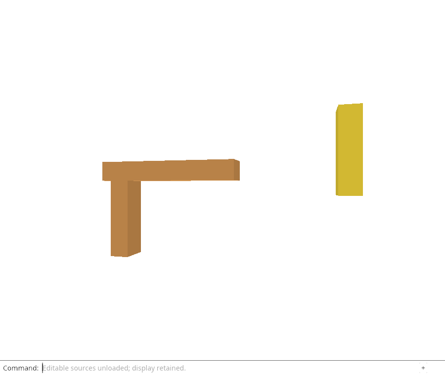
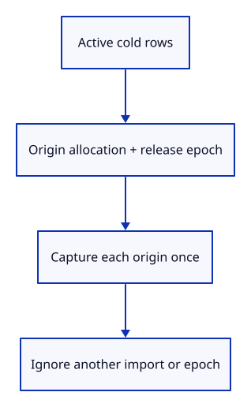

# 32g · Identify the source release a reload belongs to

**Typing: 19–37 minutes.** [Estimate](typing-load.md).

Define `ReloadKey` as an Origin owner and one release epoch. matches compares the actual imported Origin Rc and the row’s current epoch. That is the residency identity; local/saved object identity and source GUID remain separate.

Collect distinct keys from active cold rows. A later explicit reload can use them, while source adoption will also visit matching history roots. Do not fetch a history-only source without a current active request. If history later restores that source, a new request can obtain its current key.

## Type

Continue from [Protect history and future reload tickets](32fl-guards.md). [Save or recover your work](recovery.md).

### 1. `src/lib.rs`

Give reload identity and preparation their own Rust boundary.

<details>
<summary>Locate the existing block</summary>

```rust
pub mod reload_url;
```

</details>

Replace that block with:

```rust
--8<-- "journey/code/32g-keys-01.rs"
```

### 2. `src/rehydrate.rs`

Match an imported allocation and checked release epoch instead of only a file GUID.

Create the file and type:

```rust
--8<-- "journey/code/32g-keys-02.rs"
```

### 3. `src/editor.rs`

Request each active imported release once without duplicating its geometry.

<details>
<summary>Locate the existing block</summary>

```rust
    fn scenes_mut(&mut self) -> impl Iterator<Item = &mut Scene> {
```

</details>

Replace that block with:

```rust
--8<-- "journey/code/32g-keys-03.rs"
```

## Run and check

In your project:

```sh
cd workspace/journey
REGEN_PROTO=0 cargo build --lib --locked --target wasm32-unknown-unknown -j4
REGEN_PROTO=0 CARGO_BUILD_JOBS=4 trunk serve --port 8780
```

Open `http://127.0.0.1:8780/`. Keep an existing Trunk server running; saving rebuilds it.

Run the reload-key checks below. A key from a closed import must not match a new import of identical bytes; changing the release epoch must also reject it. No fetch is connected yet.

**Verified checkpoint in Chrome.**



[Verification scope](release.md).

Run the state checks from your project folder:

```sh
REGEN_PROTO=0 cargo test --lib --locked -j4
```

<details>
<summary>Code explanation and diagram</summary>

`Rc::clone` creates another owner of the same value; it does not copy the Origin. `Rc::ptr_eq` asks whether two owners refer to that same allocation. `Option<Self>` means a row might have no reload key: the question marks return None immediately for a loaded or unlocated row. `is_some_and` runs the comparison only when an origin exists.

Active cold rows → ReloadKey::of → unique imported Origin + release epoch.



Why is a file GUID insufficient to accept a reload result?

Duplicate imports can share the same original GUID and byte version. A result must belong to this imported Origin allocation and its current release epoch. Loaded rows, closed rows and another release cycle must not match it.

Study estimate, including typing and experiments: 1–2 hours.

</details>

<details>
<summary>Optional experiment</summary>

Compare two imports of the same file. Explain why sharing the byte version must not make a result for one import eligible for the other.

</details>

<details>
<summary>Check and save your work</summary>

Restore experimental edits, then run from `session_viewer`:

```sh
npm --prefix ../session_tests run course -- check 32g-keys
npm --prefix ../session_tests run course -- save 32g-keys
```

Source comparison leaves your project untouched. [Save and recovery instructions](recovery.md).

</details>

<details>
<summary>Viewer coverage and verification</summary>

Production source fetches carry a release token. This explicit key prepares the same rejection of old completions across replacement, Close and another release cycle.

The native test unloads, records a key, closes and imports the same bytes again. The old key cannot match the new import. A key with a changed epoch cannot match the current cold row either. No fetch or Reload Sources command exists yet; the browser retains the preceding unload behavior.

The browser checks the existing command-only unload behavior and retained drawing. Source hydration at this endpoint is verified by the native state/GPU checks; browser fetch and automatic command replay are still pending.

[Full validation scope](release.md).

To reproduce the scripted acceptance of the reference checkpoint, run from `session_viewer` with the [course bundle server](release.md#reproduce) running on port 8781:

```sh
npm --prefix ../session_tests run course -- capture 32g-keys
```

This uses the verified reference bundle; it does not check or change your typed project.

</details>
