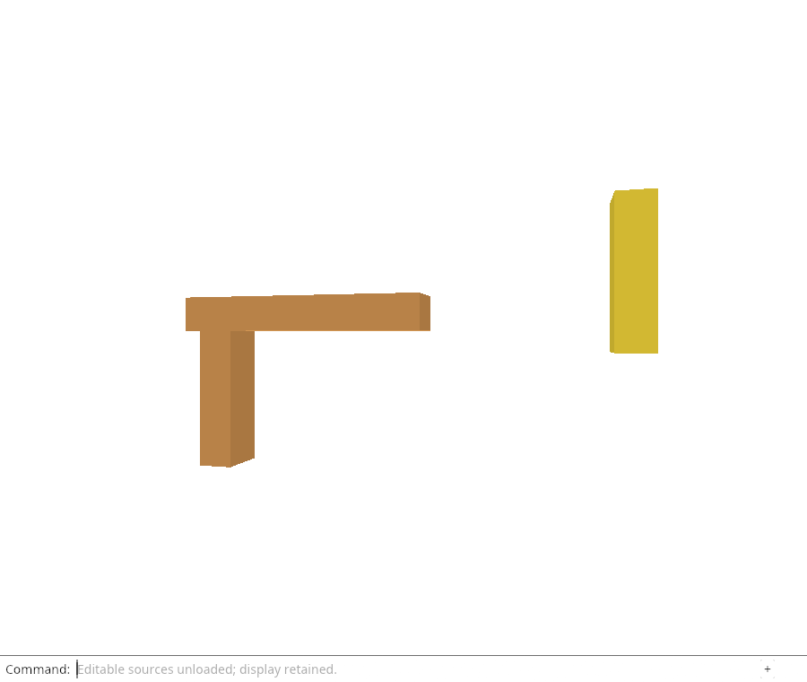

# 32ga · Prepare original kernel data without rebuilding its display

**Typing: 16–31 minutes.** [Estimate](typing-load.md).

Introduce `document::decode` as the common bounded protobuf/schema boundary. Ordinary `load_at` still creates an Origin and prepares display meshes. `document::restore` instead validates the expected immutable byte version, constructs the kernel `Session` and returns its Rc directly.

`PreparedReload` owns one key and one candidate `Session`. It checks each matching row’s original source GUID, name and visibility/locking against the decoded kernel mesh. Missing source identity or metadata drift refuses adoption; retained displays are never treated as editable geometry.

## Type

Continue from [Identify the source release a reload belongs to](32g-keys.md). [Save or recover your work](recovery.md).

### 1. `src/document.rs`

Share bounded decoding without sharing display preparation.

<details>
<summary>Locate the existing block</summary>

```rust
    if bytes.len() > MAX_BYTES { return Err("This checkpoint accepts files up to 4 MiB"); }
    let message = proto::Session::decode(bytes).map_err(|_| "Invalid session protobuf")?;
    validate(&message)?;
```

</details>

Replace that block with:

```rust
--8<-- "journey/code/32ga-prepare-01.rs"
```

### 2. `src/document.rs`

Restore only original kernel data after validating the immutable source version.

<details>
<summary>Locate the existing block</summary>

```rust
pub fn snapshot(scene: &crate::scene::Scene) -> Result<Vec<u8>, &'static str> {
```

</details>

Replace that block with:

```rust
--8<-- "journey/code/32ga-prepare-02.rs"
```

### 3. `src/rehydrate.rs`

Keep candidate kernel ownership private until every matched row has a valid original source.

<details>
<summary>Locate the existing block</summary>

```rust
#[cfg(test)]
mod tests {
```

</details>

Replace that block with:

```rust
--8<-- "journey/code/32ga-prepare-03.rs"
```

## Run and check

In your project:

```sh
cd workspace/journey
REGEN_PROTO=0 cargo build --lib --locked --target wasm32-unknown-unknown -j4
REGEN_PROTO=0 CARGO_BUILD_JOBS=4 trunk serve --port 8780
```

Open `http://127.0.0.1:8780/`. Keep an existing Trunk server running; saving rebuilds it.

Run the preparation checks below. Matching immutable bytes produce private source candidates; a wrong version is rejected without restoring any live row.

**Verified checkpoint in Chrome.**



[Verification scope](release.md).

Run the state checks from your project folder:

```sh
REGEN_PROTO=0 cargo test --lib --locked -j4
```

<details>
<summary>Code explanation and diagram</summary>

A candidate does not change a row. This separation makes it possible to validate every candidate and history root before mutation. SHA-256 here identifies the immutable selected File; mutable published HTTP source policies remain later work.

The ampersand borrows bytes and the Origin for this call. `Result<Rc<Session>, &'static str>` returns either an owned `Session` handle or an error message; the messages are string literals that exist for the whole program. map wraps only a successful `Session` in Rc. A failed candidate cannot change the `Scene` because preparation never receives a mutable `Scene`.

Original bytes → bounded decode/version check → candidate Session → original source-GUID lookup.


Why should reloading editable sources avoid preparing another display mesh?

The displayed rows and GPU buffers are already retained. Reload needs original kernel ownership for editing, not a second float approximation or a new upload. Decode and validate the exact source version, then keep a candidate Session until every affected row is checked.

Study estimate, including typing and experiments: 1–2 hours.

</details>

<details>
<summary>Optional experiment</summary>

Follow the difference between load_at and restore. Identify where display conversion occurs, and why the restored candidate should not invoke it.

</details>

<details>
<summary>Check and save your work</summary>

Restore experimental edits, then run from `session_viewer`:

```sh
npm --prefix ../session_tests run course -- check 32ga-prepare
npm --prefix ../session_tests run course -- save 32ga-prepare
```

Source comparison leaves your project untouched. [Save and recovery instructions](recovery.md).

</details>

<details>
<summary>Viewer coverage and verification</summary>

Production hydration brings back kernel Sessions before editing. This preparation stage restores original source ownership while preserving the current display and placement policy.

The browser checks the existing command-only unload behavior and retained drawing. Source hydration at this endpoint is verified by the native state/GPU checks; browser fetch and automatic command replay are still pending.

[Full validation scope](release.md).

To reproduce the scripted acceptance of the reference checkpoint, run from `session_viewer` with the [course bundle server](release.md#reproduce) running on port 8781:

```sh
npm --prefix ../session_tests run course -- capture 32ga-prepare
```

This uses the verified reference bundle; it does not check or change your typed project.

</details>
